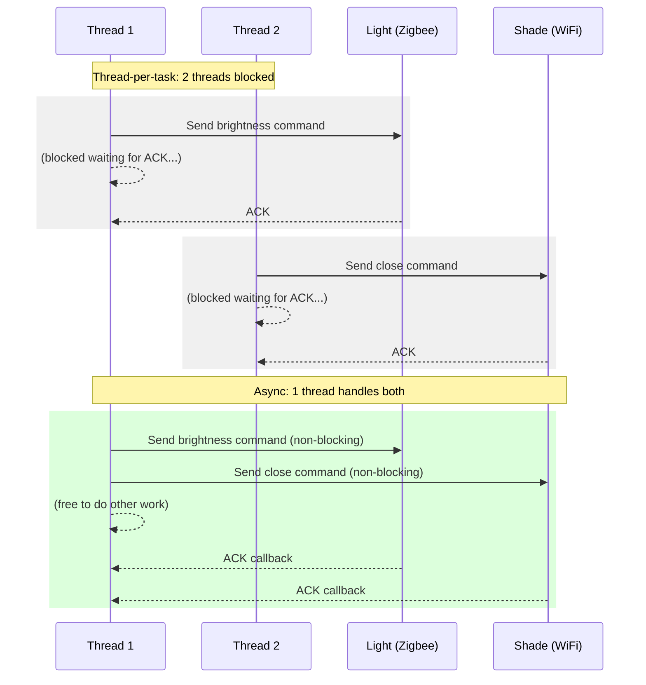

In [Lecture 31](/lecture-notes/l31-concurrency1), we learned how threads enable concurrent execution. Threads work well for CPU-bound work—tasks that keep the processor busy computing. But many real-world systems spend most of their time *waiting*: waiting for network responses, waiting for device acknowledgments, waiting for sensor data to arrive.

This lecture introduces **asynchronous programming**, an approach to concurrency that's particularly well-suited for I/O-bound work. We'll see how SceneItAll, a smart-home control application, can use asynchronous techniques to efficiently send commands to IoT devices and keep its UI responsive.

## Compare and contrast the use of threads and asynchronous programming (10 minutes)

Consider what SceneItAll does when a user activates a scene (say, "Evening"):

1. Send a brightness command to each dimmable light (set to 30%)
2. Send a close command to each shade (set to 0%)
3. Send an off command to each fan
4. Update the room state on the hub
5. Push the updated state to all connected mobile apps

A typical home scene might touch 15 devices. With a traditional thread-per-task approach, we might spawn a thread for each device command:

```java
public class SceneActivator {
    private final ExecutorService executor = Executors.newFixedThreadPool(100);

    public void activateScene(Scene scene) {
        for (DeviceCommand command : scene.getCommands()) {
            executor.submit(() -> sendCommand(command));
        }
        executor.submit(() -> updateHubState(scene));
        executor.submit(() -> pushStateToMobileApps(scene));
    }
}
```

This works, but there's a problem: each of these operations spends most of its time *waiting*. The thread sending a Zigbee command to a light waits ~200ms for the device to acknowledge. The thread pushing state to a mobile app waits for the network round-trip. We're paying the cost of a thread (memory, context switching) for work that's mostly waiting.

### Thread Overhead

Each thread in Java consumes resources:

- **Stack memory**: Each thread has its own call stack, typically 512KB to 1MB by default
- **OS resources**: The operating system tracks each thread, consuming kernel memory
- **Context switching**: When the CPU switches between threads, it must save and restore state

With 100 threads, we're using 50-100MB just for thread stacks. If we want to handle 10,000 concurrent device operations across many scenes, we'd need 10,000 threads—far too expensive.

### The Async Alternative

Asynchronous programming uses a different model: instead of dedicating a thread to wait for each I/O operation, we start the operation and provide a *callback* to be invoked when it completes. The thread is free to do other work while waiting.



With async I/O, a small number of threads can handle thousands of concurrent device commands. This is how modern IoT hubs coordinate with dozens of devices without dedicating a thread to each one.

### When to Use Each Approach

| Characteristic | Threads | Async |
|---------------|---------|-------|
| Best for | CPU-bound work | I/O-bound work |
| Resource usage | Higher (thread per task) | Lower (callbacks) |
| Programming model | Intuitive (sequential code) | Less intuitive (callbacks/futures) |
| Debugging | Familiar tools | Can be harder to trace |
| Example in SceneItAll | Computing optimal scene settings from sensors | Sending commands to devices |

For SceneItAll:
- **Use threads** for computing optimal brightness/shade settings based on time-of-day and sensor data—work where the CPU is actively computing
- **Use async** for sending Zigbee/WiFi commands to devices, pushing state to mobile apps—work where we're mostly waiting for network and radio responses

## Understand the concept of "blocking" and "non-blocking" operations (5 minutes)

A **blocking** operation halts the thread until it completes. A **non-blocking** operation returns immediately, allowing the thread to continue with other work.

### I/O Takes an Eternity

From a CPU's perspective, I/O is unimaginably slow. Let's put this in perspective by scaling time so that one CPU cycle equals one second:

| Operation | Actual Time | Scaled Time (1 cycle = 1 second) |
|-----------|-------------|----------------------------------|
| CPU cycle | 0.3 ns | 1 second |
| L1 cache access | 1 ns | 3 seconds |
| L2 cache access | 4 ns | 13 seconds |
| RAM access | 100 ns | 5 minutes |
| SSD read | 100 μs | 4 days |
| HDD read | 10 ms | 1 year |
| Network round-trip (same datacenter) | 500 μs | 19 days |
| Network round-trip (cross-country) | 50 ms | 5 years |
| Zigbee device command + ACK | 200 ms | 20 years |

When SceneItAll sends a brightness command to a Zigbee light and waits for the ACK, that "200ms" round-trip is *twenty years* of waiting from the CPU's perspective. A blocking thread sits idle, doing nothing, for twenty years.

### Blocking vs. Non-Blocking in Code

Here's a blocking call to send a device command:

```java
public void setBrightness(Light light, int level) {
    // Thread blocks here for ~200ms waiting for ACK
    DeviceResponse response = zigbeeRadio.send(
        new BrightnessCommand(light.getAddress(), level)
    );

    if (!response.isAcknowledged()) {
        throw new DeviceCommandException("Light did not ACK: " + light.getName());
    }
}
```

And here's the non-blocking equivalent:

```java
public CompletableFuture<Void> setBrightnessAsync(Light light, int level) {
    // Returns immediately—thread doesn't block
    return zigbeeRadio.sendAsync(
        new BrightnessCommand(light.getAddress(), level)
    ).thenAccept(response -> {
        if (!response.isAcknowledged()) {
            throw new DeviceCommandException("Light did not ACK: " + light.getName());
        }
    });
}
```

The async version returns a `CompletableFuture` immediately. The actual radio transmission happens in the background, and our callback (`thenAccept`) runs when the device response arrives.

### The Event Loop Model

Non-blocking I/O typically relies on an **event loop**: a single thread that monitors multiple I/O operations and dispatches callbacks when they complete.

```java
// Conceptually, an event loop works like this:
while (running) {
    List<Event> events = waitForEvents();  // OS-level poll
    for (Event event : events) {
        event.getCallback().run();  // Invoke the registered callback
    }
}
```

Node.js famously uses a single-threaded event loop to handle thousands of concurrent connections. Java's NIO (New I/O) and reactive frameworks like Project Reactor use similar approaches.

## Utilize futures to implement asynchronous programming in Java (15 minutes)

A **future** represents a value that will be available at some point in the future. It's a placeholder for the result of an asynchronous operation.

### The Future Interface

Java's `Future<T>` interface has been available since Java 5:

```java
public interface Future<T> {
    boolean cancel(boolean mayInterruptIfRunning);
    boolean isCancelled();
    boolean isDone();
    T get() throws InterruptedException, ExecutionException;
    T get(long timeout, TimeUnit unit) throws InterruptedException,
                                               ExecutionException,
                                               TimeoutException;
}
```

You can submit a task to an executor and get a `Future` to retrieve the result later:

```java
ExecutorService executor = Executors.newFixedThreadPool(10);

Future<SceneSettings> futureSettings = executor.submit(() -> {
    return computeOptimalSettings(sensorData, timeOfDay);
});

// Do other work while settings are computed...

// When we need the result, call get() (blocks if not ready)
SceneSettings settings = futureSettings.get();
```

But `Future` has limitations: `get()` is blocking, and there's no good way to compose futures or handle completion callbacks.

### CompletableFuture: The Modern Approach

Java 8 introduced `CompletableFuture<T>`, which adds powerful composition capabilities:

```java
public class AsyncSceneService {
    private final ZigbeeRadio zigbeeRadio;

    public CompletableFuture<SceneResult> activateSceneAsync(Scene scene, SensorData sensors) {
        // Start computing optimal settings (CPU-bound)
        CompletableFuture<SceneSettings> settingsFuture = computeSettingsAsync(scene, sensors);
        CompletableFuture<SunPosition> sunFuture = computeSunPositionAsync(scene.getArea());

        // Combine their results when both complete
        return settingsFuture
            .thenCombine(sunFuture, this::adjustSettingsForSun)
            .thenCompose(settings -> sendAllCommandsAsync(scene, settings))
            .thenCompose(result -> pushStateToAppsAsync(scene, result));
    }

    private CompletableFuture<SceneSettings> computeSettingsAsync(Scene scene,
                                                                    SensorData sensors) {
        return CompletableFuture.supplyAsync(() -> {
            // CPU-bound work—runs in ForkJoinPool.commonPool()
            return settingsEngine.computeOptimal(scene, sensors);
        });
    }

    private CompletableFuture<SunPosition> computeSunPositionAsync(Area area) {
        return CompletableFuture.supplyAsync(() -> {
            return sunCalculator.calculate(area.getLatLong());
        });
    }

    private SceneSettings adjustSettingsForSun(SceneSettings settings, SunPosition sun) {
        int adjustedBrightness = (int) (settings.getBrightness() * sun.getDaylightFactor());
        return settings.withBrightness(adjustedBrightness);
    }

    private CompletableFuture<SceneResult> sendAllCommandsAsync(Scene scene,
                                                                  SceneSettings settings) {
        return CompletableFuture.supplyAsync(() -> {
            commandSender.sendAll(scene.getDevices(), settings);
            return new SceneResult(settings);
        });
    }

    private CompletableFuture<SceneResult> pushStateToAppsAsync(Scene scene,
                                                                  SceneResult result) {
        // Non-blocking push to connected mobile apps
        return pushService.sendAsync(
            buildStateUpdate(scene, result)
        ).thenApply(response -> result);
    }
}
```

### Key CompletableFuture Methods

**Creating futures:**
```java
// From a value
CompletableFuture<String> immediate = CompletableFuture.completedFuture("done");

// From a supplier (runs async)
CompletableFuture<SceneSettings> async = CompletableFuture.supplyAsync(() -> computeSettings());

// From a runnable (no return value)
CompletableFuture<Void> action = CompletableFuture.runAsync(() -> logActivation());
```

**Transforming results:**
```java
CompletableFuture<Integer> brightnessFuture = settingsFuture
    .thenApply(settings -> settings.getBrightness());  // Transform SceneSettings to Integer
```

**Chaining async operations:**
```java
CompletableFuture<Void> chain = sendCommandAsync(light, brightness)
    .thenCompose(ack -> updateHubStateAsync(light))  // Returns another future
    .thenCompose(state -> pushStateToAppsAsync(state));
```

**Combining multiple futures:**
```java
// Wait for two futures and combine their results
CompletableFuture<Combined> both = future1
    .thenCombine(future2, (result1, result2) -> combine(result1, result2));

// Wait for all futures in a list
CompletableFuture<Void> all = CompletableFuture.allOf(future1, future2, future3);

// Wait for any one future to complete
CompletableFuture<Object> any = CompletableFuture.anyOf(future1, future2, future3);
```

### Error Handling in Async Chains

Errors in async code need special handling. `CompletableFuture` provides several options:

```java
public CompletableFuture<SceneResult> activateWithFallback(Scene scene) {
    return activateSceneAsync(scene)
        .exceptionally(error -> {
            // Handle error and provide fallback
            logger.error("Scene activation failed", error);
            return SceneResult.error("Activation failed: " + error.getMessage());
        });
}

public CompletableFuture<SceneResult> activateWithRetry(Scene scene) {
    return activateSceneAsync(scene)
        .handle((result, error) -> {
            if (error != null) {
                // Could retry here
                logger.warn("First attempt failed, retrying...", error);
                return activateSceneAsync(scene);  // Returns CompletableFuture
            }
            return CompletableFuture.completedFuture(result);
        })
        .thenCompose(future -> future);  // Flatten the nested future
}
```

:::note Looking Ahead
In [Lecture 33 (Event-Driven Architecture)](/lecture-notes/l33-event-architecture), we'll explore patterns like retry with exponential backoff and circuit breakers that build on these async primitives to create resilient systems.
:::

### Putting It Together: The Async Scene Activation Pipeline

Here's a complete example of SceneItAll's scene activation pipeline using async composition:

```java
public class SceneActivationPipeline {
    private final SettingsEngine settingsEngine;
    private final ZigbeeRadio zigbeeRadio;
    private final WiFiRadio wifiRadio;
    private final HubStateRepository hubState;
    private final PushService pushService;

    public CompletableFuture<ActivationResult> activateScene(Scene scene, SensorData sensors) {
        // Phase 1: Compute optimal settings (CPU-bound, use thread pool)
        CompletableFuture<SceneSettings> settingsFuture =
            CompletableFuture.supplyAsync(() -> settingsEngine.computeOptimal(scene, sensors));

        // Phase 2: Fan out commands to all 15 devices in parallel (I/O-bound)
        CompletableFuture<List<DeviceAck>> devicesFuture = settingsFuture
            .thenCompose(settings -> {
                List<CompletableFuture<DeviceAck>> commandFutures = scene.getDevices().stream()
                    .map(device -> sendCommandAsync(device, settings))
                    .toList();

                return CompletableFuture.allOf(commandFutures.toArray(new CompletableFuture[0]))
                    .thenApply(v -> commandFutures.stream()
                        .map(CompletableFuture::join)
                        .toList());
            });

        // Phase 3: Update hub state
        CompletableFuture<HubState> hubFuture = devicesFuture
            .thenCompose(acks -> hubState.updateAsync(scene, acks));

        // Phase 4: Push state to mobile apps and log activation in parallel
        CompletableFuture<Void> pushFuture = hubFuture
            .thenCompose(state -> pushService.pushToAppsAsync(state));
        CompletableFuture<Void> logFuture = hubFuture
            .thenCompose(state -> logActivationAsync(scene, state));

        // Phase 5: Return when all publishing is complete
        return hubFuture.thenCompose(state ->
            CompletableFuture.allOf(pushFuture, logFuture)
                .thenApply(v -> new ActivationResult(scene, state, true, true))
        );
    }

    private CompletableFuture<DeviceAck> sendCommandAsync(Device device,
                                                            SceneSettings settings) {
        DeviceCommand command = settings.getCommandFor(device);
        if (device.getProtocol() == Protocol.ZIGBEE) {
            return zigbeeRadio.sendAsync(command);
        } else {
            return wifiRadio.sendAsync(command);
        }
    }

    private CompletableFuture<Void> logActivationAsync(Scene scene, HubState state) {
        return CompletableFuture.runAsync(() -> {
            activationLog.record(scene.getName(), state, Instant.now());
        });
    }
}
```

This pipeline:
1. Computes optimal device settings from sensor data
2. Fans out commands to all 15 devices in parallel using `allOf`
3. Updates the hub state when all devices have acknowledged
4. Pushes state to mobile apps and logs the activation in parallel
5. Returns the final result

All without blocking any thread for device I/O.

## Evaluate the safety of asynchronous functions (15 minutes)

Asynchronous programming introduces its own category of bugs. While we avoid some thread-safety issues (fewer threads mean fewer synchronization concerns), we gain new challenges around ordering, error handling, and state management.

### The Ordering Problem

With synchronous code, operations happen in the order you write them. With async code, that guarantee disappears:

```java
// WRONG: Bug! Two brightness commands might arrive at the device out of order
public void dimThenBrighten(Light light) {
    setBrightnessAsync(light, 10);   // Starts async: dim to 10%
    setBrightnessAsync(light, 80);   // Starts async: brighten to 80%
    // Both are in flight—device might process 80% first, then 10%!
}
```

The fix is to use proper chaining:

```java
// CORRECT: Second command waits for first to complete
public CompletableFuture<Void> dimThenBrighten(Light light) {
    return setBrightnessAsync(light, 10)
        .thenCompose(ack -> setBrightnessAsync(light, 80));
}
```

### Shared Mutable State Across Async Boundaries

Even with async code, shared mutable state is dangerous:

```java
// DANGEROUS: Shared mutable state
public class DeviceStatistics {
    private int totalCommands = 0;  // Shared mutable state
    private double totalLatency = 0.0;

    public CompletableFuture<Void> recordCommand(DeviceAck ack) {
        return CompletableFuture.runAsync(() -> {
            totalCommands++;  // Race condition!
            totalLatency += ack.getLatencyMs();  // Race condition!
        });
    }
}
```

Multiple async callbacks might run concurrently, causing the same race conditions we saw with threads. The fix: use thread-safe data structures or ensure callbacks run on a single thread.

```java
// SAFE: Using atomic variables
public class DeviceStatistics {
    private final AtomicInteger totalCommands = new AtomicInteger(0);
    private final AtomicReference<Double> totalLatency = new AtomicReference<>(0.0);

    public CompletableFuture<Void> recordCommand(DeviceAck ack) {
        return CompletableFuture.runAsync(() -> {
            totalCommands.incrementAndGet();
            totalLatency.updateAndGet(current -> current + ack.getLatencyMs());
        });
    }
}
```

### Callback Hell

Before `CompletableFuture`, async code often looked like this:

```java
// "Callback Hell" - deeply nested, hard to read
void activateScene(Scene scene, Callback<Result> callback) {
    sendLightCommand(scene, lightResult -> {
        if (lightResult.isError()) {
            callback.onError(lightResult.getError());
        } else {
            sendShadeCommand(scene, shadeResult -> {
                if (shadeResult.isError()) {
                    callback.onError(shadeResult.getError());
                } else {
                    sendFanCommand(scene, fanResult -> {
                        if (fanResult.isError()) {
                            callback.onError(fanResult.getError());
                        } else {
                            updateHubState(scene, hubResult -> {
                                if (hubResult.isError()) {
                                    callback.onError(hubResult.getError());
                                } else {
                                    callback.onSuccess(hubResult);
                                }
                            });
                        }
                    });
                }
            });
        }
    });
}
```

`CompletableFuture` flattens this with chaining:

```java
// Much cleaner with CompletableFuture
CompletableFuture<HubState> activateScene(Scene scene) {
    return sendLightCommandAsync(scene)
        .thenCompose(lightAck -> sendShadeCommandAsync(scene))
        .thenCompose(shadeAck -> sendFanCommandAsync(scene))
        .thenCompose(fanAck -> updateHubStateAsync(scene));
}
```

### Error Propagation

A common mistake is forgetting that errors in async chains need explicit handling:

```java
// BAD: Error silently swallowed
sendCommandAsync(light, brightness)
    .thenAccept(ack -> updateDeviceStatus(ack));
// If the device doesn't ACK, nothing happens—no error shown to user

// GOOD: Error explicitly handled
sendCommandAsync(light, brightness)
    .thenAccept(ack -> updateDeviceStatus(ack))
    .exceptionally(error -> {
        showError("Device did not respond: " + error.getMessage());
        return null;
    });
```

### Thread Confinement in UI Applications

GUI applications have a crucial constraint: UI updates must happen on the UI thread. Async callbacks might run on any thread:

```java
// WRONG: UI update from background thread
sendCommandAsync(light, brightness)
    .thenAccept(ack -> {
        brightnessSlider.setValue(ack.getReportedLevel());  // Might crash! Wrong thread!
    });
```

The fix depends on your UI framework. In JavaFX:

```java
// CORRECT: Ensure UI update runs on JavaFX Application Thread
sendCommandAsync(light, brightness)
    .thenAcceptAsync(ack -> {
        brightnessSlider.setValue(ack.getReportedLevel());
    }, Platform::runLater);  // Runs callback on UI thread
```

:::note Recall
In [Lecture 29 (GUI Patterns)](/lecture-notes/l29-gui1) and [Lecture 30 (GUI Testing)](/lecture-notes/l30-gui2), we explored GUI architectures that handle this threading concern systematically.
:::

### Best Practices for Async Safety

1. **Prefer immutability**: Pass immutable data between async stages

```java
// Good: DeviceAck is immutable
public record DeviceAck(String deviceId, boolean acknowledged, int reportedLevel, long latencyMs) {}
```

2. **Chain properly**: Use `thenCompose` for sequential dependencies

```java
// Dependencies are explicit in the chain
sendCommandAsync(device, command)
    .thenCompose(ack -> updateHubStateAsync(ack))  // hub update depends on ACK
    .thenCompose(state -> pushStateToAppsAsync(state));
```

3. **Handle errors at the end**: Use `exceptionally` or `handle` to catch all errors

```java
complexActivationPipeline()
    .exceptionally(error -> {
        logger.error("Scene activation failed", error);
        return fallbackResult();
    });
```

4. **Consider timeouts**: Async operations can hang; use timeouts

```java
sendCommandAsync(light, brightness)
    .orTimeout(5, TimeUnit.SECONDS)
    .exceptionally(error -> {
        if (error instanceof TimeoutException) {
            return DeviceAck.timeout(light.getId());
        }
        throw new CompletionException(error);
    });
```

5. **Test async code carefully**: Async bugs may not appear in sequential tests

```java
@Test
void testConcurrentSceneActivation() throws Exception {
    // Submit many device commands concurrently
    List<CompletableFuture<DeviceAck>> futures = scene.getDevices().stream()
        .map(device -> sendCommandAsync(device, settings))
        .toList();

    // Wait for all and verify
    CompletableFuture.allOf(futures.toArray(new CompletableFuture[0])).join();

    for (CompletableFuture<DeviceAck> future : futures) {
        assertFalse(future.isCompletedExceptionally());
    }
}
```

:::note Recall
The race conditions and synchronization challenges from [Lecture 31](/lecture-notes/l31-concurrency1) still apply to async code. Async doesn't eliminate concurrency bugs—it changes their shape. Instead of threads interleaving, we have callbacks potentially executing in unexpected orders. The mental model is different, but the need for careful reasoning about shared state remains.
:::

### Summary

Asynchronous programming offers an efficient model for I/O-bound work, allowing a small number of threads to handle many concurrent operations. `CompletableFuture` provides a powerful API for expressing async workflows clearly, with explicit dependencies and error handling.

The key tradeoffs:
- **Pro**: Efficient resource usage for I/O-bound work
- **Pro**: Explicit data flow through futures and chains
- **Con**: More complex programming model than synchronous code
- **Con**: New categories of bugs (ordering, error swallowing)

Choose threads for CPU-bound work, async for I/O-bound work, and always reason carefully about how concurrent operations interact with shared state.

### Want to go deeper?

Asynchronous programming is a gateway to several deeper topics:

- **[CS 3700: Networks and Distributed Systems](https://catalog.northeastern.edu/course-descriptions/cs/)** — The network protocols that async I/O operates over. TCP, UDP, HTTP internals, and building distributed programs.
- **[CS 4730: Distributed Systems](https://catalog.northeastern.edu/course-descriptions/cs/)** — Async coordination across machines: reliable systems when network calls fail, messages arrive out of order, and clocks disagree.
