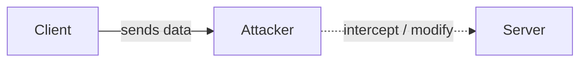
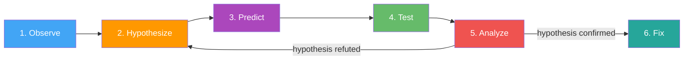
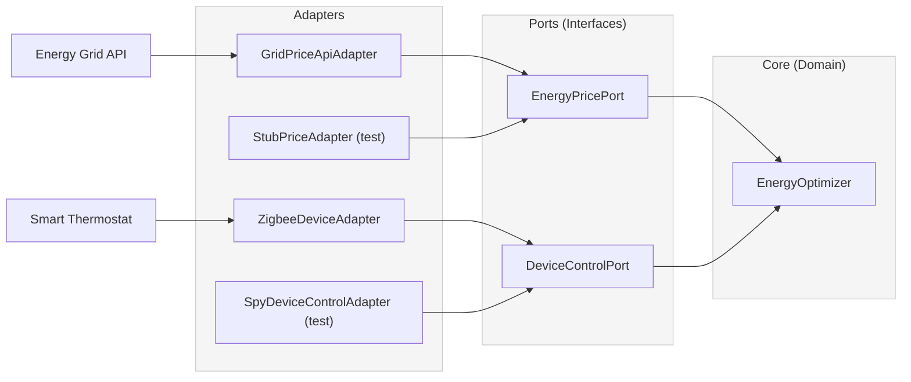
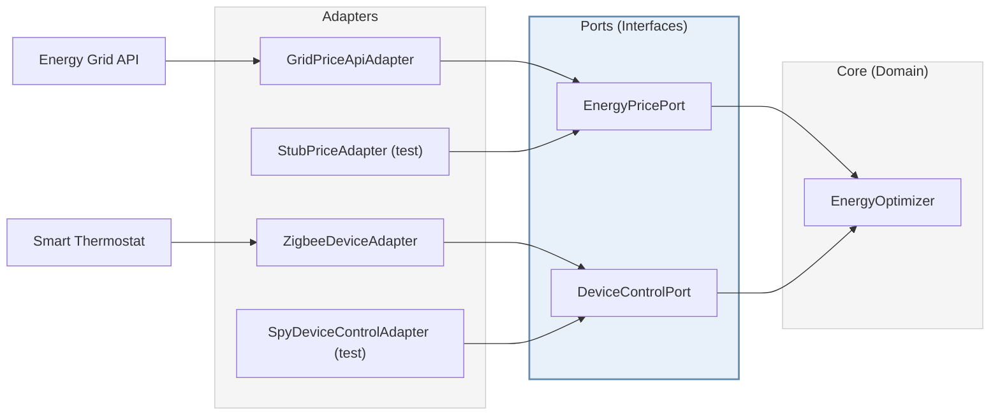

import RevealJS, { Slide } from '@site/src/components/RevealJS';
import Img from '@site/src/components/Img';
import PollSlide from '@site/src/components/PollSlide';
import QuoteSlide from '@site/src/components/QuoteSlide';
import QuizSlide from '@site/src/components/QuizSlide';

<style>
{`
  .reveal {
    font-size: 40px;
  }
`}
</style>

<RevealJS transition="slide">

<Slide>

# CS 3100: Program Design and Implementation II

## Quiz Review 2


<p style={{marginTop: '0em', fontSize: '0.7em', color: '#666'}}>
  ©2026 Ellen Spertus, CC-BY-SA
</p>
</Slide>

<Slide>

## Poll: How much of the practice quiz did you do?

<PollSlide choices=
  {["None yet", "I've skimmed it", "A few problems", "Many problems", "All problems"]}
/>
</Slide>

<Slide>

## Poll: How hard do you think it is?

<PollSlide image="/img/lectures/poll-ev/pollev-smiles.png"
/>
<p>
Click below the faces if you haven't tried it yet.
</p>
</Slide>


<Slide>

## Question 1: Critical Requirements Error

<QuizSlide
  question='A team discovers a critical requirements error after the system has been deployed to production.
According to the cost-of-change model discussed in class, how does the cost of fixing this error
compare to catching it during requirements analysis?'
  answers={[
    'The cost is roughly the same regardless of when it is discovered',
    'The cost is actually lower in production because the team better understands the system and can make more targeted fixes',
    'The cost grows exponentially — fixing in production can be 100x more expensive than fixing during requirements',
    'The cost is approximately 2x higher in production']}/>
</Slide>

<Slide>
### Catching Problems Late is Expensive
<div className='fragment'>
Lecture 1: Systematic Program Design and Implementation Process
* Bug in requirements = cheap to fix
* Bug in production = expensive

</div>
<div className='fragment'>
Lecture 9: Getting requirements wrong is the most expensive mistake in software engineering.
</div>
<div className='fragment'>
Lecture 12: Domain Models are Expensive to Change
</div>
<div className='fragment'>
Lecture 18: Architectural decisions are the ones that are expensive to change.
</div>
<div className='fragment'>
Lecture 24: Usability
* The best way to know if users can use your software is to watch them use it
* But by the time you have working software, changes are expensive
</div>
</Slide>

<Slide>
### Poll: What's Not Expensive to Change Late?

<PollSlide username='espertus'
/>
<aside className="notes">
- The opening splash screen
- The text (especially if strings are stored separately)
- The app's icon
- The URL of the server (if it's defined in a single place)
</aside>

</Slide>

<Slide>

### Question 1 Answer

<QuizSlide
  question='A team discovers a critical requirements error after the system has been deployed to production.
According to the cost-of-change model discussed in class, how does the cost of fixing this error
compare to catching it during requirements analysis?'
  correct={2}
  answers={[
    'The cost is roughly the same regardless of when it is discovered',
    'The cost is actually lower in production because the team better understands the system and can make more targeted fixes',
    'The cost grows exponentially — fixing in production can be 100x more expensive than fixing during requirements',
    'The cost is approximately 2x higher in production']}/>

</Slide>

<Slide>

## Question 2: Stakeholder Conflicts

<QuizSlide
  question='A product manager, a UX designer, and a backend engineer are all stakeholders for a recipe-sharing feature in CookYourBooks. The product manager wants maximum social engagement, the UX designer wants a simple interface, and the engineer wants to minimize API calls. Which requirements analysis principle does this scenario illustrate?'
  answers={[
    'Requirements should be gathered only from the person who is paying for the project',
    'Technical stakeholders should override non-technical stakeholders',
    'The best approach is to implement all stakeholder requests independently',
    'Different stakeholders have conflicting values, and requirements analysis must surface and negotiate these conflicts',
  ]}/>

</Slide>

<Slide>
### "It depends"

We can't maximize every metric so need to make trade-offs:
* class design with SOLID principles [Lecture 8]
* requirements analysis [Lecture 9]
* object creation patterns [Lecture 17]
* architectural qualities [Lectures 19, 21]
* usability measures [Lecture 24, not on quiz]


</Slide>

<Slide>
### Good, fast, cheap: Choose two


<div className='fragment'>

</div>

</Slide>

<Slide>

### Question 2 Answer

<QuizSlide
  question='A product manager, a UX designer, and a backend engineer are all stakeholders for a recipe-sharing feature in CookYourBooks. The product manager wants maximum social engagement, the UX designer wants a simple interface, and the engineer wants to minimize API calls. Which requirements analysis principle does this scenario illustrate?'
  correct={3}
  answers={[
    'Requirements should be gathered only from the person who is paying for the project',
    'Technical stakeholders should override non-technical stakeholders',
    'The best approach is to implement all stakeholder requests independently',
    'Different stakeholders have conflicting values, and requirements analysis must surface and negotiate these conflicts',
  ]}/>

</Slide>

<Slide>

## Question 3: Responsibility Assignment Pattern

<QuizSlide
  question='In the Pawtograder domain model, the RegradeRequest class has a method canEscalate() that checks whether the request has responses, whether it is already resolved, and whether 24 hours have passed since the last response. This is an example of which responsibility assignment pattern?'
  answers={[
    'Information Expert — RegradeRequest has the data needed to answer the question',
    'Creator — RegradeRequest creates the escalation',
    'Singleton — there can only be one active regrade request',
    'Controller — RegradeRequest handles external system events and coordinates responses across the application',
  ]}/>

</Slide>

<Slide>

### Responsibility Assignment Determines Code Structure

<p style={{fontSize: '0.9em'}}>
Now we translate our validated domain model into working code.
</p>

<p style={{fontSize: '0.85em', marginTop: '1em'}}>
The critical question: <strong>Which classes own which behaviors?</strong>
</p>

<p style={{fontSize: '0.85em', marginTop: '0.5em'}}>
We'll use three key heuristics:
</p>

<ol style={{fontSize: '0.85em'}}>
  <li><strong>Information Expert</strong> — Who has the data needed?</li>
  <li><strong>Creator</strong> — Who should create new objects?</li>
  <li><strong>Controller</strong> — Who coordinates complex operations?</li>
</ol>

<br/><br/><div style={{ fontSize: '.7em' }}>Lecture 12: Domain Modeling</div>

<aside className="notes">
**The challenge:**
- Domain model shows concepts and relationships
- OO design assigns behavior to classes
- Wrong assignments lead to tangled code

**Why heuristics:**
- No single "right" answer
- Heuristics guide toward good designs
- Experience refines judgment

→ **Transition:** Let's start with Information Expert...
</aside>

</Slide>

<Slide>

### Assign Behavior to the Class That Has the Data

<p style={{fontSize: '0.9em', color: '#9370DB'}}>
<strong>Assign responsibility to the class that has the information needed to fulfill it.</strong>
</p>

<p style={{fontSize: '0.85em', marginTop: '0.5em'}}>
Example: Who should determine if a regrade can be escalated?
</p>

<div style={{display: 'grid', gridTemplateColumns: '1fr 1fr', gap: '0.75em', fontSize: '0.62em'}}>

<div style={{backgroundColor: 'rgba(255,100,100,0.08)', padding: '0.4em', borderRadius: '6px'}}>

**❌ Ignoring the heuristic:**
```java
// Service must extract all data from request
class RegradeService {
  boolean canEscalate(RegradeRequest req) {
    List<RegradeResponse> responses =
        req.getResponses();       // extract
    RegradeStatus status =
        req.getStatus();          // extract
    if (responses.isEmpty()) return false;
    if (status == RESOLVED) return false;
    // ... more extraction and logic
  }
}
```
Service becomes a "logic hog" that pulls data from passive objects.

</div>

<div style={{backgroundColor: 'rgba(100,255,100,0.08)', padding: '0.4em', borderRadius: '6px'}}>

**✓ Following the heuristic:**
```java
// RegradeRequest knows its own history
class RegradeRequest {
  private List<RegradeResponse> responses;
  private RegradeStatus status;

  boolean canEscalate() {
    if (responses.isEmpty()) return false;
    if (status == RESOLVED) return false;
    // Data is RIGHT HERE—no extraction
    return coolingOffPeriodPassed();
  }
}
```
Data and behavior stay together. Self-contained.

</div>

</div>
<br/><br/><div style={{ fontSize: '.7em' }}>Lecture 12: Domain Modeling</div>
<aside className="notes">
**The contrast:**
- Left: Service becomes a "god class" that knows everyone's business
- Right: Each class is expert on its own state

**Connection to L7 (Cohesion):**
- Left side has *low cohesion*—service does unrelated things
- Right side has *functional cohesion*—RegradeRequest manages its own lifecycle

**Why this enables changeability:**
- Escalation rules WILL change (24h → 48h, add new conditions, etc.)
- Left: hunt through service code that extracts data from multiple objects
- Right: change ONE method in ONE class
- The data needed for the decision is already there—no ripple effects

→ **Transition:** Let's see another example...
</aside>

</Slide>

<Slide>

### The Class That Knows Its Constraints Should Enforce Them

<p style={{fontSize: '0.85em'}}>
Who should check if a grader can review a regrade?
</p>

<div style={{display: 'grid', gridTemplateColumns: '1fr 1fr', gap: '0.75em', fontSize: '0.62em'}}>

<div style={{backgroundColor: 'rgba(255,100,100,0.08)', padding: '0.4em', borderRadius: '6px'}}>

**❌ Logic scattered in service:**
```java
class RegradeService {
  boolean canGraderReview(Grader g, RegradeRequest r) {
    // Pull data from grader
    GraderType type = g.getType();
    int activeCount = g.getActiveGradingCount();
    int max = g.getMaxConcurrentGradings();

    // Pull data from request
    Grader original = r.getOriginalSession()
                        .getGrader();

    // Service implements the logic
    if (original.equals(g)) return false;
    if (activeCount >= max) return false;
    return true;
  }
}
```
Service knows too much about Grader's internals.

</div>

<div style={{backgroundColor: 'rgba(100,255,100,0.08)', padding: '0.4em', borderRadius: '6px'}}>

**✓ Grader is the expert on itself:**
```java
class Grader {
  private GraderType type;
  private int activeGradingCount;

  boolean canReviewRegrade(RegradeRequest req) {
    // Can't review own work
    if (req.getOriginalSession()
           .getGrader().equals(this)) {
      return false;
    }
    // Check MY workload (I know it!)
    if (activeGradingCount >= getMax()) {
      return false;
    }
    return true;
  }
}
```
Grader knows its own constraints. Easy to test.
</div>

</div>
<div style={{ fontSize: '.7em' }}>Lecture 12: Domain Modeling</div>
<aside className="notes">
**The contrast:**
- Left: Service has to know Grader's fields, how max is calculated, etc.
- Right: Grader encapsulates its own rules

**Connection to L6-L8 (Changeability via Hyrum's Law):**
- Left: Service depends on Grader's internal structure—if fields change, service breaks
- Right: Grader can change its internals freely—only `canReviewRegrade()` matters
- Example: "max concurrent gradings" changes from 5 to dynamic based on experience level
  - Left: hunt through all services that extract `maxConcurrent`
  - Right: change `getMax()` in Grader only

**Why this matters for testing:**
- Left: To test this, you need a service AND mock graders
- Right: To test this, you just create a Grader and call the method

→ **Transition:** Now let's look at Creator...
</aside>

</Slide>

<Slide>

### Containers Should Create What They Contain

<div style={{fontSize: '0.85em', marginTop: '0.5em'}}>
Example: Who should create InlineComment objects?

**Key point**: This means where should the `createComment()` method live, not where it should be called from.
</div>

<div style={{display: 'grid', gridTemplateColumns: '1fr 1fr', gap: '0.75em', fontSize: '0.62em'}}>

<div style={{backgroundColor: 'rgba(255,100,100,0.08)', padding: '0.4em', borderRadius: '6px'}}>

**❌ Ignoring the heuristic:**
```java
// External service creates comments
class CommentService {
  InlineComment createComment(
      GradingSession session,
      SourceFile file, int line, String text) {
    InlineComment c = new InlineComment(
        session, file, line, text, now());
    session.getComments().add(c);  // Reaches in!
    return c;
  }
}


```
Service reaches into GradingSession's internals. Session loses control of its own state.

</div>

<div style={{backgroundColor: 'rgba(100,255,100,0.08)', padding: '0.4em', borderRadius: '6px'}}>

**✓ Following the heuristic:**
```java
// Container creates what it contains
class GradingSession {
  private List<InlineComment> comments = ...;

  InlineComment addComment(
      SourceFile file, int line, String text) {
    if (!isActive()) throw new ...;
    InlineComment c = new InlineComment(
        this, file, line, text, now());
    comments.add(c);
    return c;
  }
}
```
GradingSession controls its own contents. Can enforce invariants (must be active).

</div>

</div>

<div style={{ fontSize: '.7em' }}>Lecture 12: Domain Modeling</div>

<aside className="notes">
**The contrast:**
- Left: Service bypasses GradingSession, reaches into its list directly
- Right: GradingSession is gatekeeper for its own contents

**Connection to L6 (Information Hiding):**
- Left *exposes* the comments list (or needs a setter)
- Right *hides* the list—only GradingSession can modify it

**Connection to L6-L8 (Changeability):**
- Invariant "can only add comments to active sessions" is likely to evolve:
  - "Allow comments during grace period"
  - "Allow TAs to add late comments"
- Left: hunt for all places creating comments, add checks everywhere
- Right: change `addComment()` in ONE place

**When to break this heuristic:**
- Complex creation logic → Factory pattern
- Creation needs external resources (network, etc.) → Service

→ **Transition:** Sometimes services ARE the right creator...
</aside>

</Slide>


<Slide>

### Question 3 Answer

<QuizSlide
  question='In the Pawtograder domain model, the RegradeRequest class has a method canEscalate() that checks whether the request has responses, whether it is already resolved, and whether 24 hours have passed since the last response. This is an example of which responsibility assignment pattern?'
  correct={0}
  answers={[
    'Information Expert — RegradeRequest has the data needed to answer the question',
    'Creator — RegradeRequest creates the escalation',
    'Singleton — there can only be one active regrade request',
    'Controller — RegradeRequest handles external system events and coordinates responses across the application',
  ]}/>

</Slide>


<Slide>

## Question 4: Domain Modeling
<div style={{ fontSize: '.6em' }}>
<span className="fragment fade-out" data-fragment-index="1">
```java
// Version A: Technical-focused
public class SubmissionManager {
  private Map<String, List<byte[]>> fileStorage = new HashMap<>();
  private Map<String, Integer> versionCounters = new HashMap<>();
  private Map<String, Map<String, Object>> gradeData = new HashMap<>();
}

// Version B: Domain-aligned
public class Submission {
  private final Student student;
  private final Assignment assignment;
  private final List<SourceFile> files;
  private GradingSession activeGradingSession;
}
```
</span>
What is the primary advantage of Version B over Version A?

1. Version B uses less memory because it has fewer fields

2. Version B has a smaller representational gap — its structure mirrors how stakeholders think about the domain

3. Version B compiles faster because it avoids generic types

4. Version B is required by the Java language specification for domain objects, which mandates named types over raw collections in business logic
</div>

<div className='fragment' data-fragment-index="1" style={{ fontSize: '.8em' }}>
🤯 You can use *quizmanship* to answer the question without reading the code!
</div>

</Slide>

<Slide>
### Poll: What is this class about?

<PollSlide username='espertus'
  choices={["Slightly reducing memory usage", "Creating understandable programs", "Making compilation faster", "Java syntax"]}
/>

</Slide>

<Slide>

### Question 4 Answer

<QuizSlide
  question='What is the primary advantage of Version B over Version A?'
  correct={1}
  answers={[
    'Version B uses less memory because it has fewer fields',
    'Version B has a smaller representational gap — its structure mirrors how stakeholders think about the domain',
    'Version B compiles faster because it avoids generic types',
    'Version B is required by the Java language specification for domain objects, which mandates named types over raw collections in business logic',
  ]}/>

</Slide>

<Slide>
### Question 4 Rewrite
<div style={{ fontSize: '.8em' }}>
Which version of the code has a smaller representational gap, with structure mirroring how stakeholders think about the domain?

```java
// Version A: Technical-focused
public class SubmissionManager {
  private Map<String, List<byte[]>> fileStorage = new HashMap<>();
  private Map<String, Integer> versionCounters = new HashMap<>();
  private Map<String, Map<String, Object>> gradeData = new HashMap<>();
}

// Version B: Domain-aligned
public class Submission {
  private final Student student;
  private final Assignment assignment;
  private final List<SourceFile> files;
  private GradingSession activeGradingSession;
}
```

<div className='fragment'>
The structure of the domain-aligned version (B) mirrors how stakeholders think about the domain.
</div>
</div>

</Slide>

<Slide>

## Question 5: AI Collaboration

<QuizSlide
  question="A developer uses an AI programming agent to generate a complete authentication module without reviewing the generated code or understanding how it works. According to the course's framework for AI collaboration, this is an example of:"
  answers={[
    'Effective use of AI to maximize productivity',
    'Pair programming with an AI partner',
    'The "vibe coding" trap — accepting AI output without applying domain knowledge to evaluate it',
    'The recommended approach for boilerplate code',
  ]}/>

</Slide>

<Slide>

### The Fundamental Principle: Task Familiarity


<br/><br/><div style={{ fontSize: '.7em' }}>Lecture 13: AI Coding Assistants</div>

<aside className="notes">
Authentication (and security in general) is hard to get right.
</aside>
</Slide>


<Slide>

### Fallacy 4: "The Network Is Secure"


<div style={{ fontSize: '.8em' }}>

Data crossing networks can be intercepted, modified, or spoofed. Every network boundary is a potential attack surface.

*Pawtograder:* Without the OIDC token, anyone could POST fake grades. Without HTTPS, a network observer could read or modify grades in transit.

*(We'll dive deep on security later in this lecture.)*
</div>

<br/><br/><div style={{ fontSize: '.7em' }}>Lecture 20: Distributed Architecture</div>

<aside className="notes">
- OIDC (OpenID Connect) is an authentication protocol
</aside>

</Slide>

<Slide>

### A Well-Maintained Library Beats DIY for Security

<p style={{fontSize: '0.85em'}}>
Is it safer to use a popular library or write your own? <strong>Almost always use the library</strong> — if it's well-maintained.
</p>

<div style={{display: 'grid', gridTemplateColumns: '1fr 1fr', gap: '1.5em', marginTop: '1em', fontSize: '0.7em'}}>

<div style={{padding: '0.75em', border: '2px solid #4CAF50', borderRadius: '8px'}}>

**Why well-maintained libraries win:**
- Battle-tested by thousands of users
- Security researchers scrutinize popular projects
- Vulnerabilities get reported and patched
- You benefit from specialists' expertise

</div>

<div style={{padding: '0.75em', border: '2px solid #FF9800', borderRadius: '8px'}}>

**When dependencies introduce risk:**
- Every dependency is an attack surface
- Transitive dependencies multiply the risk
- Unmaintained dependencies don't get patches
- You're trusting code you've never read

</div>

</div>

<br/><br/><div style={{ fontSize: '.7em' }}>Lecture 21: Open-Source Frameworks</div>

</Slide>

<Slide>

### Question 5 Answer

<QuizSlide
  question="A developer uses an AI programming agent to generate a complete authentication module without reviewing the generated code or understanding how it works. According to the course's framework for AI collaboration, this is an example of:"
  correct={2}
  answers={[
    'Effective use of AI to maximize productivity',
    'Pair programming with an AI partner',
    'The "vibe coding" trap — accepting AI output without applying domain knowledge to evaluate it',
    'The recommended approach for boilerplate code',
  ]}/>
</Slide>

<Slide>

## Question 6: Debugging Approach

<QuizSlide
  question='When debugging, a developer notices that a Recipe object has an unexpected null value for its instructions field. They form the hypothesis: "The instructions field is set to null in the constructor." They then set a breakpoint in the constructor and run the program. This approach is an example of:'
  answers={[
    'Rubber duck debugging',
    'Trial-and-error debugging',
    'Print-statement debugging',
    'The scientific method applied to debugging — observe, hypothesize, predict, test',
  ]}/>

</Slide>

<Slide>
### Rubber-Duck Debugging


<div style={{ fontSize: '.7em' }}>CC-BY-NC <a href="https://sketchplanations.com/rubberducking">sketchplanations</a></div>
</Slide>

<Slide>
### Ad Hoc Techniques

* Trial-and-error debugging
* Print-statement debugging


</Slide>

<Slide>

### The Scientific Method Applied to Debugging

<div style={{fontSize: '0.85em'}}>



<ol style={{marginTop: '0.5em'}}>
  <li><strong>Observe:</strong> Notice unexpected behavior or test failure</li>
  <li><strong>Hypothesize:</strong> Form a theory about the cause</li>
  <li><strong>Predict:</strong> What evidence would support or refute this?</li>
  <li><strong>Test:</strong> Gather evidence (debugger, logging, tests)</li>
  <li><strong>Analyze:</strong> Does the evidence support the hypothesis?</li>
  <li><strong>Iterate:</strong> Refine hypothesis or implement fix</li>
</ol>
</div>
<br/><br/><div style={{ fontSize: '.7em' }}>Lecture 14: Program Understanding & Debugging</div>

</Slide>

<Slide>

### Question 6 Answer

<QuizSlide
  question='When debugging, a developer notices that a Recipe object has an unexpected null value for its instructions field. They form the hypothesis: "The instructions field is set to null in the constructor." They then set a breakpoint in the constructor and run the program. This approach is an example of:'
  correct={3}
  answers={[
    'Rubber duck debugging',
    'Trial-and-error debugging',
    'Print-statement debugging',
    'The scientific method applied to debugging — observe, hypothesize, predict, test',
  ]}/>

</Slide>

<Slide>
## Question 7: Test Doubles
<div style={{ fontSize: '.6em' }}>
Consider this test for a `ThermostatController`:
```java
@Test
public void activatesHeatingWhenBelowTarget() {
  TemperatureSensor mockSensor = mock(TemperatureSensor.class);
  HVACService mockHVAC = mock(HVACService.class);
  NotificationService mockNotifier = mock(NotificationService.class);

  when(mockSensor.readTemperature("livingRoom")).thenReturn(65.0);

  ThermostatController controller = new ThermostatController(
    mockSensor, mockHVAC, mockNotifier);
  controller.adjustToTargetTemperature(72.0, "livingRoom");
  verify(mockHVAC).setMode(HVACMode.HEATING, "livingRoom");
  verify(mockHVAC).activate("livingRoom");
}
```
In this test, mockSensor is acting as a (A) stub, (B) mock, (C) integration test fixture, or (D) spy.
</div>

</Slide>

<Slide>

### Test Doubles: Stand-Ins for Real Dependencies

<p style={{ fontSize: '1.1em', color: '#9370DB', fontStyle: 'italic', marginBottom: '0.5em' }}>Stubs return canned answers; fakes work simply; spies record calls.</p>

<div
  style={{ display: 'grid', gridTemplateColumns: '1fr 1fr 1fr', gap: '1em', marginTop: '0.5em' }}>
  <div style={{ textAlign: 'center' }}>
    <p style={{ fontSize: '1.1em', color: '#9370DB' }}>
      <strong>Stubs</strong>
    </p>
    <p style={{ fontSize: '0.8em' }}>Return canned answers</p>
  </div>
  <div style={{ textAlign: 'center' }}>
    <p style={{ fontSize: '1.1em', color: '#9370DB' }}>
      <strong>Fakes</strong>
    </p>
    <p style={{ fontSize: '0.8em' }}>Simplified implementations</p>
  </div>
  <div style={{ textAlign: 'center' }}>
    <p style={{ fontSize: '1.1em', color: '#9370DB' }}>
      <strong>Spies</strong>
    </p>
    <p style={{ fontSize: '0.8em' }}>Record what happened</p>
  </div>
</div>

<p style={{ marginTop: '1.5em', fontSize: '0.9em', color: '#666' }}>
  From simplest to most sophisticated
</p>

<div className='fragment' style={{ fontSize: '.8em' }}>
*What about mocks?* We'll get there.
</div>

<div style={{ fontSize: '.7em' }}>Lecture 15: Test Doubles and Isolation</div>
</Slide>

<Slide>

### Stubs: Return Canned Answers

<p style={{ fontSize: '1.1em', color: '#9370DB', fontStyle: 'italic', marginBottom: '0.5em' }}>Ignore details you don't care about; return what you need.</p>

```java
class StubGitHubService implements GitHubService {
    private final CodeSnapshot fixedCode;

    public StubGitHubService(CodeSnapshot code) {
        this.fixedCode = code;
    }

    @Override
    public CodeSnapshot fetchCode(String repoUrl) {
        return fixedCode;  // Always returns the same code
    }
}
```

<p style={{ marginTop: '0.5em', fontSize: '0.85em' }}>
  Ignores the repo URL, always returns sample code — <strong>that's fine!</strong>
</p>

<br/><br/><div style={{ fontSize: '.7em' }}>Lecture 15: Test Doubles and Isolation</div>

</Slide>

<Slide>

### Fakes: When You Need Real Behavior

<p style={{ fontSize: '1.1em', color: '#9370DB', fontStyle: 'italic', marginBottom: '0.5em' }}>When you need save-then-retrieve, use a working in-memory implementation.</p>

```java
class FakeUserRepository implements UserRepository {
    private final Map<String, User> users = new HashMap<>();

    @Override
    public void save(User user) {
        users.put(user.getId(), user);
    }

    @Override
    public User findById(String id) {
        return users.get(id);
    }

    @Override
    public List<User> findAll() {
        return new ArrayList<>(users.values());
    }
}
```

<p style={{ marginTop: '0.5em', fontSize: '0.85em' }}>
  A working implementation — just simpler than the real database
</p>

<br/><br/><div style={{ fontSize: '.7em' }}>Lecture 15: Test Doubles and Isolation</div>
</Slide>

<Slide>

### Spies: Record What Happened (Decorator Pattern)

<p style={{ fontSize: '1.1em', color: '#9370DB', fontStyle: 'italic', marginBottom: '0.5em' }}>Wrap, record, delegate—verify interactions after the fact.</p>

```java
class SpyDatabase implements Database {
    private final Database delegate;  // Wraps a real implementation
    private boolean saveGradeCalled = false;
    private String savedStudentId = null;

    public SpyDatabase(Database realDatabase) {
        this.delegate = realDatabase;  // Decorator pattern!
    }

    @Override
    public void saveGrade(String studentId, int score) {
        this.saveGradeCalled = true;       // Record the call
        this.savedStudentId = studentId;
        delegate.saveGrade(studentId, score);  // Delegate to real impl
    }

    // Query methods for tests
    public boolean wasSaveGradeCalled() { return saveGradeCalled; }
    public String getSavedStudentId() { return savedStudentId; }
}
```

<br/><br/><div style={{ fontSize: '.7em' }}>Lecture 15: Test Doubles and Isolation</div>

</Slide>

<Slide>
### Where Do Mocks Fit In?

These describe the *behavior* of the test double:

* stub: returns canned answer
* fake: simplified implementation
* spy: records how methods were called

<div className='fragment'>

Test doubles can be created

* as ordinary classes (as shown on previous slides)
* at run-time by a mocking framework, such as Mockito
</div>

</Slide>

<Slide>

### Mockito: Create, Configure, Verify

<p style={{ fontSize: '1.1em', color: '#9370DB', fontStyle: 'italic', marginBottom: '0.5em' }}>mock(), when().thenReturn(), verify()—the three operations you'll use most.</p>

<table style={{ margin: '0 auto', fontSize: '0.85em' }}>
  <tbody>
    <tr>
      <td style={{ padding: '0.5em 0.8em' }}>
        <code>mock(Class.class)</code>
      </td>
      <td style={{ padding: '0.5em 0.8em' }}>Create a test double</td>
    </tr>
    <tr>
      <td style={{ padding: '0.5em 0.8em' }}>
        <code>when(...).thenReturn(...)</code>
      </td>
      <td style={{ padding: '0.5em 0.8em' }}>Configure stub behavior</td>
    </tr>
    <tr>
      <td style={{ padding: '0.5em 0.8em' }}>
        <code>verify(mock).method(...)</code>
      </td>
      <td style={{ padding: '0.5em 0.8em' }}>Check spy recordings</td>
    </tr>
    <tr>
      <td style={{ padding: '0.5em 0.8em' }}>
        <code>when(...).thenThrow(...)</code>
      </td>
      <td style={{ padding: '0.5em 0.8em' }}>Simulate exceptions</td>
    </tr>
  </tbody>
</table>

<p style={{ marginTop: '1em', fontSize: '0.85em', color: '#666' }}>
  Mockito uses reflection to generate implementations at runtime
</p>

<br/><br/><div style={{ fontSize: '.7em' }}>Lecture 15: Test Doubles and Isolation</div>

</Slide>


<Slide>
### Question 7 Answer
<div style={{ fontSize: '.6em' }}>
```java
@Test
public void activatesHeatingWhenBelowTarget() {
  TemperatureSensor mockSensor = mock(TemperatureSensor.class);
  HVACService mockHVAC = mock(HVACService.class);
  NotificationService mockNotifier = mock(NotificationService.class);

  when(mockSensor.readTemperature("livingRoom")).thenReturn(65.0);

  ThermostatController controller = new ThermostatController(
    mockSensor, mockHVAC, mockNotifier);

  controller.adjustToTargetTemperature(72.0, "livingRoom");

  verify(mockHVAC).setMode(HVACMode.HEATING, "livingRoom");
  verify(mockHVAC).activate("livingRoom");
}
```
<div className='fragment'>
In this test, `mockSensor` is acting as a:<br/>
   (A) stub  — it returns a pre-configured value without real behavior<br/>
   (B) Mock object verified with `verify()`  — its primary role here is to assert method calls<br/>
   (C) Integration test fixture — it connects to real hardware<br/>
 **(D) spy — it records method calls for later verification**

(A) is arguably also correct, and (B) is kind of misleading.
</div>
</div>

</Slide>

<Slide>

## Question 8: Test Double Tradeoffs

<QuizSlide
  question='What is the primary risk of relying exclusively on test doubles (mocks and stubs) for all testing?'
  answers={[
    'Test doubles are slower than real implementations',
    'Test doubles violate the Open/Closed Principle',
    'Test doubles are not supported by modern testing frameworks, which require real object instances to correctly measure code coverage',
    'Test doubles can give false confidence — tests pass even when real components don\'t integrate correctly',
  ]}/>

</Slide>

<Slide>

### Choices
<div style={{ fontSize: '.8em' }}>
Test doubles are slower than real implementations?
<div className='fragment'>
* They're often faster, but we don't care about little speed improvements.
</div>

<div className='fragment'>
Test doubles violate the Open/Closed Principle?
</div>
<div className='fragment'>
* They have nothing to do with classes being open for extension and closed for modification.
</div>

<div className='fragment'>
Test doubles are not supported by modern testing frameworks, which require real object instances to correctly measure code coverage?
</div>
<div className='fragment'>
* Test doubles are real objects (just not production objects). Test frameworks *support* measuring code coverage but don't *require* it.
</div>

<div className='fragment'>
Test doubles can give false confidence — tests pass even when real components don't integrate correctly?
</div>
<div className='fragment'>
🎯
</div>
</div>
</Slide>

<Slide>
### How Could a Test Double Give False Confidence?

```java
@Test
public void thrusterFiresForCorrectDuration() {
  // Create a double of Lockheed Martin's thruster.
  ThrusterController mockThruster = mock(ThrusterController.class);

  // Verify that the NavigationSystem calls the thruster's
  // fire method with 4.45 Newtons.
  NavigationSystem nav = new NavigationSystem(mockThruster);
  nav.fireThruster(4.45);
  verify(mockThruster).fire(4.45);
}
```

<div className='fragment' style={{ fontSize: '.8em' }}>
The test passes but the Mars Climate Orbiter fails. Why?
</div>

</Slide>

<Slide>

### The Mars Climate Orbiter Disaster


</Slide>

<Slide>

### Question 8 Answer

<QuizSlide
  question='What is the primary risk of relying exclusively on test doubles (mocks and stubs) for all testing?'
  correct={3}
  answers={[
    'Test doubles are slower than real implementations',
    'Test doubles violate the Open/Closed Principle',
    'Test doubles are not supported by modern testing frameworks, which require real object instances to correctly measure code coverage',
    'Test doubles can give false confidence — tests pass even when real components don\'t integrate correctly',
  ]}/>

</Slide>

<Slide>

## Question 9: Hexagonal Architecture

```java
// code omitted
```
<QuizSlide
  question='In an IoT EnergyOptimizer, EnergyPricePort is a port and GridPriceApiAdapter (which calls a real pricing API) is an adapter. In Hexagonal Architecture, what is the main benefit of this separation?'
  answers={[
    'Adapters are faster than direct method calls',
    'The application core can be tested and reused without depending on any specific external system',
    'Ports automatically generate REST API endpoints',
    'The Java compiler requires interfaces for external dependencies involving I/O',
  ]}/>

</Slide>

<Slide>

### Hexagonal Architecture (Ports and Adapters)

<p style={{fontSize: '0.9em'}}>
  The solution is called <strong>Hexagonal Architecture</strong>, proposed by Alistair Cockburn (2005)
</p>

 threshold) reducePower()' and the caption 'Pure business rules. No technology.' Two ports sit on the hexagon's edges as electrical outlet sockets. On the left, EnergyPricePort has two adapters plugged in: GridPriceApiAdapter (blue, connecting to an Energy Grid API cloud) and StubPriceAdapter (green, labeled 'returns $0.35'). On the right, DeviceControlPort has ZigbeeDeviceAdapter (blue, connecting to a smart thermostat) and SpyDeviceControlAdapter (green, labeled 'records calls'). A callout reads 'Tests plug in here! Same ports, different adapters.' Blue adapters represent production; green adapters represent test doubles."
    prompt="Technical diagram: Hexagonal Architecture (Ports and Adapters) for IoT Smart Home.
CENTER - THE HEXAGON (warm golden glow):
A hexagonal shape labeled 'APPLICATION CORE' at top, 'Domain Logic' below. Inside the hexagon, show clean text:

'EnergyOptimizer'
'if (price > threshold) reducePower()'
'Pure business rules. No technology.'
EDGES - TWO PORTS (shown as electrical outlet sockets on left and right edges of hexagon):

Left edge: 'EnergyPricePort' with small label 'interface'
Right edge: 'DeviceControlPort' with small label 'interface'
OUTSIDE LEFT - EnergyPricePort connections:
Production adapter (solid blue cable): 'GridPriceApiAdapter' connects via blue plug to EnergyPricePort, cable runs to a cloud icon labeled 'Energy Grid API'
Test adapter (dashed green cable): 'StubPriceAdapter' with green plug near the same port, labeled 'returns $0.35'
OUTSIDE RIGHT - DeviceControlPort connections:
Production adapter (solid blue cable): 'ZigbeeDeviceAdapter' connects via blue plug to DeviceControlPort, cable runs to a smart thermostat icon
Test adapter (dashed green cable): 'SpyDeviceControlAdapter' with green plug near the same port, labeled 'records calls'
BOTTOM RIGHT CALLOUT BOX (green background): 'Tests plug in here! Same ports, different adapters.'
STYLE: Clean technical diagram, light gray background. Hexagon glows warm amber. Production adapters and cables in blue. Test adapters and cables in dashed green. External systems in gray. Electrical outlet/plug metaphor for ports and adapters. Uncluttered with plenty of whitespace."
/>

<br/><br/><div style={{ fontSize: '.7em' }}>Lecture 16: Designing for Testability</div>
</Slide>

<Slide>

### The Three Layers



<div style={{fontSize: '0.8em', marginTop: '0.5em'}}>
  <strong>Core:</strong> Knows nothing about databases, APIs, or hardware—only the domain.<br/><br/>
  <strong>Ports:</strong> Interfaces that describe *what* the domain needs, not *how* to get it.<br/><br/>
  <strong>Adapters:</strong> Implementations of the interfaces to talk to specific technologies
</div>

<br/><br/><div style={{ fontSize: '.7em' }}>Lecture 16: Designing for Testability</div>

</Slide>

<Slide>

### Now let's look at the code



```java
public class EnergyOptimizer {
  private final EnergyPricePort priceService;
  private final DeviceControlPort deviceControl;
  private final UserPreferencesPort preferences;

  public EnergyOptimizer(EnergyPricePort priceService, DeviceControlPort deviceControl,
      UserPreferencesPort preferences) {
    this.priceService = priceService;
    this.deviceControl = deviceControl;
    this.preferences = preferences;
    }
}
```

</Slide>


<Slide>

### Question 9 Answer

<QuizSlide
  question='In an IoT EnergyOptimizer, EnergyPricePort is a port and GridPriceApiAdapter (which calls a real pricing API) is an adapter. In Hexagonal Architecture, what is the main benefit of this separation?'
  correct={1}
  answers={[
    'Adapters are faster than direct method calls',
    'The application core can be tested and reused without depending on any specific external system',
    'Ports automatically generate REST API endpoints',
    'The Java compiler requires interfaces for external dependencies involving I/O',
  ]}/>

</Slide>

<Slide>

## Question 10: Testability Anti-Patterns

<QuizSlide
  question='Which of the following is an anti-pattern that makes code difficult to test?'
  answers={[
    'Accepting dependencies through the constructor',
    'Defining behavior behind interfaces',
    'Using new to directly instantiate collaborators inside a method, hiding the dependency',
    'Separating domain logic from infrastructure code',
  ]}/>

<aside className="notes">
→ What's an anti-pattern?
</aside>

</Slide>

<Slide>

### What's an Anti-Pattern?
<div className='fragment'>
* A **pattern** is a positive example that should be applied where appropriate.
</div>
<div className='fragment'>
* An **anti-pattern** is a negative example that should be avoided.
</div>

<aside className="notes">

</aside>

</Slide>

<Slide>
### Hardcoding Dependencies vs. Dependency Injection

<div style={{display: 'flex', gap: '1rem', fontSize: '0.7em'}}>

<div style={{flex: 1}}>
```java
// Hard-coded dependency
public class ImportService {


  public ImportService() {

  }

  public void importRecipe(Path file) {
    Recipe recipe = parseRecipe(file);
    new LibraryServiceImpl().addRecipe(recipe);
  }
}
```

<span style={{color: 'red'}}>✗</span> Using `new` to directly instantiate collaborators inside a method, hiding the dependency
</div>

<div style={{flex: 1}}>
```java
// Dependency injection
public class ImportService {
  private final LibraryService libraryService;

  public ImportService(LibraryService libraryService) {
    this.libraryService = libraryService;
  }

  public void importRecipe(Path file) {
    Recipe recipe = parseRecipe(file);
    libraryService.addRecipe(recipe);
  }
}
```

<span style={{color: 'green'}}>✓</span> Accepting dependencies through the constructor
</div>

</div>

</Slide>

<Slide>

### Question 10 Answer

<QuizSlide
  question='Which of the following is an anti-pattern that makes code difficult to test?'
  correct={2}
  answers={[
    'Accepting dependencies through the constructor',
    'Defining behavior behind interfaces',
    'Using new to directly instantiate collaborators inside a method, hiding the dependency',
    'Separating domain logic from infrastructure code',
  ]}/>

</Slide>


<Slide>

## Question 11: Hidden Dependencies

```java
// code omitted
```

<QuizSlide
  question='In an ImportService, the method importRecipe() calls LibraryService.getInstance().addRecipe(recipe). What problem does the LibraryService.getInstance() call introduce?'
  answers={[
    'It makes ImportService slower by calling a static method',
    'It causes a NullPointerException at runtime',
    'It creates a hidden dependency that cannot be replaced for testing or reuse',
    'It violates the Single Responsibility Principle because ImportService now manages library instances',
  ]}/>

</Slide>
<Slide>

### Consider the Code
<div style={{ fontSize: '.8em' }}>
```java
public class ImportService {
  public void importRecipe(Path file) {
    Recipe recipe = parseRecipe(file);
    LibraryService.getInstance().addRecipe(recipe);
  }
}
```

<div className='fragment'>
This has exactly the same problem as in the previous question.
</div>
</div>
</Slide>

<Slide>
### Hardcoding dependencies vs. dependency injection

<div style={{display: 'flex', gap: '1rem', fontSize: '0.7em'}}>

<div style={{flex: 1}}>
```java
// Hard-coded dependency
public class ImportService {


  public ImportService() {

  }

  public void importRecipe(Path file) {
    Recipe recipe = parseRecipe(file);
    // two bad options, hardcoding dependencies
    new LibraryServiceImpl().addRecipe(recipe);
    LibraryService.getInstance().addRecipe(recipe);
  }
}
```

<span style={{color: 'red'}}>✗</span> Hardcoding dependency with `new`

<span style={{color: 'red'}}>✗</span> Hardcoding dependency with static method call
</div>

<div style={{flex: 1}}>
```java
// Dependency injection
public class ImportService {
  private final LibraryService libraryService;

  public ImportService(LibraryService libraryService) {
    this.libraryService = libraryService;
  }

  public void importRecipe(Path file) {
    Recipe recipe = parseRecipe(file);
    // Use LibraryService injected through constructor
    libraryService.addRecipe(recipe);

  }
}
```

<span style={{color: 'green'}}>✓</span> Accepting dependencies through the constructor
</div>

</div>

</Slide>

<Slide>

### Question 11 Answer

<QuizSlide
  question='In an ImportService, the method importRecipe() calls LibraryService.getInstance().addRecipe(recipe). What problem does the LibraryService.getInstance() call introduce?'
  correct={2}
  answers={[
    'It makes ImportService slower by calling a static method',
    'It causes a NullPointerException at runtime',
    'It creates a hidden dependency that cannot be replaced for testing or reuse',
    'It violates the Single Responsibility Principle because ImportService now manages library instances',
  ]}/>

</Slide>

<Slide>

## Question 12: Dependency Injection

<QuizSlide
  question='A developer refactors ImportService so that LibraryService is passed in through the constructor rather than looked up via getInstance(). This refactoring applies which pattern?'
  answers={[
    'Strategy Pattern — the algorithm for importing is swappable',
    'Dependency Injection — the dependency is provided externally rather than looked up internally',
    'Service Locator — ImportService looks up its dependency from a central registry rather than receiving it from the outside',
    'Builder Pattern — the ImportService is constructed step by step',
  ]}/>

</Slide>

<Slide>

### Question 12 Answer

<QuizSlide
  question='A developer refactors ImportService so that LibraryService is passed in through the constructor rather than looked up via getInstance(). This refactoring applies which pattern?'
  correct={1}
  answers={[
    'Strategy Pattern — the algorithm for importing is swappable',
    'Dependency Injection — the dependency is provided externally rather than looked up internally',
    'Service Locator — ImportService looks up its dependency from a central registry rather than receiving it from the outside',
    'Builder Pattern — the ImportService is constructed step by step',
  ]}/>

</Slide>

<Slide>

## Question 13: Architecture Decision Records

<QuizSlide
  question='What is an Architecture Decision Record (ADR)?'
  answers={[
    'A log file generated by the build system that records compilation decisions, dependency resolutions, and warnings for later auditing',
    'A UML diagram showing all classes in the system',
    'A performance benchmark comparing different architectural approaches',
    'A short document that captures the context, decision, and consequences of a significant architectural choice',
  ]}/>

</Slide>

<Slide>

### Architecture Decision Records (ADRs)

<p style={{fontSize: '0.78em'}}>
Diagrams show <em>what</em>. <strong>ADRs capture <em>why</em></strong>. An ADR documents: <strong>Context</strong>, <strong>Decision</strong>, and <strong>Consequences</strong>.
</p>

<div style={{fontSize: '0.58em', padding: '0.75em', backgroundColor: 'rgba(147, 112, 219, 0.1)', borderRadius: '8px', border: '1px solid rgba(147, 112, 219, 0.3)'}}>

**ADR-001: Centralized Feed Algorithm vs. Per-Server Algorithm**

**Context:** We need to rank posts for each user's feed. We could rank centrally using global engagement signals, or let each server (or user) choose their own algorithm.

**Decision:** Chirp will **rank feeds centrally** using a shared EngagementStrategy. The RankingStrategy interface is retained to allow A/B testing of algorithms internally.

**Consequences:**
- ✅ **Consistency:** All users get a coherent, optimized experience
- ✅ **Changeability:** New algorithms can be tested without touching the Feed Service
- ✅ **Scalability:** Ranking infrastructure can be optimized centrally
- ⚠️ **Autonomy:** Users cannot opt out of the platform's ranking choices
- ⚠️ **Coupling:** Feed quality is tied to the platform's data — if engagement data degrades, all feeds degrade

</div>

<div style={{ fontSize: '.7em' }}>Lecture 18: Thinking Architecturally</div>

</Slide>

<Slide>

### ADR-001: Patron Service Boundaries
<div style={{ fontSize: '.7em' }}>
**Context**: The client used by the Patron needs to be able to make requests of
a service layer that applies business logic to repositories. We were
constrained to prioritize the Actor service boundary heuristic.

**Decision**: We will have these separate service interfaces supporting these commands:
* `HoldService`
  * `hold book`
  * `holds`

[remainder omitted]

We separated `HoldService` from other services, such as `AccountService` because of the former's greater rate of change.

**Consequences**:
* ✅ Decoupling: Changes to hold policy affect only `HoldService` and its implementations,
not other services, such as `AccountService`.
* ⚠️ Testability: We need to mock `BookRepository` to test the method `isPermittedToPlaceHold()`,
even though that method does not reference `BookRepository`.
</div>

<br/><div style={{ fontSize: '.7em' }}>Lecture 23: Open Source Frameworks</div>

</Slide>

<Slide>

### Question 13 Answer

<QuizSlide
  question='What is an Architecture Decision Record (ADR)?'
  correct={3}
  answers={[
    'A log file generated by the build system that records compilation decisions, dependency resolutions, and warnings for later auditing',
    'A UML diagram showing all classes in the system',
    'A performance benchmark comparing different architectural approaches',
    'A short document that captures the context, decision, and consequences of a significant architectural choice',
  ]}/>

</Slide>

<Slide>

## Question 14: Service Boundary Heuristics

<QuizSlide
  question='When determining where to draw service boundaries in a system, which of the following is a valid heuristic discussed in class?'
  answers={[
    'Group code that changes together and for the same reasons; separate code that changes independently or for different actors',
    'Each service should contain exactly one class',
    'Service boundaries should follow alphabetical ordering of class names',
    'All database access should be in a single service to minimize connection pooling overhead and ensure a consistent data access layer across the system',
  ]}/>

</Slide>

<Slide>

### Service Boundary Heuristics
<div style={{ fontSize: '.8em' }}>
1. **Actor**: Things used by different actors should be separate.

2. **Rate of Change**: Things that change at different speeds should be separate. [This is about code, not data.]

3. **Interface Segregation**: Clients that need different things should get different interfaces. [Clients aren't people. They are classes, microservices, and GUIs.]

4. **Testability**: Things that need independent testing should be separable.
</div>
</Slide>

<Slide>

### Question 14 Answer

<QuizSlide
  question='When determining where to draw service boundaries in a system, which of the following is a valid heuristic discussed in class?'
  correct={0}
  answers={[
    'Group code that changes together and for the same reasons; separate code that changes independently or for different actors',
    'Each service should contain exactly one class',
    'Service boundaries should follow alphabetical ordering of class names',
    'All database access should be in a single service to minimize connection pooling overhead and ensure a consistent data access layer across the system',
  ]}/>

</Slide>

<Slide>

## Question 15: How Team Structure Shapes Architecture

<QuizSlide
  question="A company has three teams: a frontend team, a backend team, and a database team. They build a system with three layers: a presentation layer, an application layer, and a data access layer. According to Conway's Law, why is this architecture unsurprising?"
  answers={[
    'Three-layer architectures are the best design for web applications because they cleanly separate presentation, business logic, and data concerns',
    'The company chose the best architecture for performance reasons',
    'Organizations tend to produce system designs that mirror their own communication structures',
    'The Java language specification requires layered architectures',
  ]}/>

</Slide>

<Slide>
### Conway's Law: Teams Shape Architecture

<QuoteSlide
  quote="Organizations which design systems are constrained to produce designs which are copies of the communication structures of these organizations."
  author="Melvin Conway, 1967"
/>

<div style={{marginTop: '1em'}}>

**Translation:** Your software's architecture will mirror your team's structure—whether you plan for it or not.

</div>

<div style={{backgroundColor: 'rgba(255,100,100,0.1)', padding: '0.5em', borderRadius: '8px'}}>

**Example:** Three teams working on one app → three separate services that need integration

</div>

<br/><div style={{ fontSize: '.7em' }}>Lecture 22: Teams and Collaboration</div>

</Slide>

<Slide>

### Question 15 Answer

<QuizSlide
  question="A company has three teams: a frontend team, a backend team, and a database team. They build a system with three layers: a presentation layer, an application layer, and a data access layer. According to Conway's Law, why is this architecture unsurprising?"
  correct={2}
  answers={[
    'Three-layer architectures are the best design for web applications because they cleanly separate presentation, business logic, and data concerns',
    'The company chose the best architecture for performance reasons',
    'Organizations tend to produce system designs that mirror their own communication structures',
    'The Java language specification requires layered architectures',
  ]}/>

</Slide>

<Slide>

## Question 16: Fallacies of Distributed Computing

<QuizSlide
  question='"The network is reliable" is the first of the Eight Fallacies of Distributed Computing. A developer writes code that calls a remote recipe-sharing API without any error handling. When the network is temporarily unavailable, the application crashes. Which design strategy would address this fallacy?'
  answers={[
    'Increase the server\'s RAM to handle more requests, since network failures are often caused by servers running out of memory under load',
    'Implement timeouts, retries with exponential backoff, and graceful degradation',
    'Switch from HTTP to a faster protocol',
    'Cache all data locally and never use the network',
  ]}/>

</Slide>


<Slide>

### The Fallacies of Distributed Computing


<br/><div style={{ fontSize: '.7em' }}>Lecture 20: Distributed Architecture: Networks, Microservices, and Security</div>

</Slide>

<Slide>

### Question 16 Answer

<QuizSlide
  question='"The network is reliable" is the first of the Eight Fallacies of Distributed Computing. A developer writes code that calls a remote recipe-sharing API without any error handling. When the network is temporarily unavailable, the application crashes. Which design strategy would address this fallacy?'
  correct={1}
  answers={[
    'Increase the server\'s RAM to handle more requests, since network failures are often caused by servers running out of memory under load',
    'Implement timeouts, retries with exponential backoff, and graceful degradation',
    'Switch from HTTP to a faster protocol',
    'Cache all data locally and never use the network',
  ]}/>

</Slide>

<Slide>

## Question 17: CIA Triad

<QuizSlide
  question='In the CIA Triad for security, what do Confidentiality, Integrity, and Availability mean?'
  answers={[
    'Confidentiality means data is only accessible to authorized parties; Integrity means data is not tampered with; Availability means the system is accessible when needed',
    'Confidentiality means fast response times; Integrity means code compiles; Availability means 24/7 customer support',
    'Confidentiality means using encryption everywhere; Integrity means using checksums; Availability means using load balancers',
    'These are three types of software testing methodologies',
  ]}/>

</Slide>

<Slide>

### Security Decisions Trade Off Confidentiality, Integrity, and Availability


</Slide>


<Slide>

### Question 17 Answer

<QuizSlide
  question='In the CIA Triad for security, what do Confidentiality, Integrity, and Availability mean?'
  correct={0}
  answers={[
    'Confidentiality means data is only accessible to authorized parties; Integrity means data is not tampered with; Availability means the system is accessible when needed',
    'Confidentiality means fast response times; Integrity means code compiles; Availability means 24/7 customer support',
    'Confidentiality means using encryption everywhere; Integrity means using checksums; Availability means using load balancers',
    'These are three types of software testing methodologies',
  ]}/>

</Slide>


<Slide>

## Question 18: Graceful Degradation

<QuizSlide
  question='A CookYourBooks developer adds a feature that calls a remote nutrition API. During testing, the API occasionally takes 30 seconds to respond. The developer adds a 5-second timeout and returns cached nutrition data when the API is slow, along with a warning that the data may not be up-to-date. This design applies which distributed systems concept?'
  answers={[
    'Horizontal scaling — adding more servers to handle the load',
    'The CIA Triad — ensuring confidentiality of nutrition data',
    "Conway's Law — the team structure determines the API design",
    'Graceful degradation — providing reduced but functional service when a dependency is unavailable',
  ]}/>

</Slide>


<Slide>

### Vertical and Horizontal Scaling (Servers)

<p style={{fontSize: '0.82em'}}>
How does the system handle growth in load, data, or users?
</p>

<div style={{display: 'grid', gridTemplateColumns: '1fr 1fr', gap: '1em', fontSize: '0.65em', marginTop: '0.75em'}}>

<div style={{padding: '0.25em', border: '2px solid #FF9800', borderRadius: '8px'}}>

**Vertical Scaling**


</div>

<div style={{padding: '0.25em', border: '2px solid #4CAF50', borderRadius: '8px'}}>

**Horizontal Scaling**


</div>

</div>

<br/><div style={{ fontSize: '.7em' }}>Lecture 19: Architectural Styles</div>

</Slide>

<Slide>

### Vertical and Horizontal Scaling (People)


<div style={{ fontSize: '.7em' }}>Lecture 22: Teams and Collaboration</div>

</Slide>

<Slide>

### Question 18 Answer

<QuizSlide
  question='A CookYourBooks developer adds a feature that calls a remote nutrition API. During testing, the API occasionally takes 30 seconds to respond. The developer adds a 5-second timeout and returns cached nutrition data when the API is slow, along with a warning that the data may not be up-to-date. This design applies which distributed systems concept?'
  correct={3}
  answers={[
    'Horizontal scaling — adding more servers to handle the load',
    'The CIA Triad — ensuring confidentiality of nutrition data',
    'Conway\'s Law — the team structure determines the API design',
    'Graceful degradation — providing reduced but functional service when a dependency is unavailable',
  ]}/>

</Slide>

<Slide>

## Question 19: Brooks' Law

<QuizSlide
  question="According to Brooks' Law, what happens when you add more developers to a late software project?"
  answers={[
    'The project gets even later because communication overhead grows quadratically with team size',
    'The project gets back on schedule because there are more people working',
    'The project speed is unaffected because individual productivity stays the same and new developers can immediately work on independent tasks',
    'The project finishes faster but with lower quality code',
  ]}/>

</Slide>

<Slide>
### Brooks' Law


</Slide>

<Slide>

### Question 19 Answer

<QuizSlide
  question="According to Brooks' Law, what happens when you add more developers to a late software project?"
  correct={0}
  answers={[
    'The project gets even later because communication overhead grows quadratically with team size',
    'The project gets back on schedule because there are more people working',
    'The project speed is unaffected because individual productivity stays the same and new developers can immediately work on independent tasks',
    'The project finishes faster but with lower quality code',
  ]}/>

</Slide>

<Slide>

## Question 20: Open Source Licensing

<QuizSlide
  question='A startup is considering including open-source libraries in their proprietary (closed-source) commercial product. Should the specific licenses of the libraries affect their decision?'
  answers={[
    'No, they should make the decision purely based on the library quality',
    'No, all open-source licenses forbid inclusion in commercial code, so they cannot use any of them',
    'Yes, some open-source libraries require derivative works to also share their source code',
    'Yes, some open-source licenses provide quality guarantees, which will make their product more reliable',
  ]}/>

<div className='fragment'>
💡Be skeptical of answers that say "all", "always", or "never".
</div>

</Slide>

<Slide>

### Two Philosophies: Maximize Adoption vs. Protect the Commons


<br/><div style={{ fontSize: '.7em' }}>Lecture 23: Open Source Frameworks</div>

</Slide>

<Slide>

### Question 20 Answer

<QuizSlide
  question='A startup is considering including open-source libraries in their proprietary (closed-source) commercial product. Should the specific licenses of the libraries affect their decision?'
  correct={2}
  answers={[
    'No, they should make the decision purely based on the library quality',
    'No, all open-source licenses forbid inclusion in commercial code, so they cannot use any of them',
    'Yes, some open-source libraries require derivative works to also share their source code',
    'Yes, some open-source licenses provide quality guarantees, which will make their product more reliable',
  ]}/>

</Slide>

<Slide>
## Conclusion
<div style={{ fontSize: '.7em' }}>
Quizmanship
* Remember what we are emphasizing in this class: scalable software, not:
   * optimizing performance
   * Java details
* Be skeptical of answers with "always", "all", or "never".

<div className='fragment'>
Topics
* We've reviewed many important topics from Lecture 9 to Lecture 24.
* There are other important topics I did not review, including (but not limited to)
  * Domain Modeling
  * Fallacies of Distributed Computing
  * REST APIs
  * Teams & Collaboration
* I am happy to do so in the remaining time or to go through [Prof. Bell's slides](https://neu-pdi.github.io/cs3100-public-resources/lecture-slides/l25-review2#/1).
</div>
</div>

</Slide>

<Slide>
## Bonus Slide


</Slide>

</RevealJS>