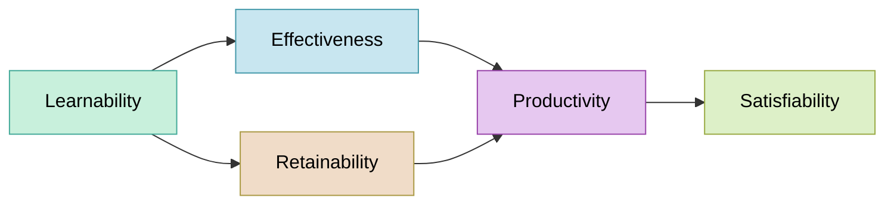
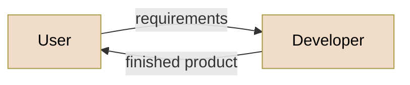
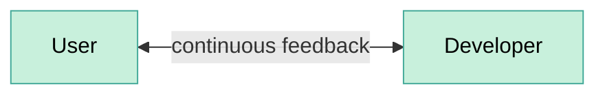
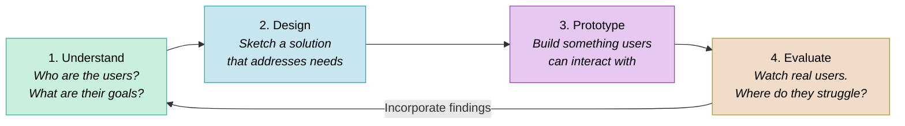
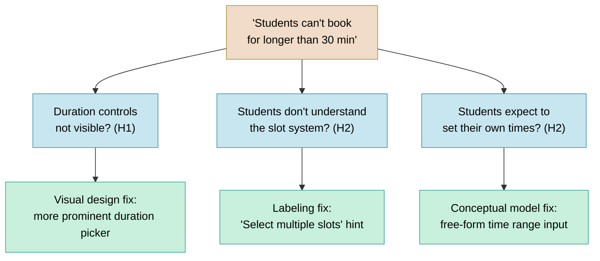

import RevealJS, { Slide } from '@site/src/components/RevealJS';
import Img from '@site/src/components/Img';
import PollSlide from '@site/src/components/PollSlide';

<RevealJS transition="slide">

{/* ============================================ */}
{/* COVER IMAGE */}
{/* ============================================ */}

<Slide>
  

<aside className="notes">
**Lecture overview:**
- **Total time:** ~45 minutes
- **Prerequisites:** L24 (Usability, heuristic evaluation), L9 (Requirements analysis)
- **Connects to:** Lab usability work, final project

**Structure (~28 slides):**
- Recall from L24 (~2 min) — quick bridge to usability concepts from last week
- Arc 1: Why UCD Matters (~12 min) — limitations of expert review, cost of building wrong thing, can't think your way to usability
- Arc 2: The UCD Process (~6 min) — iterative cycle, fidelity matching
- Arc 3: Prototyping Approaches (~10 min) — paper, Wizard-of-Oz, working prototypes, AI as accelerator
- Arc 4: Evaluation Methods (~10 min) — think-aloud, facilitation tips, task completion, root cause analysis, iteration guidance
- Arc 5: UCD as Requirements Discovery (~8 min) — interviews vs prototypes, requirements from prototypes, findings→requirements, risk reduction
- Design Sprints (~3 min) — GA0 connection, time-boxed UCD in practice
- Key Takeaways (~2 min)

**Running example:** Study room booking app

**Cover image concept:** The image shows the *evolution* of the study room booking app through three UCD stages — paper sketch with user feedback ("I don't care which building!"), wireframe mockup with more feedback, and polished final app. Each stage shows real users providing input and the design improving. The cost labels ($, $$, $$$) reinforce that early changes are cheap.

**Narrative spine:** In L24, we learned to *evaluate* usability with heuristics. But expert evaluation misses real user confusion. UCD closes that gap by putting real users at the center of the design process — through prototyping and evaluation at every stage, not just at the end.

> **Transition:** Let's start with the learning objectives...
</aside>

</Slide>

{/* ============================================ */}
{/* TITLE SLIDE */}
{/* ============================================ */}

<Slide>

# CS 3100: Program Design and Implementation II

## Lecture 27: User-Centered Design

  &copy;2026 Jonathan Bell, CC-BY-SA

<aside className="notes">
**Context from previous lectures:**
- L9: Requirements analysis — participatory vs. extractive approaches
- L24: Usability — five aspects, personas, mental models, Nielsen's heuristics
- Today: How do we *design* for usability from the start, rather than just evaluate at the end?

**Key theme:** Expert evaluation finds obvious violations. Only real users reveal the invisible gap between your mental model and theirs.

> **Transition:** Here's what you'll be able to do after today...
</aside>

</Slide>

{/* ============================================ */}
{/* LEARNING OBJECTIVES */}
{/* ============================================ */}

<Slide>

## Learning Objectives

After this lecture, you will be able to:

<ol style={{fontSize: '0.75em', textAlign: 'left'}}>
  <li>Describe the value of user-centered design in software development</li>
  <li>Describe the UCD process: prototyping and evaluation for usability</li>
  <li>Apply UCD as a requirements elicitation technique</li>
</ol>

<aside className="notes">
**Time allocation:**
- Objective 1: Why UCD matters, cost of skipping it (~12 min)
- Objective 2: UCD cycle, prototyping approaches, evaluation methods (~24 min)
- Objective 3: UCD as requirements discovery, risk reduction (~7 min)

**Connection to L24:** We learned *what* usability is and how to evaluate it with heuristics. Today we learn *how* to design for it — and why that process reveals far more than usability issues alone.

> **Transition:** Let's start with a fundamental limitation of what we learned last time...
</aside>

</Slide>

{/* ============================================ */}
{/* RECALL FROM L24 */}
{/* ============================================ */}

<Slide>

## Recall from L24: What Usability Means

**Five aspects that trade off against each other**

**Key concepts from L24:**

- **Marcus & Dorothy** — power user vs. occasional user personas with conflicting needs
- **Mental models** — users and designers think about the same interface differently
- **Nielsen's 10 Heuristics** — systematic expert evaluation checklist
- **Stakeholder trade-offs** — you can't optimize for everyone

L24 taught us to <em>evaluate</em> usability. Today: how to <em>design for</em> it from the start.

<aside className="notes">
**Quick recap (~2 min):**

This slide bridges L24 (a week ago, before the exam) to today's content. Students should recognize all these concepts.

**Five aspects:** Learnability, Effectiveness, Productivity, Retainability, Satisfiability — and the trade-offs between them. Optimizing for one can hurt another.

**Marcus & Dorothy:** Our personas from SceneItAll. Marcus (power user, wants productivity and flexibility) vs. Dorothy (visiting grandparent, wants learnability and simplicity). Their needs often conflict.

**Mental models:** The Marcus/Dorothy hierarchy example — when users tap "All Lights Off" on Living Room, different users expect different things (only Living Room? cascade up to Downstairs? cascade down to Reading Nook?).

**Nielsen's heuristics:** H1-H10, the systematic checklist for expert evaluation. Today we'll see why this isn't enough on its own.

> **Transition:** Let's start with a fundamental limitation of heuristic evaluation...
</aside>

</Slide>

<Slide>

## Nielsen's Heuristics: A 30-Year-Old Checklist That Still Works (review)

**H1:** Visibility of system status

**H2:** Match between system and real world

**H3:** User control and freedom

**H4:** Consistency and standards

**H5:** Error prevention

**H6:** Recognition rather than recall

**H7:** Flexibility and efficiency of use

**H8:** Aesthetic and minimalist design

**H9:** Help users recognize, diagnose, and recover from errors

**H10:** Help and documentation

Developed in the 1990s by Jakob Nielsen, these heuristics capture recurring patterns in usability problems. Their relevance to modern apps (including mobile, IoT, voice interfaces) is a testament to the stability of human cognitive factors.

<aside className="notes">
**Pronunciation:** Jakob Nielsen = "YAH-kob NEEL-sen" (Danish)

**Why these still work:**
- Based on how humans think, not specific technologies
- Humans haven't changed since the 1990s
- The same cognitive limitations apply to modern interfaces

**How to use them:**
- Systematic checklist for evaluation
- Go through each heuristic, ask: "Does our interface violate this?"
- Document specific violations, not just "yes/no"

**Overlap:**
- The heuristics aren't perfectly independent
- A problem might violate multiple heuristics
- That's okay — use them as a framework, not a taxonomy

> **Transition:** Let's examine each heuristic with SceneItAll examples...
</aside>

</Slide>

<Slide>

## Why Aren't the Usability Techniques from L24 Sufficient?

</Slide>

{/* ============================================ */}
{/* ARC 1: WHY UCD MATTERS (~12 min) */}
{/* ============================================ */}

<Slide>

## Heuristic Evaluation Catches Violations, Not Misunderstandings

 Floor > Room > Time Slot. Breadcrumbs, clear labels, consistent buttons. A UX expert with glasses nods approvingly. Label: 'EXPERT VERDICT: No violations found'. RIGHT SIDE: A stressed college student with a laptop and backpack, standing outside a library 20 minutes before a group meeting. They stare at the 'Select Building' screen confused, with a thought bubble: 'I don't care WHICH building — I just need a room at 3pm!' The interface is technically perfect but organized around the wrong concept for the user's actual need. Label: 'USER REALITY: Can't figure out the basic workflow'. Clean, modern infographic style with flat design elements, teal/purple color palette."
  alt="Split comparison: Left shows a UX expert approving a study room booking app's building-first navigation on all 10 heuristics. Right shows a stressed student who just wants a room at 3pm, confused by the 'Select Building' screen."
/>

<strong>Connection to L24:</strong> Heuristic evaluation is valuable — but experts evaluating against principles are not the same as real users trying to accomplish real goals. <strong>Use both:</strong> heuristics catch obvious violations quickly and cheaply; UCD catches deeper mental model mismatches that experts can't see.

<aside className="notes">
**The limitation of heuristic evaluation:**
- In L24, we learned Nielsen's 10 heuristics — a powerful expert review tool
- Experts can catch obvious violations: bad error messages, inconsistent terminology, missing feedback
- But heuristic evaluation *can't* catch problems that emerge from the gap between the designer's mental model and the user's mental model

**Study room booking example:**
- An expert reviews the booking flow and finds no violations
- Navigation is consistent (Building > Floor > Room breadcrumbs), labels are clear, available/unavailable indicators provide feedback
- But a student rushing to find a room for their 3pm group meeting doesn't think in terms of buildings and floors — they think "I need a room at 3pm, show me what's available"

**The insight:** The interface is technically flawless. The problem is invisible to experts because *the organizational model makes perfect sense to someone who understands the system*.

> **Transition:** Why does this happen? Because designers and users think differently...
</aside>

</Slide>

<Slide>

## The Designer's Mental Model Is Not the User's Mental Model

 Snell Library > 3rd Floor > Room 310. The designer thinks booking starts with selecting a physical location, drilling down through the spatial hierarchy. Clean, organized, architectural. RIGHT THOUGHT BUBBLE (labeled 'Student's Model', warm orange border): Shows a simple calendar/clock view with '3:00 PM Today' highlighted and a list of available rooms below it. The student thinks booking starts with WHEN they need a room, and the system should figure out WHERE. Urgent, time-driven, need-focused. Clean, modern infographic style with flat design, professional color palette."
  alt="A study room 'Book Room' button with two diverging thought bubbles: the designer imagines a building-floor-room spatial hierarchy, while the student imagines entering a time and seeing available rooms. A gap between them is labeled 'invisible until you watch real users.'"
/>

Neither model is <em>wrong</em>. But when the interface assumes the designer's model, users who think differently get lost — and <strong>no amount of expert review catches this</strong>.

<strong>Connection to L24:</strong> Remember Marcus and Dorothy? Marcus (power user) might think building-first because he understands system architecture. Dorothy (visiting grandparent) thinks time-first — she just wants a room at 3pm. Same gap: expert vs. casual user mental models.

<aside className="notes">
**Why mental model gaps are invisible to experts:**
- Experts share the designer's mental model (they understand the system's structure)
- Real users bring their own context: a group meeting in 20 minutes, no preference about which building
- The gap isn't a "violation" of any heuristic — it's a mismatch in *organizing principles*

**Why both models are reasonable:**
- Location-first makes sense if you're the *facilities team* — rooms ARE physical spaces in buildings
- Time-first makes sense if you're a *student* — you have a TIME constraint, not a LOCATION preference
- The designer's model mirrors the system's data model; the user's model mirrors their actual need

**Connection to L24 (Mental Models slide):**
- We saw Marcus and Dorothy having different mental models about SceneItAll's hierarchy
- Same principle here: designer and user have fundamentally different starting assumptions
- The interface can be perfectly consistent, well-labeled, and error-free — and still confusing

**Connection to L9 (Participatory approach):**
- In L9, we contrasted extractive ("What features do you need?") with participatory ("Show me how you find a room today")
- The extractive approach would miss this gap entirely
- Only watching students frantically searching for rooms before class reveals it

> **Transition:** So what happens when we skip this step and just build?
</aside>

</Slide>

<Slide>

## Building the Wrong Thing Is the Most Expensive Mistake in Software

<strong>Paper prototype fix:</strong> minutes &nbsp; $

<strong>Mockup fix:</strong> hours &nbsp; $$

<strong>Code fix:</strong> days &nbsp; $$$

<strong>Redesign after shipping:</strong> weeks &nbsp; $$$$

<strong>Users abandon your product:</strong> everything &nbsp; $$$$$

Every team that skipped user feedback and built for 6 months has the same story: "We thought we knew what users wanted."

<aside className="notes">
**The iceberg of cost:**
- Fixing a paper sketch: erase and redraw (literally free)
- Fixing a mockup: update a Figma file (hours)
- Fixing implemented code: refactor, retest, redeploy (days)
- Redesigning after shipping: all the above plus migration, retraining, PR damage (weeks)
- Users abandoning: no amount of money fixes lost trust

**Real-world example:**
- Team builds entire study room booking system around building-first navigation
- After 3 months of development, students say "Why can't I just pick a time?"
- Now they need: time-first search, availability aggregation across buildings, "nearest available" logic — none of which was planned
- 3 months of location-first UI work partially wasted, timeline blown

**The ROI math:**
- Testing 3 paper concepts with 5 students: ~2 hours total
- Testing 3 coded concepts with 5 students: ~3 weeks total
- Same learning, 100x the cost
- UCD doesn't slow you down — it *prevents* the rework that actually slows you down

**The key insight:** The later you discover you built the wrong thing, the more expensive it is to fix. UCD front-loads this discovery to when changes are cheap.

> **Transition:** But maybe we're smart enough to get it right without testing?
</aside>

</Slide>

<Slide>

## You Can't Think Your Way to Good Usability

**What teams assume**

- "We're smart engineers"
- "We use the domain ourselves"
- "We read the requirements carefully"
- "We applied all 10 heuristics"
- "We'll get it right"

**What actually happens**

- Designer assumed building-first navigation → Students wanted time-first search
- Designer assumed students know which buildings have whiteboards → Students had no idea
- Designer assumed "Reserve" was self-explanatory → Students searched for "Book" or "Get a room" **(H2 violation: terminology doesn't match user language)**
- Designer assumed 30-minute fixed slots → Students wanted custom time ranges like "3pm to 4:30pm" **(H1 violation: system constraints not visible)**

These aren't edge cases. These are the primary workflow. <strong>Connection to L24:</strong> Experts applying Nielsen's heuristics are still experts — they share the designer's mental model. Heuristic evaluation catches violations; only real users reveal misunderstandings.

<aside className="notes">
**Why smart teams still get it wrong:**
- Developers have the *curse of knowledge* — they can't un-know how the system works
- Even domain experts (developers who book rooms) aren't representative of all users
- Requirements documents describe *what* the system should do, not *how users expect to do it*
- Heuristic evaluation checks *interface quality*, not *conceptual fit*

**Each study room booking example:**
1. Navigation: The database is organized by building/floor/room — so the UI mirrors that hierarchy. Students think in time slots, not floor plans.
2. Room features: The facilities team knows Room 310 has a whiteboard. Students don't — they need to search by feature, not location.
3. Terminology: "Reserve" is the formal term in the system. Students say "book a room" or "get a room." The button label is technically correct but doesn't match how students talk.
4. Time slots: 30-minute increments make scheduling logic simple. But study groups don't think in 30-minute blocks — they think "we need about an hour and a half."

**The principle:** You *cannot* predict user behavior from first principles. You must *observe* it.

> **Transition:** So if we can't think our way there, what's the alternative?
</aside>

</Slide>

<Slide>

## Design *With* Users, Not *For* Users

**Extractive (L9)**

- "What features do you need?"
- Requirements document
- Build for months
- Acceptance test at the end

**Participatory (UCD)**

- "Show me how you find a room today"
- Iterate on prototypes together
- Feedback at every stage
- Users are design partners

<strong>Connection to L9:</strong> We introduced the participatory approach for requirements. UCD extends it into the <em>entire</em> design and development process.

<aside className="notes">
**Recall from L9:**
- Extractive: treat users as requirement sources, then go build
- Participatory: treat users as design partners, involve them throughout
- We argued participatory leads to better solutions — ones neither party imagined alone

**Study room example:**
- Extractive: "What features do you need in a room booking app?" → students say "search, booking, calendar"
- Participatory: "Show me how you find a study room today" → you watch a student frantically texting groupmates, checking 3 different building websites, and giving up
- The participatory approach reveals that the *process* is broken, not just the *features*

**The key shift:**
- From: "Users tell us what they want → we build it → they accept it"
- To: "Users show us their world → we sketch something → they react → we refine → repeat"

**Why this works:**
- Users can't always articulate what they need (L9)
- But they *can* react to something concrete: "That's not what I meant" or "Oh, can it also...?"
- Prototypes make abstract ideas tangible and criticizable

> **Transition:** But there's a timing problem...
</aside>

</Slide>

<Slide>

## The Timing Paradox: We Need Feedback Early but Evidence Comes Late

<strong>Cost to change:</strong>

  
Low ✓

  

  

  
High ✗

<strong>Quality of user evidence:</strong>

  
Low ✗

  

  

  
High ✓

  ← Early (design phase)
  Late (production) →

UCD's answer: iterate with prototypes of <em>increasing fidelity</em> — get user feedback when changes are still cheap.

<aside className="notes">
**The fundamental tension:**
- We want to find problems *early*, when they're cheap to fix
- But the *best* evidence about usability comes from real users with real software — which comes *late*

**If we wait:**
- Working software → watch users → discover fundamental workflow is wrong → expensive rework
- Study room example: 3 months building location-first UI, then discover students want time-first search

**If we test too early:**
- Paper sketches → users react to sketches → but sketches can't test real interaction details
- Users might say "looks fine" on paper, then struggle with real interface

**UCD's resolution:**
- Don't choose one extreme — iterate through increasing fidelity
- Paper → mockup → working prototype → production
- Each stage catches different kinds of problems
- Each stage is cheaper to change than the next

> **Transition:** Let's look at this iterative cycle more closely...
</aside>

</Slide>

{/* ============================================ */}
{/* ARC 2: THE UCD PROCESS (~6 min) */}
{/* ============================================ */}

<Slide>

## UCD Is an Iterative Cycle, Not a One-Time Consultation

Each iteration increases fidelity — from paper sketches to working software. Users aren't consulted once at the beginning and again at the end. They're involved <strong>continuously</strong>.

<aside className="notes">
**The four steps:**

**1. Understand:** Who are the users? What are their goals? What's their context?
- Builds on stakeholder analysis from L24
- Study room app: commuter students, residents, grad students with lab access — different needs and schedules

**2. Design:** Based on understanding, create a design that addresses user needs
- Early: conceptual ("user picks a building, then a floor, then a room")
- Later: specific interface layouts and interaction flows

**3. Prototype:** Build a representation that users can interact with
- Doesn't need to be working software
- Paper sketches can be "interactive" if a facilitator simulates responses

**4. Evaluate:** Put the prototype in front of real users, observe what happens
- Where do they struggle? What surprises them?
- What do they try to do that the design doesn't support?

**Then repeat:** Incorporate findings into the next iteration
- Maybe go back to understanding (discovered a new user type)
- Or refine the design based on specific feedback
- Each cycle increases confidence

> **Transition:** The key is matching prototype fidelity to your stage...
</aside>

</Slide>

<Slide>

## Prototype Fidelity Should Match Your Current Level of Uncertainty

  <strong>Paper sketches</strong>
  Low fidelity
  Minutes to create
  Zero cost to change

  <strong>Interactive mockups</strong>
  Medium fidelity
  Hours to create
  Low cost to change

  <strong>Working prototypes</strong>
  High fidelity
  Days to create
  Medium cost to change

  <strong>Production software</strong>
  Full fidelity
  Weeks/months to create
  High cost to change

<strong>High uncertainty?</strong> Use low-fidelity prototypes — don't invest in details until the concept is right. <strong>Concept validated?</strong> Increase fidelity to test interaction details.

<aside className="notes">
**The matching principle:**
- If you're still unsure about the basic *concept* (should navigation be building-first or time-first?), use paper
- If the concept is validated but you're unsure about *layout* and *flow*, use interactive mockups
- If the flow works but you need to test *feel* and *performance*, use working prototypes
- Don't build production code to test a hypothesis you could test with paper

**Study room example progression:**
1. Paper: "Should booking start from building list, time picker, or campus map?" — test 3 sketches
2. Mockup: "Students prefer time-first. Now: does the available rooms list make sense?" — clickable Figma
3. Working prototype: "Room list works. But does the time picker feel right on mobile?" — real code
4. Production: "Everything works. Ship it."

**The cost math:**
- Testing 3 paper concepts: 30 minutes total
- Testing 3 coded concepts: 3 weeks total
- Same learning, 100x the cost

> **Transition:** Let's look at each prototyping approach in detail...
</aside>

</Slide>

{/* ============================================ */}
{/* ARC 3: PROTOTYPING APPROACHES (~10 min) */}
{/* ============================================ */}

<Slide>

## Paper Prototypes: Minutes to Create, Zero Cost to Throw Away

**How it works:** Draw each screen on paper. A facilitator "plays computer" — when the user "taps" a button, swap in the next paper screen.

**Why it works:** Users feel comfortable criticizing paper. Fast to modify *during* the session. Forces focus on concepts, not visual polish.

<aside className="notes">
**Paper prototyping mechanics:**
- Draw each screen on a separate piece of paper
- Lay out the flow: Building List → Floor → Room → Time Slot → Confirmation
- Give the user a task: "You have a group project meeting at 3pm. Book a study room."
- When user "taps" a button, the facilitator swaps in the appropriate next screen
- The facilitator can simulate *any* system behavior — including behaviors not yet designed

**Why paper is perfect for this stage:**
- The team has a design hypothesis: building-first navigation
- Before writing a single line of code, they can test whether this concept works
- Drawing 5 screens takes 15 minutes — implementing them takes days
- If the concept is wrong (spoiler: it is), nothing is wasted

**Advantages:**
- Extremely fast to create (minutes, not hours)
- Easy to modify *during the session*: "What if we started with time instead of building?"
- Users feel comfortable criticizing paper — "This is just a sketch"
- No code, no tools, no technical skill required

**Limitations:**
- Can't test detailed interactions (drag-and-drop feel, animation timing)
- Facilitator responses may not match what software would actually do
- Some users have trouble imagining paper as real software

> **Transition:** Let's see what happens when a student actually uses these paper screens...
</aside>

</Slide>

<Slide>

## Paper Prototypes Reveal Conceptual Confusion Before You Write Code

  <strong>Facilitator</strong> <em>(shows paper Screen 1: building list)</em>: "You have a group meeting at 3pm today. Book a study room."

  <strong>Student</strong>: "Um... which building should I pick? I don't care which building. Is there a way to just see what's free at 3?"

  <strong>Facilitator</strong>: "What would you expect to see first?"

  <strong>Student</strong>: "A time picker? Or just... a list of rooms that are available at 3. I don't want to check every building one by one."

The entire navigation concept is wrong — discovered in 5 minutes with paper. Not in 5 sprints with code.

<aside className="notes">
**What this reveals:**
- The student is stuck at *Screen 1* — the very first screen
- The building-first hierarchy forces users to make a choice they don't have a preference about
- This isn't a label problem or a layout problem — the *organizing principle* is wrong
- The fix: start with time, then show available rooms across all buildings

**Why paper caught this:**
- The student voiced their confusion *in real time* — "I don't care which building"
- With working software, the student might have just picked a random building, clicked through 3 floors with no availability, gotten frustrated, and given up
- Paper's roughness gives the student *permission* to question the design
- The facilitator can follow up immediately: "What would you expect to see first?"

**The cost comparison:**
- Paper: 5 minutes to discover, 10 minutes to sketch a time-first alternative, 5 minutes to test again
- Code: weeks to build building-first navigation, user testing reveals the problem, fundamental refactoring required

**What happens next:**
- The team sketches a new paper prototype: Screen 1 is now a time picker
- Screen 2 shows all available rooms across campus at that time
- They test again — and this time the student breezes through it

> **Transition:** The paper prototype told us the concept was wrong. Now let's test the *corrected* design with more realism...
</aside>

</Slide>

<Slide>

## The Wizard of Oz: The Man Behind the Curtain

https://www.youtube.com/watch?v=ZHYw0nTcQXc

</Slide>

<Slide>

## Wizard-of-Oz Prototypes: Real Interface, Human Behind the Curtain

The interface looks real. The responses look real. But a human is simulating the hard parts. <strong>Test the user experience before building the technology.</strong>

<aside className="notes">
**Wizard-of-Oz mechanics:**
- The user sees what appears to be a working app (could be a clickable mockup, slide deck, or real UI shell)
- Instead of actual code processing inputs, a hidden "wizard" observes and triggers appropriate responses
- Named after the movie — "pay no attention to the man behind the curtain"

**Study room booking example:**
- Paper prototyping revealed that time-first is the right concept
- Now we need to test the *redesigned* time-first interface with more realism
- But building real-time availability aggregation across all campus buildings is complex backend work
- Instead: student selects a time → facilitator checks spreadsheets and types available rooms → student sees results
- The user experience is identical — the technology behind it doesn't matter yet

**What we learn with realistic interfaces:**
- Students behave more naturally than with paper
- We can test whether the room details shown (capacity, amenities) are useful
- "Finding available rooms..." — does the student feel confident? Anxious? How long is too long?
- Do students understand what "4 seats" means for their group of 5?

**When to use:**
- Concept is validated (paper prototyping done — we know time-first works)
- Need to test specific interaction details in the corrected design
- The "hard part" (real-time availability backend) isn't built yet but the UX needs testing

> **Transition:** Eventually, some things can only be tested with real code...
</aside>

</Slide>

<Slide>

## Working Prototypes Reveal What Only Real Interaction Can

**Time Picker Feel**

Does the time selector feel snappy on mobile?

Can students quickly jump between days?

*Paper and mockups can't test this.*

**Availability Updates**

Does the room list update smoothly when the time changes?

Is the loading state clear?

*This is about milliseconds and feedback.*

**Keyboard Navigation**

Can students tab through the time picker and room list?

Do screen readers announce availability?

*Accessibility requires real code.*

**How it works:** The UI is fully implemented and responsive. But instead of a real availability API, it returns predefined room lists. Instead of a real booking backend, it uses mock data.

<strong>The UI is real. The backend can be mocked.</strong> Test the interaction, not the infrastructure.

<aside className="notes">
**When you need working prototypes:**
- After paper and Wizard-of-Oz have validated the concept and flow
- When the questions are about *feel*, not *function*
- Scroll jank, animation timing, touch target sizes, keyboard accessibility
- These can only be tested with real code running on real devices

**Study room working prototype:**
- Real app that opens, shows a time picker, displays room results
- Selecting any time returns the same predefined list of available rooms
- Booking confirmation works fully — you see room details, confirm, get a summary
- But there's no real backend — everything is local mock data

**What this reveals:**
- Performance issues: Does the room list load fast enough on a phone between classes?
- Interaction details: Is the time picker easy to use with one thumb on a phone?
- Accessibility: Does VoiceOver announce room availability clearly?
- Edge cases: What happens when no rooms are available?

**Cost/benefit:**
- More expensive than paper or Wizard-of-Oz (days, not minutes/hours)
- But still much cheaper than production code (no real backend, no deployment)
- Reveals the final class of issues before committing to production

> **Transition:** AI can help speed up prototype creation...
</aside>

</Slide>

<Slide>

## AI Accelerates Prototype Creation, Not User Understanding

**What AI can do** ✓

- Generate UI code quickly: "Create a room booking interface with a time picker and room list"
- Create realistic sample data: "Generate 50 study rooms across 5 buildings with capacities and amenities"
- Produce design variations: "Show me three different layouts for the available rooms list"
- Write Wizard-of-Oz scripts: "Write a server that returns mock room availability data"

**What AI cannot do** ✗

- Replace actual user testing: AI generates prototypes, but can't tell you if students understand them
- Know your specific users: AI produces "average" designs — your users (commuters? residents? grad students with lab access?) have specific needs
- Predict user confusion: The whole point of UCD is that *you can't predict user behavior from first principles*

AI builds prototypes in seconds. Only users can tell you if they work.

<aside className="notes">
**AI as prototype accelerator:**
- The bottleneck in UCD is *not* building prototypes — it's getting user feedback
- AI dramatically reduces the time to create testable artifacts
- "Generate an HTML/CSS mockup of a room booking interface with time picker" → minutes instead of hours
- This means more iterations in less time

**What AI is great for:**
- Generating initial UI layouts to react to (not to ship)
- Creating realistic dummy data so prototypes feel real
- Producing multiple design alternatives quickly
- Writing the Wizard-of-Oz backend scripts

**What AI fundamentally can't do:**
- Tell you whether a real student rushing between classes can book a room on their phone
- Know that *your* users think in time-first, not building-first
- Predict that "Reserve" is confusing when students say "book"
- Replace the act of *watching a real person struggle*

**The right mental model:**
- AI is a prototype *builder*
- Users are prototype *evaluators*
- Both are essential; neither replaces the other

> **Transition:** Before we move to evaluation methods, let's check understanding with a quick poll...
</aside>

</Slide>

<Slide>

## Poll: Mental model gap (LO1)

Your team designs a campus dining app organized by dining hall location. During testing, students say "I just want to know what's open near me that has pizza." What have you discovered?

<PollSlide username='espertus' choices={[
  "A heuristic violation — the navigation labels are unclear",
  "A mental model gap — designers organized by location, users think by food and proximity",
  "A bug — the search feature isn't working",
  "That students are using the app incorrectly"
]} />

<aside className="notes">
Answer: B. Parallels the study room example — the interface is technically correct but organized around the wrong concept.
</aside>

</Slide>

<Slide>

## Poll: Fidelity matching (LO2)

You're unsure whether your app should organize rooms by building, by time, or by campus map. What's the most cost-effective way to find out?

<PollSlide username='espertus' choices={[
  "Build a working prototype with all three options and A/B test",
  "Conduct a survey asking users which they'd prefer",
  "Sketch all three on paper and test with 3–5 users",
  "Apply Nielsen's heuristics to each design"
]} />

<aside className="notes">
Answer: C. High uncertainty about the basic concept = low-fidelity prototype. Don't invest in code to test a hypothesis you can test with paper.
</aside>

</Slide>

<Slide>

## Poll: Prototyping approach (LO2)

Your team validated that time-first booking is the right concept. Now you want to test whether users understand the room capacity labels and can select a duration — but the availability backend doesn't exist yet. What prototyping approach fits?

<PollSlide username='espertus' choices={[
  "Paper prototype",
  "Wizard-of-Oz prototype",
  "Working prototype",
  "Heuristic evaluation"
]} />

<aside className="notes">
Answer: B. Concept is validated (past paper stage), need realistic interaction, but backend isn't built — a human simulates the hard parts behind the curtain.
</aside>

</Slide>

<Slide>

## Poll: Think-aloud insight (LO2 + LO3)

During a think-aloud session, a student says: "It says 3:00 to 3:30 — we need at least an hour. How do I change that?" What type of finding is this?

<PollSlide username='espertus' choices={[
  "A visual design issue — the duration picker is too small",
  "A terminology issue — the user doesn't understand 'time slot'",
  "A workflow mismatch — users expect custom durations, not fixed 30-min slots",
  "User error — they need to read the instructions more carefully"
]} />

<aside className="notes">
Answer: C. The system assumes fixed slots; the user assumes free-form duration. This is a discovered requirement, not a UI bug.
</aside>

</Slide>

<Slide>

## Poll: Interview vs. prototype (LO3)

You interview 5 students about what they need in a room booking app. They mention search, booking, and a calendar. A paper prototype test with 5 different students reveals they also want recurring bookings, custom durations, and to see where friends booked. Why did the interviews miss these?

<PollSlide username='espertus' choices={[
  "The interviewees were less knowledgeable than the prototype testers",
  "The interview questions were poorly designed",
  "Users can't articulate needs they haven't encountered yet — prototypes make abstract needs concrete",
  "Interviews are always less reliable than prototypes"
]} />

<aside className="notes">
Answer: C. Interviews capture what users think to mention; prototypes reveal what users actually do when faced with a concrete interface.

**Transition:** Now let's talk about how we actually learn from users interacting with prototypes...
</aside>

</Slide>

{/* ============================================ */}
{/* ARC 4: EVALUATION METHODS (~8 min) */}
{/* ============================================ */}

<Slide>

## Think-Aloud Protocol: Hear the User's Mental Model in Real Time

"As you use this, please tell me what you're thinking. What are you looking at? What are you trying to do?"

"OK, I need a room at 3pm... I see the time picker, that makes sense..."

"I'll select 3pm today... nice, it's showing me rooms..."

"Room 310, 4 seats... <strong>wait, there are 5 of us. Does '4 seats' mean 4 max, or is that just the table?</strong>"

"OK I'll pick Room 205, 8 seats, that's safe. Booking... confirmed!"

"Wait, it says 3:00 to 3:30? <strong>We need at least an hour. How do I change that?</strong>" <em style={{fontSize: '0.85em'}}>(H1: system status not visible — user didn't know about fixed slots)</em>

The color coding reveals what to listen for: confidence, hesitation, success, problems discovered. Notice how UCD reveals issues that map back to Nielsen's heuristics — but only real users reveal <em>which</em> heuristics matter most.

<aside className="notes">
**Think-aloud protocol mechanics:**
- Ask users to verbalize their thoughts *as they use the prototype*
- "What are you looking at? What do you expect to happen? Why did you click that?"
- Record or take notes on everything they say
- The facilitator should prompt gently but not lead: "What are you thinking?" not "Did you see the time picker?"

**What this transcript reveals:**
1. "I see the time picker, that makes sense" — the time-first redesign works! (good!)
2. "'4 seats' — does that mean 4 max?" — capacity labeling is ambiguous (need clearer wording or photos)
3. "3:00 to 3:30?" — default booking duration doesn't match expectations (H1: visibility of system status)
4. "How do I change that?" — students need easy duration control, not fixed 30-min slots

**Why think-aloud is powerful:**
- Reveals the user's mental model *in real time*
- You hear expectations ("does 4 seats mean 4 max?") before they become frustrations
- You learn what users notice and what they miss
- You discover requirements: custom duration is a requirement nobody planned for

**Limitations:**
- Thinking aloud is unnatural — some students clam up
- Verbalizing can change behavior (users become more careful)
- Small sample sizes (typically 5-8 users per round)

> **Transition:** Here are some practical tips for running these sessions...
</aside>

</Slide>

<Slide>

## Running a User Test: Practical Tips

**Do**

- "What are you thinking?"
- "What do you expect to happen?"
- "Walk me through what you're trying to do"
- Wait through silence — let them work it out
- Take notes on *behavior*, not just words

**Don't**

- "Did you see the time picker?"  ← leading
- "You need to click there" ← helping
- "That's not how it works" ← correcting
- Explain the design before they try it
- Test with only people on your team

**A 25-minute session:** 5 min warmup ("think aloud as you go") → 15 min tasks (3-4 concrete tasks) → 5 min debrief ("what surprised you?"). **3-5 users** catches most major problems.

<aside className="notes">
**How to actually run a user test:**

**Recruiting participants:**
- You need 3-5 people who are NOT on your team
- Classmates, friends, family members — anyone who represents your target user
- Don't use 5 CS majors if your users are home cooks
- For GA0: your TA mentor is your first evaluator. Classmates outside your team are great for additional testing.

**Session structure (25 minutes):**
1. **Warmup (5 min):** "I'm testing the design, not you. There are no wrong answers. Please think aloud — tell me what you're looking at and what you're trying to do."
2. **Tasks (15 min):** Give 3-4 concrete tasks. "Book a room for your group at 3pm." Watch what they do. Don't help.
3. **Debrief (5 min):** "What was hardest? What surprised you? What would you change?"

**When users go silent:**
- Wait 5-10 seconds — silence is data (they're confused or concentrating)
- Then gently: "What are you thinking right now?"
- If still stuck: "What are you trying to do?" — NOT "Try clicking the time picker"

**The golden rule:** Every time you want to help, bite your tongue. Their struggle IS the data.

**How many users?**
- Nielsen's research: 5 users find ~85% of usability problems
- 3 users find ~65% — often enough for major issues
- Diminishing returns above 8-10
- For GA0: even 1-2 people outside your team is dramatically better than 0

> **Transition:** For more quantitative data, we can measure task completion...
</aside>

</Slide>

<Slide>

## Task Completion Testing: Measure Where Users Succeed and Fail

<strong>Study room booking tasks given to 10 test users:</strong>

  

    Book a room at 3pm
    

      
90%

    

  

  

    Find a room with a whiteboard
    

      
80%

    

  

  

    Book for longer than 30 min
    

      
65%

    

  

  

    Cancel and rebook a room
    

      
30%

    

  

  
<strong>Success rate</strong> Completed the task?

  
<strong>Time on task</strong> How long?

  
<strong>Error rate</strong> Wrong paths tried?

  
<strong>Assistance needed</strong> Asked for help?

<aside className="notes">
**Task completion testing mechanics:**
- Give users specific, concrete tasks (not "explore the app")
- Observe whether they can complete them — without helping
- Measure success rate, time, errors, and whether they asked for help

**What the study room data tells us:**
- Basic booking works great (90%) — the time-first design is intuitive
- Filtering by amenities works pretty well (80%) — most students find the whiteboard filter
- Custom duration is mediocre (65%) — students struggle with 30-min slot increments
- Cancel/rebook is terrible (30%) — students can't find their existing bookings

**What to do with this data (rough thresholds):**
- &gt;85% success → working fine, ship it — don't fix what isn't broken
- 70-85% success → minor tweaks needed (label changes, visual hierarchy)
- 50-70% success → moderate redesign — the concept is right but the interaction is wrong
- &lt;50% success → fundamental rethink — users don't understand the concept at all
- These are guidelines, not rules — a 60% success rate on a *core* workflow is worse than 60% on a nice-to-have

**How many users?**
- Nielsen's research: 5 users catch ~85% of usability problems
- 8-10 users for quantitative data
- Diminishing returns above ~15

> **Transition:** But raw success rates don't tell you *why* users fail...
</aside>

</Slide>

<Slide>

## Findings Require Root Cause Analysis, Not Just Symptom Fixing

Finding: "Students can't book for longer than 30 minutes"

Same symptom, three different root causes, three different fixes. <strong>Connection to L24:</strong> Root causes often map to specific heuristics (H1: visibility, H2: user language) — but UCD reveals <em>which</em> root cause is actually affecting your users.

<aside className="notes">
**Why root cause matters:**
- "Students can't book for more than 30 min" might mean the duration picker is hidden — easy visual fix
- Or it might mean students don't realize they can select multiple slots — labeling fix
- Or it might mean students expect to type "3pm to 4:30pm" and the fixed-slot model is fundamentally wrong — conceptual model fix
- If you pick the wrong root cause, you'll "fix" it and students will still fail

**How to determine root cause:**
- Think-aloud data helps: Did students *see* the duration option and ignore it? (Labeling problem)
- Did students look for a way to extend and not find it? (Visual design problem)
- Did students find it, try it, and say "This isn't what I expected"? (Conceptual model problem)

**Prioritization framework:**
- **Severity:** Does it prevent task completion or just slow users down?
- **Frequency:** Does it affect most users or just edge cases?
- **Cost to fix:** Quick label change vs. architectural restructure?

**The validation step:**
- After implementing changes, test again with new users
- Confirm the fix works
- Check that it doesn't introduce new problems (changing time selection might break the availability display)
- This is another iteration of the UCD cycle

> **Transition:** But how many times do we iterate?
</aside>

</Slide>

<Slide>

## How Many Iterations? It Depends — and That's OK

```mermaid
graph LR
    P1["Paper<br/>prototype"] -->|"test"| E1["3 users"]
    E1 -->|"major issues"| P2["Revised<br/>paper prototype"]
    P2 -->|"test"| E2["3 users"]
    E2 -->|"concept works"| M["Interactive<br/>mockup"]
    M -->|"test"| E3["5 users"]
    E3 -->|"minor issues"| W["Working<br/>prototype"]

    style P1 fill:#c8f0dc,stroke:#4a9,color:#000
    style P2 fill:#c8f0dc,stroke:#4a9,color:#000
    style E1 fill:#f0dcc8,stroke:#a94,color:#000
    style E2 fill:#f0dcc8,stroke:#a94,color:#000
    style E3 fill:#f0dcc8,stroke:#a94,color:#000
    style M fill:#c8e6f0,stroke:#49a,color:#000
    style W fill:#e6c8f0,stroke:#94a,color:#000
```

- **Move to higher fidelity** when major conceptual issues are resolved
- **Iterate at the same fidelity** when you're still finding fundamental problems
- **Stop** when additional testing reveals only minor, diminishing issues

There's no magic number of iterations. The goal is <strong>confidence that the concept is right</strong> before investing in higher-fidelity work. CS 2484 and 4530 explore this process in much greater depth.

<aside className="notes">
**How many cycles is enough?**
- There is no universal answer — it depends on risk, timeline, and what you're learning
- The honest answer: iterate until you stop being *surprised* by user behavior
- If every test session reveals a fundamental misunderstanding, you're not ready to move up in fidelity
- If test sessions mostly confirm what you expected with minor tweaks, you're ready

**Practical signals for "move to next fidelity":**
- Paper → Mockup: Users understand the *concept* and can complete the basic flow. Remaining issues are about layout, visual hierarchy, and interaction details — not about whether the organizing principle is right.
- Mockup → Working prototype: Users can navigate the flow and complete tasks. Remaining issues are about *feel* — performance, timing, touch targets, accessibility.
- Working prototype → Production: Users can accomplish real tasks successfully. Remaining issues are about polish, edge cases, and scale.

**Practical signals for "iterate at same fidelity":**
- Users are stuck on Screen 1 (like our building-first example)
- Multiple users try the same wrong path
- Users describe a fundamentally different mental model than what you designed

**Signals for "stop iterating":**
- Last 2-3 users had only minor, different issues (no pattern)
- Success rate on core tasks is above your threshold (>85%)
- You're making changes that affect less than 5% of users

**For this course:**
- In GA0, you'll do 1-2 iterations at most (paper sketches → TA feedback → revised design)
- In industry and in CS 4530, you'd do more formal cycles with larger user pools
- The *principle* is what matters: test early, iterate, increase fidelity as confidence grows

**CS 4530 connection:**
- CS 4530 (Software Development) covers the full UCD lifecycle in depth
- Includes: formal usability studies, A/B testing, analytics-driven iteration, accessibility audits
- Think of today as the conceptual foundation — you now understand *why* and *what*; CS 4530 teaches *how* at scale

> **Transition:** Now here's the really powerful insight about UCD...
</aside>

</Slide>

{/* ============================================ */}
{/* ARC 5: UCD AS REQUIREMENTS DISCOVERY (~7 min) */}
{/* ============================================ */}

<Slide>

## Prototypes Reveal What Interviews Miss

**Interview (L9 extractive approach)**

*"What features do you need in a room booking app?"*

- "Search for rooms"
- "Book a room"
- "See my bookings"

**3 basic features described.**

Interviews capture what users *think to mention*.

**Prototype testing (UCD)**

*Watch a student use a paper prototype to book a room.*

- "I think about time, not building" ← conceptual model
- "I need this room every Tuesday" ← recurring booking
- "Does '4 seats' mean max?" ← ambiguous labeling
- "Can I extend if we run over?" ← edge case
- "Can I see where my friends booked?" ← social feature

**5+ requirements *and* conceptual insights discovered.**

Prototypes reveal what users *actually do*.

Interviews discover <strong>features</strong>. Prototypes discover <strong>requirements</strong> — including the organizing principles and workflows that make features usable. <strong>Connection to L24:</strong> Prototypes test all five usability aspects directly — can users <em>learn</em> it, be <em>effective</em>, stay <em>productive</em>?

<aside className="notes">
**Why interviews miss these:**
- Users can't articulate needs they haven't imagined yet (L9 participatory insight)
- Interviews ask about *features*; prototypes reveal *workflows*
- Interviews depend on what users *remember to mention*; prototypes reveal what users *actually do*
- Users tell you about their *current* tools; prototypes reveal what they *expect from yours*

**The study room comparison in detail:**
- Interview: "I need search" — OK, but search by what? By time? By building? By amenity? The interview doesn't tell you.
- Prototype: Student ignores the building list and looks for a time picker — NOW you know the organizing principle.
- Interview: Nobody mentions recurring bookings — it doesn't occur to them in the abstract.
- Prototype: "I need this room every Tuesday" — it occurs to them because they're *actually imagining booking a room*.

**Connection to L9:**
- In L9 we said: "Users can't always articulate what they need"
- Today we see the solution: don't ask them to articulate — watch them interact
- UCD makes the participatory approach from L9 *concrete and repeatable*

> **Transition:** Let's see more of what prototype testing reveals...
</aside>

</Slide>

<Slide>

## Users Interacting With Prototypes Reveal Requirements You Never Imagined

UCD isn't just a usability technique — it's a <strong>requirements elicitation technique</strong>. Real users with real tasks reveal functional requirements, edge cases, and workflow mismatches that no requirements document would capture.

<aside className="notes">
**The insight that elevates UCD:**
- When you put real users in front of real (or simulated) interfaces, you discover *all kinds* of requirements — not just usability concerns

**What each discovery type reveals:**

**Functional requirements ("Can I book a recurring weekly slot?"):**
- Recurring bookings — a feature nobody planned
- Emerged only because the student has a *weekly study group*
- No requirements interview would have surfaced this

**Edge cases and error handling ("What if my meeting runs over?"):**
- Extension handling, grace periods, conflict resolution
- What happens when the next slot is already booked?
- Only visible when a student imagines their real schedule

**Workflow mismatches ("4 seats — is that really the max?"):**
- Design shows capacity as a number, students interpret it ambiguously
- A fundamental mismatch between the data model and user understanding
- Maybe rooms need photos, or "fits 4 comfortably, 6 max" labels

**New features ("Can I see if my friends booked nearby?"):**
- Students think of study rooms *socially*, not just spatially
- Coordinating with friends is part of how students *actually use* rooms
- This is domain knowledge that only emerges through observation

> **Transition:** But how do we turn these observations into actual requirements?
</aside>

</Slide>

<Slide>

## Translating Observations Into Requirements

After a prototype session, document what you learned:

  <strong>User said:</strong> "We need this room every Tuesday" &nbsp;→&nbsp; <strong>Requirement:</strong> Recurring weekly booking &nbsp; <em style={{color: '#4a9'}}>(Functional)</em>

  <strong>User did:</strong> Ignored building list, looked for time picker &nbsp;→&nbsp; <strong>Requirement:</strong> Time-first navigation as default &nbsp; <em style={{color: '#c90'}}>(Conceptual model)</em>

  <strong>User asked:</strong> "Does '4 seats' mean max?" &nbsp;→&nbsp; <strong>Requirement:</strong> Capacity must distinguish comfortable vs. maximum &nbsp; <em style={{color: '#94a'}}>(Labeling)</em>

  <strong>User struggled:</strong> Couldn't extend past 30 min &nbsp;→&nbsp; <strong>Requirement:</strong> Custom duration input, not fixed slots &nbsp; <em style={{color: '#c44'}}>(Workflow mismatch)</em>

Every observation has a <strong>source</strong> (what the user said/did), a <strong>requirement</strong> (what the system needs), and a <strong>type</strong> (functional, conceptual, labeling, workflow). This is how UCD produces requirements, not just usability feedback.

<aside className="notes">
**Why this step matters:**
- Without documenting findings as requirements, prototype testing is just "we watched some people"
- With documentation, it becomes a systematic requirements elicitation process
- This is the difference between "we did UCD" and "UCD revealed these specific requirements"

**Types of requirements UCD discovers:**
- **Functional:** New capabilities the system needs (recurring booking, extensions, social features)
- **Conceptual model:** How users think about the domain (time-first vs. building-first)
- **Labeling/terminology:** What words users use and expect ("book" not "reserve," capacity clarification)
- **Workflow:** How users expect to accomplish tasks (custom duration, not fixed slots)
- **Edge cases:** What happens when things go wrong (meeting runs over, no rooms available)

**For GA0:**
- When you show your wireframes to your TA or a classmate, write down what they say and do
- Translate each observation into a requirement using this format
- This is how your design sprint becomes a *requirements discovery* exercise, not just a design exercise

**Prioritizing discovered requirements:**
- **Frequency:** Did 1 user mention it or 3 out of 5? If multiple users hit the same issue, it's a real requirement.
- **Severity:** Does it block the core task or just slow them down?
- **Cost:** Quick label change or architectural restructure?
- Use these three dimensions to decide what to address in GA1 vs. defer to GA2

> **Transition:** This discovery process directly reduces the requirements risks from L9...
</aside>

</Slide>

<Slide>

## UCD Reduces All Three Dimensions of Requirements Risk

**Understanding Risk** ↓

Instead of *interpreting* requirements documents, you *watch users interpret your interface*.

Having a representative set of users test your prototype directly reduces this risk.

**Scope Risk** ↓

Prototyping reveals hidden complexity. The "simple" room booking turns out to need recurring slots, duration control, capacity clarification, and social features.

Better to discover this expansion during *paper prototyping* than during *implementation*.

**Volatility Risk** ↓

Early user feedback lets you pivot before committing.

If prototype testing reveals students fundamentally misunderstand your booking workflow, you can redesign the *concept* before building it.

<strong>Connection to L9:</strong> Same three risk dimensions we identified in requirements analysis — now with a concrete mitigation strategy at every stage of development.

<aside className="notes">
**Recall from L9 — three dimensions of requirements risk:**
1. **Understanding risk:** Do we understand what users actually need?
2. **Scope risk:** Do we know how big this really is?
3. **Volatility risk:** Will requirements change under us?

**How UCD addresses each:**

**Understanding risk:**
- Instead of reading requirements and guessing what they mean
- You watch real students interact with your design
- Their behavior *is* the requirement — no interpretation needed
- "Students think time-first, not building-first" is clearer than any requirements doc

**Scope risk:**
- Every prototype session reveals new requirements nobody anticipated
- Recurring bookings, duration control, capacity clarification, social features
- Finding these during paper prototyping = adjust plan
- Finding these during implementation = scope explosion and timeline slip

**Volatility risk:**
- Early feedback means early pivots — when pivoting is cheap
- "Students don't understand the building-first navigation" → redesign on paper (hours)
- vs. discovering this after implementation → rewrite code (weeks)

**The meta-point:**
- UCD creates a continuous feedback loop between users, requirements, and implementation
- The result isn't just more usable software — it's software that more accurately solves the real problem

> **Transition:** Let's make this cost comparison concrete...
</aside>

</Slide>

<Slide>

## Better to Discover Hidden Scope on Paper Than in Production

<aside className="notes">
**The visual tells the story:**

**With UCD:**
- Paper prototype phase: discover time-first preference, recurring booking need, duration control, social features
- Each discovery is a small sticky note — manageable, expected
- The team adjusts their plan early — while it's still cheap
- Delivery stays on track because scope was understood before building began

**Without UCD:**
- The team charges ahead, coding the building-first navigation as designed
- 3 months in: beta users say "Why can't I just pick a time?"
- 3.5 months in: students say "I need this room every Tuesday"
- 4 months in: "Why can't I book for more than 30 minutes?"
- Each discovery is an explosion — rework, refactoring, timeline slip

**The math:**
- Both teams discover the *same* requirements
- Team 1 discovers them on paper (cost: hours of prototype iteration)
- Team 2 discovers them in code (cost: weeks of rework)
- Same knowledge, 10-100x difference in cost

**The takeaway for students:**
- Before your next project, spend an hour with paper prototypes and a real user
- You'll learn more about what to build than a week of requirements analysis
- UCD isn't extra work — it's work that prevents far more work later

> **Transition:** Let's wrap up...
</aside>

</Slide>

{/* ============================================ */}
{/* DESIGN SPRINTS */}
{/* ============================================ */}

<Slide>

## Your Design Sprint: [GA0](/assignments/cyb10-design-sprint) Starts Today

A design sprint is a time-boxed period where a team applies UCD <em>before writing production code</em>. Here's yours:

**Each team member** (15 pts)

1. **User Persona** — a realistic user of *your* feature (goals, pain points, context)
2. **Low-fidelity wireframes** — 3-5 hand-drawn screens showing key interactions
3. **Accessibility considerations** — keyboard nav, screen readers, WCAG

**As a team** (15 pts)

1. **Architecture diagram** — ViewModels ↔ Services
2. **Integrated wireframes** — navigation flow between features
3. **UI terminology table** — consistent user-facing labels
4. **Feature Buffet selection** — pick 2-3 for GA2
5. **"Our Feature" concept** — your original idea (designed, not built)

<strong>Due Thursday March 26.</strong> Full spec: <a href="/assignments/cyb10-design-sprint">GA0: Design Sprint</a>. Assign features, then start sketching.

<aside className="notes">
**Walk through GA0 with students:**

**Step 1 — Assign features today.** Each team member owns one core feature:
- Library View, Recipe Editor, Import Interface, Search & Filter (3-person teams can drop Search)
- Update your Team Charter with assignments

**Step 2 — Individual deliverables.** Each person creates for *their* feature:
- **User Persona:** Think about who uses your feature. A home cook importing grandmother's recipes is different from a food blogger organizing content. Be specific — name, background, goals, pain points, context.
- **Wireframes:** Hand-drawn is fine — photos of whiteboard sketches are acceptable. Show 3-5 screens: main view, key interactions, transitions to other features. These ARE the paper prototypes we just talked about.
- **Accessibility:** How does your feature work with a keyboard only? What does a screen reader announce? How do you handle color/contrast?

**Step 3 — Team deliverables.** Come together to:
- **Architecture diagram:** How do your ViewModels connect to the A5 services?
- **Integrated wireframes:** How does a user navigate between your features?
- **Terminology table:** This is EXACTLY the mental model alignment we discussed — is it "Cookbook" or "Collection"? "Import" or "Add Recipe"?
- **Feature Buffet:** Pick 2-3 features for GA2. Graded on process not product, so pick what interests you.
- **"Our Feature":** Design something creative that ISN'T on the buffet. Full UCD creativity, no implementation constraint.

**TA mentor meetings — your first user test:**
- You have your weekly 30-minute meeting with your TA mentor early next week
- Come prepared with your feature assignments and initial wireframe sketches
- **Treat this as a prototype evaluation session:** Show your TA your wireframes and ask them to walk through a task. Listen for confusion, unexpected questions, and assumptions that don't match yours.
- Don't wait until Wednesday night to start — your TA meeting is your first real "user feedback" opportunity

**GA0 is a requirements discovery exercise, not just a design exercise:**
- Your wireframes ARE paper prototypes — testing them reveals requirements you didn't anticipate
- Your terminology table IS requirements elicitation — it documents the conceptual model your users actually employ
- Your "Our Feature" IS UCD as a creative, generative technique — start with user pain points, not technical possibilities
- **After testing your wireframes, ask yourself:** "Did anyone react in a way I didn't expect? Did anyone want to do something my design doesn't support?" Those are discovered requirements.
- Bring at least 2 "requirements we didn't anticipate" findings to your team meeting

> **Transition:** Let's wrap up with the key takeaways...
</aside>

</Slide>

{/* ============================================ */}
{/* KEY TAKEAWAYS */}
{/* ============================================ */}

<Slide>

## Key Takeaways: UCD Creates a Continuous Feedback Loop Between Users and Implementation

1. **Expert evaluation has limits** — heuristic evaluation catches violations, but only real users reveal the gap between your mental model and theirs

2. **Building the wrong thing is the most expensive mistake** — 2 hours of paper prototyping can save weeks of rework

3. **Iterate with increasing fidelity** — paper → mockups → working prototypes, testing with users at each stage. Move up when the concept is validated.

4. **Prototypes reveal what interviews miss** — interviews discover features; prototypes discover requirements, mental models, and workflows

5. **Document findings as requirements** — every observation has a source (what the user said/did), a requirement (what the system needs), and a type (functional, conceptual, labeling, workflow)

6. **UCD reduces understanding, scope, and volatility risk** (L9) — by making requirements visible through user behavior, not documents

<aside className="notes">
**The meta-message:**
- In L24, we learned to *evaluate* usability (heuristics, personas)
- Today we learned to *design for* usability (UCD process)
- The key insight: UCD isn't just about making things pretty or easy to use
- It's about building the *right thing* — and discovering what "right" means through observation

**For their projects:**
- Even a single paper prototype session with one real user will teach you something you didn't know
- The cost is minutes; the savings can be weeks
- Don't wait until the end to get user feedback — by then, it's too late to change anything fundamental

**Connection across the course:**
- L9: Requirements analysis (participatory approach)
- L12: Domain modeling (user vocabulary)
- L24: Usability evaluation (heuristics, personas)
- Today: UCD process (prototyping, iterative evaluation)
- These all form a coherent approach to building software that serves real human needs

> **Transition:** Looking ahead...
</aside>

</Slide>

<Slide>

## Looking Ahead

**Today:** Assign features to team members, start sketching wireframes

**Early next week:** TA mentor meeting — bring your feature assignments and initial sketches for feedback

**Thursday March 26:** [GA0 Design Sprint](/assignments/cyb10-design-sprint) due

**Next lecture:** Accessibility and Inclusivity — designing for the full range of human ability

Today we learned to design <strong>with</strong> users. Next, we'll ask: <strong>which</strong> users — and are we designing for all of them?

<aside className="notes">
**Action items for students — make this concrete:**
- **Today after class:** Coordinate with your team. Assign features (Library View, Recipe Editor, Import Interface, Search & Filter). Update your Team Charter.
- **This weekend:** Start your individual deliverables — persona and wireframes for your feature. Hand-drawn is fine. Don't overthink it.
- **Early next week:** TA mentor meeting. Bring your wireframe sketches and persona drafts. This is your first real "user feedback" opportunity — your TA can react to your designs the way a user would. Don't show up empty-handed.
- **Midweek:** Team deliverables — architecture diagram, integrated wireframes, terminology table, feature buffet selection, "Our Feature" concept.
- **Thursday March 26:** Everything due.

**Preview of accessibility lecture:**
- UCD assumes we know who our users are
- But who gets to *be* a user? Who gets excluded?
- Accessibility means designing for the full range of human ability — vision, motor, cognitive, situational
- Connection: UCD's participatory approach only works if your participants *represent* your actual users
- GA0 includes accessibility considerations — next lecture gives you the tools to do that well

> That's it for today. Questions?
</aside>

</Slide>

<Slide>

## Bonus Slide

</Slide>

</RevealJS>
