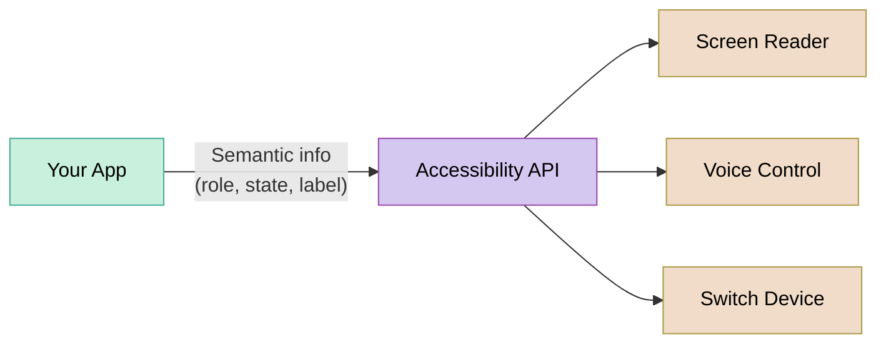

import RevealJS, { Slide } from '@site/src/components/RevealJS';
import Img from '@site/src/components/Img';
import PollSlide from '@site/src/components/PollSlide';

<RevealJS transition="slide">

{/* ============================================ */}
{/* COVER IMAGE */}
{/* ============================================ */}

<Slide>
  

<aside className="notes">
**Lecture overview:**
- **Total time:** ~50 minutes
- **Prerequisites:** L24 (Usability), L27 (User-Centered Design)
- **Connects to:** GA0 accessibility deliverable, GA1 implementation requirements

**Structure (~28 slides):**
- Arc 1: From Usability to Accessibility and Inclusivity (~30 min) — running example (adding a device in SceneItAll), spectrum, curb cut effect, GenderMag/SESMag with Fee vs. Dav walkthrough, invisible assumptions table, assistive technologies (vision, motor/hearing)
- Arc 2: POUR Framework + Assistive Tech in Practice (~15 min) — POUR principles with running example connections, standard vs. custom widget comparison, five rules checklist, keyboard navigation
- Arc 3: Evaluating Accessibility Claims (~15 min) — evaluation tiers, Google Maps exercise, connection to group project
- Key Takeaways (~2 min)

**Running example:** "Adding a new device in SceneItAll" — introduced early, revisited through different user lenses (blind, tremors, Dav/Fee, ESL) across all three arcs.

**Narrative spine:** In L24 and L27 we learned to design for users. Today we ask: *which* users? We'll discover that designing for users at the margins improves software for everyone — and that our invisible assumptions about who users are can exclude entire populations.

> **Transition:** Let's start with the learning objectives...
</aside>

</Slide>

{/* ============================================ */}
{/* TITLE SLIDE */}
{/* ============================================ */}

<Slide>

# CS 3100: Program Design and Implementation II

## Lecture 28: Accessibility and Inclusivity

  &copy;2026 Jonathan Bell & Ellen Spertus, CC-BY-SA

<aside className="notes">
**Context from previous lectures:**
- L24: Usability — five aspects, Nielsen's heuristics, evaluating interfaces
- L27: User-Centered Design — personas, wireframes, prototyping, designing with users
- Today: We extend both by asking — whose needs are we missing?

**Key theme:** When we design for the margins, we improve the experience for everyone.

> **Transition:** Here's what you'll be able to do after today...
</aside>

</Slide>

{/* ============================================ */}
{/* LEARNING OBJECTIVES */}
{/* ============================================ */}

<Slide>

## Learning Objectives

After this lecture, you will be able to:

<ol style={{fontSize: '0.75em', textAlign: 'left'}}>
  <li>Distinguish between accessibility and inclusivity, and explain why both matter</li>
  <li>Identify how invisible assumptions about users exclude people by gender, SES, ability, and context</li>
  <li>Apply the POUR framework (Perceivable, Operable, Understandable, Robust) to evaluate software</li>
  <li>Describe what assistive technologies need from your code to function</li>
  <li>Critically evaluate accessibility claims and identify what counts as real evidence</li>
</ol>

<aside className="notes">
**Time allocation:**
- Objective 1-2: Accessibility vs. inclusivity, GenderMag/SESMag (~12 min)
- Objective 3-4: POUR framework and assistive tech (~13 min)
- Objective 5: Evaluating claims + Google Maps exercise (~20 min)

**Why this matters:** Your GA0 accessibility plan wasn't hypothetical. In GA1, your features need to be keyboard-navigable and work with standard assistive technologies. Today gives you the framework to do that well.

→ Let's start where we left off in L24 and L27...
</aside>

</Slide>

{/* ============================================ */}
{/* ARC 1: ACCESSIBILITY AND INCLUSIVITY (~25 min) */}
{/* ============================================ */}

<Slide>

## We Designed for Users — But Which Ones?

In <a href="/lecture-notes/l24-usability">L24</a> we learned to evaluate usability. In <a href="/lecture-notes/l27-ucd">L27</a> we learned to design with users in mind.

But when we design, we make assumptions about who our users are:

<ul style={{fontSize: '0.8em'}}>
  <li>They can <strong>see</strong> the screen</li>
  <li>They can <strong>use a mouse</strong></li>
  <li>They have a <strong>reliable device</strong> with <strong>fast internet</strong></li>
  <li>They're <strong>comfortable</strong> with technology jargon</li>
  <li>They <strong>trust</strong> that they can undo mistakes</li>
</ul>

These assumptions are so embedded in our mental models that we don't notice them — until someone who doesn't fit them tries to use our software and can't.

<aside className="notes">
**Key insight:** This isn't about carelessness — it's about invisible defaults. Most developers are young, tech-savvy, sighted, able-bodied, English-fluent, with fast internet and their own devices. We design for ourselves without realizing it.

**Connection to GA0:** "Did any of your personas have a disability? Were over 60? Speak English as a second language? Use a shared computer at a library?"

Most students will realize their personas were basically... themselves.

> **Transition:** Let's make this concrete with an example we'll follow through the whole lecture...
</aside>

</Slide>

<Slide>
## Poll: What disabilities do you or people you care about have?

<PollSlide username='espertus'
  choices={[
    "Mobility 🦼 👋",
    "Visual 🦯 🐕‍🦺",
    "Hearing 🧏 🦻",
    "Neurological 🧠 ♾️",
    "Psychiatric 💚 🌀",
    "Other ❤️‍🩹"
  ]}
/>
<aside className="notes">
- Multiple answer Poll
- Acknowledge limitations of survey
</aside>
</Slide>

<Slide>

## Social Model of Disability

**Impairment**

An absence of normal function due to an injury or disorder
* Near-sightedness
* Deafness
* Tremor

**Assistive technology**

A tool that helps impaired individuals function despite impairments
* Eyeglasses*
* Hearing aid
* Mechanical keyboard

**Accommodation**

A modification to a process or environment for inclusion of an individual
* Access to electronic content
* Captions
* Scribe or permission to type

**Disability**

An inability to participate in activities due to unaccommodated impairments
* Inability to use a website
* Inability to follow a lecture
* Inability to use an iPad

<aside className="notes">

</aside>

</Slide>

<Slide>

## From Accommodation to Accessibility

| | Who acts | For whom |
|---|---|---|
| **Accommodation** | An institution | A specific person |
| **Assistive technology** | The individual | Themselves |
| **Accessibility** | A designer/developer | Everyone |

<aside className="notes">

</aside>

</Slide>

<Slide>

## Accessibility ↔ Inclusivity: A Spectrum, Not a Binary

**Accessibility**

Ensuring software works for users with disabilities. Often a **legal requirement** (ADA, WCAG).

**Inclusivity**

Ensuring software works across all dimensions of human diversity: age, gender, culture, language, SES, cognitive style.

| Scenario | Where on the spectrum? |
|----------|----------------------|
| A blind user navigating with a screen reader | Accessibility |
| An elderly user struggling with small touch targets | Both |
| A user in bright sunlight who can't see their phone | Situational accessibility |
| A non-native English speaker confused by idiomatic button labels | Inclusivity |

<aside className="notes">
**Why the spectrum matters:** The boundary between accessibility and inclusivity is blurry — and that's the point. A user in bright sunlight has a temporary visual impairment. A user with a broken arm has a temporary motor impairment. Designing for permanent disabilities often solves situational ones too.

**Legal context:** Accessibility is legally required in many contexts (Section 508 for government, ADA for public-facing services, EU Accessibility Act). Inclusivity is rarely legally required but is often a business and ethical imperative.

> **Transition:** This isn't just a moral argument. It's a legal one...
</aside>

</Slide>

<Slide>

## This Is Not Optional: Robles v. Domino's Pizza

**The situation:** Guillermo Robles, who is blind, wants to order a pizza. Not a complicated request. He uses a screen reader — the same tool millions of blind people use to navigate the web every day. But Domino's website and app are unusable: images have no alt text, links have no descriptions, and redundant navigation traps his screen reader in loops. He can't browse the menu. He can't use a coupon. He can't place an order.

**The timeline:**

- **2016:** Robles sues under the ADA. District court dismisses — *"the ADA doesn't apply to websites."*
- **2019:** Ninth Circuit reverses — the ADA **does** apply, because Domino's website is a "service of a public accommodation" connected to its physical restaurants.
- **2019:** Domino's petitions the **Supreme Court.** The Court **declines to hear the case.**
- **2021:** Judge orders Domino's to comply with WCAG 2.0 accessibility standards.
- **2022:** Domino's settles. **Six years of litigation** over fixes that would have taken a developer days.

It shouldn't take 6 years and a federal case to order a pizza.

Sources: <a href="https://www.boia.org/blog/the-robles-v.-dominos-settlement-and-why-it-matters">BOIA: The Robles v. Domino's Settlement</a> · <a href="https://www.eater.com/2019/7/25/8930669/dominos-supreme-court-website-accessible-blind-users">Eater: Domino's and the Supreme Court</a>

<aside className="notes">
**The human angle:** This is worth pausing on. Robles didn't want to make legal history. He wanted a pizza. The entire case exists because a multibillion-dollar company's website couldn't do the equivalent of putting alt text on an image.

**Why this case matters for students:**
1. It establishes that the ADA applies to websites and apps — not just physical spaces. This is settled law (at least in the Ninth Circuit, and the Supreme Court declined to overturn it).
2. The specific violations were *trivial* to fix: missing alt text, unlabeled links, poor keyboard navigation. These are the exact things we'll cover today with POUR.
3. Domino's didn't lose because accessibility is hard. They lost because they chose to fight rather than fix. The engineering cost of compliance was negligible compared to six years of legal Fays.

**The irony:** The three violations — no alt text, no link descriptions, redundant links — are all things automated testing tools catch. Domino's could have run a free scan and found these issues in minutes.

**The legal principle:** The court ruled that when a website has a "nexus" to a physical business — meaning it's one of the primary ways customers access the business's services — it falls under ADA Title III. Since Domino's website and app are how most customers order pizza, they're covered.

**Connection to course:** "When you build your group project features, keyboard navigation and labeled elements aren't nice-to-haves. They are legal requirements for public-facing software."

**Other notable cases to mention if asked:** Target ($6M settlement, 2008), Winn-Dixie (2017), Beyoncé's Parkwood Entertainment (2019). The trend is clear and accelerating — web accessibility lawsuits have increased every year since 2017.

> **Transition:** So accessibility is legally required. But there's a deeper reason to care — designing for the margins actually improves software for everyone...
</aside>

</Slide>

<Slide>

## The Curb Cut Effect: Design for the Margins, Improve It for Everyone

<aside className="notes">
**The history:** Curb cuts are surprisingly recent. The first one was installed in Kalamazoo, Michigan in 1945 — as a pilot program for disabled WWII veterans returning home. For decades they remained rare. It wasn't until the **Americans with Disabilities Act (ADA) in 1990** — only 36 years ago — that curb cuts were mandated nationwide. Before 1990, a wheelchair user in most American cities simply could not cross the street independently. Today we can't imagine a sidewalk without them.

**The paradox:** Something that now seems obviously necessary for *everyone* was fiercely resisted as a "special accommodation" for a small group. The same pattern plays out in software accessibility: features dismissed as niche end up improving the product for all users.

**Software equivalents:**
- **Captions:** Help deaf users AND people watching in noisy environments
- **Keyboard navigation:** Helps motor-impaired users AND power users who hate reaching for the mouse
- **Plain language:** Helps cognitive disabilities AND non-native speakers AND everyone in a hurry
- **High contrast:** Helps low-vision users AND anyone using their phone outside

**Key takeaway:** Accessibility features are not special accommodations for a small group — they're improvements that help everyone. This is the strongest business case for accessibility.

> **Transition:** The curb cut effect covers sensory and motor accessibility. But there's a broader kind of exclusion too...
</aside>

</Slide>

<Slide>

## Beyond Ability: Software Also Excludes by Cognitive Style

Accessibility focuses on sensory and motor abilities. But software also excludes people through assumptions about how they <em>think</em> and <em>behave</em>:

<ul style={{fontSize: '0.8em'}}>
  <li><strong>Risk tolerance</strong> — Will users experiment freely, or stick to what's safe because they can't afford to lose work?</li>
  <li><strong>Self-efficacy</strong> — When something goes wrong, do they blame the software or themselves?</li>
  <li><strong>Relationship to authority</strong> — Do they see an error message as a suggestion to work around, or a verdict they can't challenge?</li>
  <li><strong>Communication literacy</strong> — Can they parse jargon, idioms, and complex instructions?</li>
  <li><strong>Access to technology</strong> — Own device with fast internet, or shared library computer with 30 minutes?</li>
</ul>

Research frameworks like <strong>GenderMag</strong> (Burnett et al.) and <strong>SESMag</strong> study how these facets vary by gender and socioeconomic status — and how software designed for one end of the spectrum systematically excludes the other.

These aren't deficits in the user — they're assumptions in the software.

<aside className="notes">
**GenderMag** is a research framework from Oregon State (Margaret Burnett and colleagues) identifying cognitive facets that vary statistically by gender: risk tolerance, self-efficacy, information processing style, etc.

**SESMag** extends this to socioeconomic status. People from different SES backgrounds interact with technology differently — not because of ability, but because of experience, access, education, and life circumstances. Key personas: "Fee" (high SES, experiments freely, blames the tool, comfortable with jargon) vs. "Dav" (low SES, sticks to familiar features, blames themselves, struggles with tech vocabulary).

**Examples to mention verbally:**
- "Session expired, please re-authenticate" — Fee logs back in. Dav on a shared computer thinks they're locked out.
- "Are you sure? This action cannot be undone" — Fee clicks through. Dav avoids the feature entirely.
- Auto-save to the cloud — great with reliable internet, silent data loss without it.

**Key insight for students:** Most of you are closer to Fee. You design for Fee by default. That's not malicious — it's invisible.

> **Transition:** Let's see what this looks like with our running example...
</aside>

</Slide>

<Slide>

## Running Example: Adding a New Device

Let's follow one user task through this entire lecture: <strong>adding a new smart light to SceneItAll.</strong>

The flow seems simple:

1. Click "Add Device" button
2. App scans the network and discovers a new light
3. Name the device and assign it to a room
4. Set initial brightness and color
5. Save and confirm the device appears in your dashboard

Now imagine this flow used by:

<ul style={{fontSize: '0.8em'}}>
  <li>A <strong>blind user</strong> navigating with a screen reader</li>
  <li>A user with <strong>tremors</strong> who can't drag a brightness slider precisely</li>
  <li>A user on a <strong>shared tablet</strong> at an assisted living facility with 10 minutes left</li>
  <li>A user whose <strong>first language isn't English</strong>, trying to parse "Zigbee pairing timeout"</li>
</ul>

Same feature. Same five steps. Completely different experience — depending on who the user is.

<aside className="notes">
**This is the throughline for the lecture.** We'll return to this device setup flow repeatedly:
- Accessibility vs. inclusivity spectrum: which of these users face accessibility barriers vs. inclusivity barriers?
- POUR: walk through each principle against this flow
- Assistive tech: what does each tool need from this flow to work?
- Evaluation: would automated testing catch problems in this flow?

Don't spend too long here — just plant the example. It pays off when you reference it later.

> **Transition:** These different experiences exist on a spectrum...
</aside>

</Slide>

<Slide>

## Same Feature, Different Experience: Adding a Device

**Fee** (high self-efficacy, high risk tolerance)

1. Clicks "Add Device" — immediately starts network scan
2. Sees "Zigbee pairing timeout" — shrugs, moves the device closer to the hub and retries
3. Notices the default room is wrong — changes it to "Bedroom" without hesitation
4. Drags the brightness slider to 70%, hits "Save" without reading the confirmation
5. **Total time: 60 seconds**

**Dav** (low self-efficacy, low risk tolerance)

1. Looks for "Add Device" — not sure which button it is (icon only, no label)
2. Sees "Zigbee pairing timeout" — thinks *they* broke something. Doesn't know what Zigbee is. Doesn't retry.
3. Wants to change the room but the dropdown says "Assign to Area" — not sure what "Area" means in this context
4. Reads the confirmation dialog. Sees "Override existing device configuration?" — panics and clicks Cancel
5. **Gives up. Device not added.**

The interface didn't change. The user did. Every design decision — icon-only buttons, technical error messages, jargon in dialogs — is a filter that selects for one kind of user and excludes another.

<aside className="notes">
**This is the core GenderMag/SESMag insight made concrete.** Walk through each step and ask students: which design decision caused Dav's different experience?

- Step 1: Icon-only button → recognition vs. recall (H6). Fee recognizes it from other apps. Dav doesn't.
- Step 2: "Zigbee pairing timeout" → developer language. Fee blames the tool. Dav blames themselves.
- Step 3: "Assign to Area" → internal jargon. Fee guesses it means room. Dav isn't sure and hesitates.
- Step 4: "Override existing device configuration?" → scary confirmation. Fee ignores it. Dav can't proceed without understanding what "override" means.

**The punchline:** Dav is not a less capable user. Dav is a user your software wasn't designed for. These are fixable design choices, not user deficits.

**Connection to GA0:** "Look at your personas. Are any of them closer to Dav than Fee? If not, you're only designing for one end of the spectrum."

> **Transition:** We've been talking about cognitive and social exclusion. Now let's look at how users with physical disabilities interact with software...
</aside>

</Slide>

<Slide>

## What's Different Between These Two Interfaces?

Both interfaces add a device. Both have the same features. Look at the two versions and identify: <strong>what assumptions does the left version make about its users that the right version doesn't?</strong>

<aside className="notes">
**This is a class discussion prompt.** Give students 1–2 minutes to study the image and call out differences. As they identify each one, connect it to who gets excluded and why.

**Answers to draw out (if students don't get there on their own):**

| What students might notice | The assumption | Who it excludes | The fix (right side) |
|-----------|----------------|-----|-----|
| Icon-only button vs. labeled button | User can see and recognize the plus icon | Blind users, low-vision users, unfamiliar users | Add text label: "Add Device" |
| Slider-only vs. slider + text input | User can precisely drag a slider | Users with tremors, keyboard users | Add a numeric text input alongside the slider |
| Technical error vs. plain language error | User can read "Zigbee pairing timeout" | Non-technical users, ESL speakers | "Could not connect. Try moving it closer and click Retry." |
| Color-only status vs. color + text status | User can distinguish red from green | Colorblind users (~8% of men) | Add text labels: "Connected" / "Searching..." |
| "Assign to Area" vs. "Choose a room" | User understands internal terminology | Non-technical users, new users | Use plain language matching the user's mental model |
| No reassurance vs. "You can change this later" | User trusts that actions won't break things | Low self-efficacy users (Dav) | Add reassuring text, show undo is possible |

**Point out the pattern:** Most of these fixes are *also* better for the "default" user. Text labels help everyone. Progress indicators help everyone. Plain language helps everyone. Curb cut effect in action.

**Punchline:** Every design choice on the left is an invisible assumption about who your user is. The right side doesn't assume — it accommodates.

> **Transition:** Now let's understand the specific technologies these users rely on...
</aside>

</Slide>

<Slide>

## What's Inaccessible about this User Interface?

<aside className="notes">
When Ellen types her login password on a Mac keyboard, she can't tell if
she's getting it right because she only sees asterisks, and Northeastern
requires long passwords.
</aside>

</Slide>

{/* ============================================ */}
{/* ASSISTIVE TECHNOLOGIES */}
{/* ============================================ */}

<Slide>

## How Do Users With Disabilities Use Software?

Before we talk about how to design for accessibility, let's understand what users are actually working with. These are not exotic tools — they ship with the devices you already own.

<aside className="notes">
**Frame this section:** Students often think assistive technology is specialized hardware they've never seen. In reality, every phone and laptop they own has these tools built-in. The next two slides cover vision, then motor and hearing.

> **Transition:** Let's start with how users with visual impairments interact with software...
</aside>

</Slide>

<Slide>

## Assistive Tech: Vision

**Screen readers** convert the visual interface to audio. They announce text, buttons, headings, form fields, and their states — all read aloud. Users navigate entirely by keyboard commands, not by looking at the screen.

*Built-in:* VoiceOver (Mac/iPhone), TalkBack (Android), Narrator (Windows)

**Screen magnifiers** enlarge a portion of the screen (2x–16x). Users see only a small area at a time and pan around — they never see your whole interface at once.

*Built-in:* Zoom (Mac/iPhone), Magnifier (Windows/Android)

**High contrast / color adjustments** change the color palette for users who are colorblind or have low vision. Your interface needs to still make sense when colors shift.

*Built-in:* Display settings on every major OS

<aside className="notes">
**Demo option (high impact, 2 min):** Turn on VoiceOver (Cmd+F5 on Mac) and tab through the course website for 30 seconds. Students will hear what a screen reader actually sounds like. Turn it off (Cmd+F5 again). This creates more understanding in 30 seconds than 10 minutes of explanation.

**Screen magnifier point:** Students intuitively think about blindness but forget about low vision. Low-vision users can see *some* of your interface — but only a tiny piece at a time. This means spatial layout matters differently: related controls need to be close together, not spread across the screen.

**Key takeaway:** For screen readers to work, your software must provide *semantic information* — what things are, not just what they look like. We'll get into this more with the POUR framework.

> **Transition:** Now let's look at how users with motor and hearing impairments interact with software...
</aside>

</Slide>

<Slide>

## Simulating Poor Vision

* [silktide browser extension](https://silktide.com/toolbar/) (Chrome and Edge)
  * Cataracts & Myopia
  * Glare
  * Yellowing
  * Loss of peripheral vision
  * Loss of central vision
  * Double vision
  * Loss of contrast

* Set Zoom to 400%
  * Windows: `Ctrl` + `+`
  * macOS: `Cmd` + `+`

Check the [course schedule](https://nubanner.neu.edu/StudentRegistrationSsb/ssb/term/termSelection?mode=search)
to see what Khoury classes are offered online during the summer.

<aside className="notes">

</aside>

</Slide>

<Slide>

## Assistive Tech: Motor &amp; Hearing

**Keyboard-only navigation** — Tab between elements, Enter to activate, arrow keys within components. No mouse, no touchpad. Used by people with motor impairments, repetitive strain injuries, and power users who prefer keyboard shortcuts.

**Voice control** — Users speak commands: "Click Import," "Press Tab," "Scroll down." The software maps spoken words to UI elements by their labels. If your button doesn't have a label, voice control can't target it.

**Switch devices** — A single button (or sip-and-puff tube) that cycles through interface elements one at a time. Interaction is extremely slow — every unnecessary focusable element adds real time. Poor focus order isn't just annoying; it's exclusionary.

**Captions and transcripts** — Text alternatives for audio content. Used by deaf and hard-of-hearing users, but also by anyone in a noisy environment or watching without sound.

<aside className="notes">
**Switch devices** are worth pausing on. Most students have never considered this use case. Show them the math: if your app has 50 focusable elements and someone navigates with a single switch, they press that switch up to 50 times to reach the last element. Every fake button, every decorative element in the tab order, costs them a press.

**Voice control** is increasingly mainstream — Siri, Google Assistant, Alexa are all voice control. The difference is that motor-impaired users rely on it as their *only* input method, not a convenience.

**Captions** are the classic curb cut: built for deaf users, used by everyone watching TikTok on mute.

> **Transition:** Now that we know what assistive technologies exist, let's look at a framework for making sure our software works with them...
</aside>

</Slide>

<Slide>

## Simulating a Motor disorder

Use your non-dominant hand to find out what time office hours are today.

<aside className="notes">

</aside>

</Slide>

{/* ============================================ */}
{/* POUR FRAMEWORK */}
{/* ============================================ */}

<Slide>

## POUR: A Framework for Accessible Software

The Web Content Accessibility Guidelines (WCAG) organize accessibility around four principles:

**Perceivable** 👁️

Information must be presentable in ways users can sense

**Operable** ✋

Interface must be usable through multiple input methods

**Understandable** 🧠

Information and operation must make sense to users

**Robust** ⚙️

Must work reliably with assistive technologies

While originally for web content, POUR applies to any software interface — desktop apps, mobile apps, anything with a UI.

<aside className="notes">
**POUR is your checklist.** When evaluating any interface — yours or someone else's — walk through these four questions:
1. Can the user *perceive* the information? (What if they can't see? Can't hear?)
2. Can the user *operate* the controls? (What if they can't use a mouse?)
3. Can the user *understand* what's happening? (What if they don't speak the jargon?)
4. Does it *work* with assistive technology? (Screen readers, voice control, switches?)

> **Transition:** Let's look at each principle with examples you'll recognize...
</aside>

</Slide>

<Slide>

## Perceivable: Can the User Sense It?

Never use color alone to convey meaning.

**Wordle (before colorblind mode)**

🟩🟨⬜ — Green = correct, Yellow = wrong position, Gray = not in word

~8% of men are red-green colorblind. Green and yellow squares were indistinguishable.

**Wordle (with high-contrast mode)**

🟧🟦⬜ — Orange = correct, Blue = wrong position

Added distinct shapes + different colors that are distinguishable by colorblind users.

<strong>Text alternatives:</strong> Every image needs alt text. Every icon needs a label. Instagram auto-generates: <em>"Photo may contain: 2 people, outdoor, smiling."</em> Without it, a screen reader just says <em>"image."</em>

<aside className="notes">
**Wordle is a great example** because most students have played it. The colorblind mode was added after launch — it should have been there from the start.

**Alt text example:** Ask students: "Have you ever had someone text you a meme with no context? That's what every image on the internet is like for a screen reader user."

**Instagram example:** Instagram's auto-generated alt text isn't great, but it's better than nothing. The best approach is author-written alt text that conveys the *meaning* of the image, not just its literal content.

**Running example connection:** In the SceneItAll device setup flow — device status is shown with colored circles only (red/green). Without text labels, a colorblind user can't tell if the device is connected. The device icon has no alt text — a screen reader user doesn't know what type of device was found.

> **Transition:** Can users interact with it?
</aside>

</Slide>

<Slide>

## Operable: Can the User Interact With It?

Every action possible with a mouse must also be possible with a keyboard.

**The volume slider problem:**

Many media players have a volume slider that works perfectly with a mouse — click and drag. But try it with a keyboard:

- Some sliders: arrow keys adjust volume in steps ✅
- Some sliders: Tab skips right over it — no keyboard interaction at all ❌
- Some sliders: you can focus it but the arrow keys scroll the page instead ❌

**Who needs this?**
- Users with motor impairments who can't use a mouse
- Users with tremors who can't perform precise drag gestures
- Power users who prefer keyboard shortcuts
- Anyone whose hands are full, wet, or injured

<strong>The fix is almost always:</strong> use standard UI components. They get keyboard support for free.

<aside className="notes">
**Key principle:** If you build a custom widget from scratch (a custom slider, a custom dropdown, a custom button made from a div), you have to implement keyboard support yourself. If you use a standard component from your UI framework, it comes built in.

**Connection to GA1:** Standard UI components from any framework support keyboard navigation automatically. If you build custom components from scratch, you need to handle this yourself.

**Running example connection:** The device setup flow requires dragging a brightness slider precisely. A user with tremors can't do this accurately. A keyboard user can use arrow keys — but only if the slider is focusable. Fix: provide a text input as an alternative to the slider.

> **Transition:** Can users understand what's happening?
</aside>

</Slide>

<Slide>

## Understandable: Does It Speak the User's Language?

**Developer language**

- `Error 403: Forbidden`
- `NullPointerException in Parser.parse() at line 247`
- `detached HEAD state`
- `Syncing... (retry 3/5, exponential backoff)`

**User language**

- "You don't have permission to view this page. Try logging in."
- "We couldn't read that image. Try a clearer photo."
- "You're looking at an older version. Switch to the latest?"
- "Reconnecting... this may take a moment."

Remember <a href="/lecture-notes/l24-usability">Nielsen's Heuristic #2</a>: <em>Match between system and the real world.</em> Speak the user's language, not yours.

<aside className="notes">
**Git's "detached HEAD state"** always gets a laugh — it's famously incomprehensible to beginners. It's a perfect example of software that is technically accurate but completely fails the "understandable" principle.

**Connection to SESMag:** Dav struggles with tech jargon and complex sentence structures. Fee can parse "exponential backoff." Most users are closer to Dav than Fee for unfamiliar software.

**Connection to GA0:** This is why you created a user-facing terminology table — so your team uses consistent, user-friendly language.

**Running example connection:** "Zigbee pairing timeout" → Dav doesn't know what Zigbee means. "Could not connect to the device. Try moving it closer to your hub." → everyone understands.

> **Transition:** The last principle — does it work with assistive technology?
</aside>

</Slide>

<Slide>

## Robust: Does It Work With Assistive Technology?

Your app doesn't exist in isolation. It communicates with the operating system's <strong>accessibility API</strong>, which communicates with assistive technologies:

<strong>Standard UI components</strong> (buttons, text fields, checkboxes) participate in this chain automatically. 
<strong>Custom widgets</strong> built from scratch are invisible to assistive tech unless you wire them up manually.

<aside className="notes">
**The key insight:** Robustness is mostly about using the right building blocks. If you use your framework's standard button component, a screen reader knows it's a button, knows its label, knows if it's disabled. If you make something that *looks* like a button but isn't one, the screen reader has no idea it's there.

**Practical rule for GA1:** Use standard UI components whenever possible. If you must build something custom, you'll need to set accessibility properties manually (which is much more work).

> **Transition:** Let's see what this actually looks like...
</aside>

</Slide>

<Slide>

## What You Build vs. What Assistive Tech Sees

Back to our running example — the "Add Device" button in SceneItAll:

**Standard button component**

What the user sees: a clickable "Add Device" button

What a screen reader announces: *"Add Device, button"*

What a keyboard user experiences: Tab highlights it, Enter activates it

What voice control hears: "Click Add Device" → works

**Custom-built fake button**

What the user sees: something that *looks* identical

What a screen reader announces: *...nothing.* It's invisible.

What a keyboard user experiences: Tab skips right over it. No way to activate it.

What voice control hears: "Click Add Device" → *"No matching element found"*

They look the same on screen. They are completely different to assistive technology.

<aside className="notes">
**This is the single most important technical point in the lecture.** Students will encounter this distinction when they start building GUIs in L29.

**What makes a "real" button?** It's a component from your UI framework's standard library. The framework tells the operating system "this is a button with this label." The OS tells screen readers, voice control, and switch devices.

**What makes a "fake" button?** It's a piece of text or an image that you styled to *look* like a button and attached a mouse click handler to. It looks right on screen but provides no semantic information to the OS. Assistive tech has no idea it exists.

**The fix is almost always simple:** use the real component. You'll learn the specific components in L29.

> **Transition:** Here's the practical checklist...
</aside>

</Slide>

<Slide>

## Five Things That Make Software Work With Assistive Tech

<ol style={{fontSize: '0.8em'}}>
  <li><strong>Use standard components, not custom fakes.</strong> 
  A real button component is automatically announced as "button" by a screen reader. Something that merely looks like a button but isn't one is silent.</li>

  <li><strong>Everything visible needs a text label.</strong> 
  Icons, images, status indicators — if a sighted user gets information from it, there must be a text equivalent.</li>

  <li><strong>Every mouse action has a keyboard equivalent.</strong> 
  Tab to navigate, Enter to activate, Escape to dismiss. Arrow keys within composite widgets.</li>

  <li><strong>When something changes on screen, announce it.</strong> 
  If content updates dynamically (loading complete, error appeared, list filtered), screen readers need to be told.</li>

  <li><strong>Focus goes where the user expects.</strong> 
  Dialog opens → focus moves in. Dialog closes → focus returns to the button that opened it. Never leave users stranded.</li>
</ol>

<aside className="notes">
**This is the practical checklist for GA1.** Students don't need to become accessibility experts — they need to follow these five rules.

Rules 1 and 3 are the most important for their projects. If they use standard components and ensure keyboard operability, they'll cover most of the low-hanging fruit.

**Focus management (rule 5)** is the one students are least likely to think about. Give a concrete example: "You click 'Add Device,' a setup dialog appears. You're a screen reader user. If focus doesn't move to the dialog, you don't know it appeared. You hear nothing. You press Tab and end up in the footer."

> **Transition:** Let's talk about how keyboard navigation should feel...
</aside>

</Slide>

<Slide>

## Keyboard Navigation: The Hidden Contract

The standard keyboard navigation contract:

| Key | Action |
|-----|--------|
| **Tab** | Move to next interactive element |
| **Shift+Tab** | Move to previous interactive element |
| **Enter** | Activate the focused element (click a button, follow a link) |
| **Space** | Toggle (checkboxes, expand/collapse) |
| **Arrow keys** | Navigate within a component (menu items, radio buttons, tabs) |
| **Escape** | Close/dismiss (dialogs, dropdowns, menus) |

<strong>Focus must be visible.</strong> Users need to see which element is currently focused. If you remove the focus outline (a common CSS sin), keyboard users are flying blind.

<aside className="notes">
**This slide is reference material** students can come back to when implementing GA1.

**Common mistakes students will make:**
- Removing focus outlines because they "look ugly" — never do this
- Making clickable things that aren't focusable (divs instead of buttons)
- Tab order that doesn't match visual order
- Trapping focus (user tabs into something and can't tab out)

**Demo option:** If time allows, tab through the course website right now and show students what focus looks like, how tab order works, and what happens when it breaks.

> **Transition:** Now — how do we know if software is actually accessible?
</aside>

</Slide>

{/* ============================================ */}
{/* ARC 2: EVALUATING ACCESSIBILITY (~20 min) */}
{/* ============================================ */}

<Slide>

## "We're Accessible!" — But Are They?

How would you evaluate whether an app is actually accessible?

<aside className="notes">
**Set up the critical thinking frame:** Accessibility badges and compliance statements are everywhere. But what do they actually mean? This arc teaches students to be skeptical consumers of accessibility claims — a skill they'll use as developers AND as users.

> **Transition:** There are three levels of accessibility evaluation, and they vary enormously in rigor...
</aside>

</Slide>

<Slide>

## Poll: Who should evaluate whether an app is accessible?

<PollSlide username='espertus'
  choices={["An accessibility expert", "Disabled people", "An automated checker", "The development team"]}
/>

<aside className="notes">
- Multi-select
</aside>

</Slide>

<Slide>

## Three Tiers of Accessibility Evaluation

<aside className="notes">
**Walk through each tier:**

**Automated testing:** Tools like axe, Lighthouse, WAVE scan your interface for violations. Fast and cheap. Good for: missing alt text, low contrast, missing form labels. Bad at: assessing whether the user experience actually makes sense. **Catches only ~30% of accessibility issues.**

**Expert evaluation:** Trained evaluators use assistive technologies (screen readers, keyboard-only) to test key workflows. They can assess user experience and find issues tools miss. Quality depends heavily on evaluator expertise.

**Testing with disabled users:** Real users with disabilities attempt to complete tasks. Reveals actual experience. Small samples may not represent all users, but provides ground truth that nothing else can.

**Key message:** All three are valuable. None alone is sufficient. Automated testing is necessary but not nearly sufficient.

> **Transition:** Let's be specific about what doesn't count...
</aside>

</Slide>

<Slide>

## What Automated Tools Catch vs. Miss

**Catches** ✅

- Missing alt text on images
- Insufficient color contrast ratios
- Missing form labels
- Missing document language
- Duplicate IDs

*Mechanical checks with clear right/wrong answers*

**Misses** ❌

- Alt text that says "image.png"
- Tab order that makes no sense
- Error messages nobody understands
- Keyboard traps you can't escape
- Whether the app actually makes sense to use

*Anything requiring human judgment*

Passing automated tests ≠ accessible. It means you cleared the lowest bar.

<aside className="notes">
**Analogy:** Automated accessibility testing is like a spell checker. It catches "teh" → "the." It doesn't catch "their" when you meant "there." It definitely doesn't catch whether your writing makes sense.

**The 30% number** comes from research by the UK Government Digital Service and others. Automated tools are great at what they do, but what they do is limited.

> **Transition:** There are also some things that *sound* like evaluation but aren't...
</aside>

</Slide>

<Slide>

## What Doesn't Count as Accessibility Evaluation

**🚩 Compliance checklist nobody tested**

"We went through the WCAG checklist and checked every box." Checking boxes doesn't demonstrate that software is accessible — only that someone *believes* guidelines were followed.

**🚩 Empathy simulation**

"Everyone on the team tried using the app blindfolded for 10 minutes." Valuable for building awareness, but tells you how *sighted people experience artificial vision loss*, not how *blind users experience your software*. Blind users have years of screen reader expertise you don't.

**🚩 One testimonial without methodology**

"A blind user said they could use it." Without systematic tasks, multiple participants, and consideration of diverse experiences, individual testimonials don't generalize.

<aside className="notes">
**The empathy simulation point is counterintuitive** and worth dwelling on. Students often think "just try it yourself" is the gold standard. But a sighted person fumbling with a blindfold is not experiencing what a skilled screen reader user experiences. It's like judging a programming language by giving it to someone who's never coded.

**The testimonial point:** Would you ship software based on one user saying it works? No — you'd test with multiple users across different scenarios. Same applies to accessibility.

> **Transition:** Let's experience this ourselves...
</aside>

</Slide>

{/* ============================================ */}
{/* EXERCISE: GOOGLE MAPS */}
{/* ============================================ */}

<Slide>

## Exercise: Google Maps, Keyboard Only

**Setup:** Close your trackpad. Put your mouse aside. Open **Google Maps** in your browser.

**Try these three tasks using only your keyboard:**

1. Search for a restaurant near campus
2. Get walking directions from Olin Library to that restaurant
3. Switch to satellite view

**Hints** (Google Maps does have keyboard support — but can you find it?):
- Press **Ctrl + /** to see all available shortcuts
- Arrow keys move the map; **+** / **-** to zoom
- Tab until the map is focused (look for a highlighted square)

**As you work, note:**
- Where did you get stuck?
- Which POUR principle was violated?
- What worked surprisingly well — and how long did it take you to discover it?

Reference: <a href="https://support.google.com/maps/answer/6396990?hl=en&co=GENIE.Platform%3DDesktop">Google Maps Accessibility Guide</a>

<aside className="notes">
**Time:** Give students 5-6 minutes to attempt the tasks, then 2-3 minutes for debrief.

**If students have accessibility issues themselves:** They can pair with a neighbor or just observe. Don't force anyone to participate.

**Why the hints matter pedagogically:** Google Maps *does* have keyboard navigation — arrow keys to pan, +/- to zoom, Ctrl+/ to show all shortcuts. But most students will never find these without the hints. That's the point: **discoverability is an accessibility issue.** A feature that exists but can't be found is the same as a feature that doesn't exist.

**Google Maps keyboard nav details** (from [Google's accessibility guide](https://support.google.com/maps/answer/6396990)):
- Tab until the map is focused — a highlighted square appears with numbered places below
- Arrow keys move the map; Shift + arrow keys move by one square
- +/- to zoom in/out
- Press the number associated with a place to learn more
- Press 9 to view more places, 8 for previous
- Ctrl+/ shows all shortcuts

**Likely findings (use these to guide debrief discussion):**

| Task | Keyboard experience | POUR principle |
|------|-------------------|----------------|
| Search for a restaurant | Works well — Tab to search box, type, Enter | ✅ Operable |
| Get directions | Doable but clunky — lots of tabbing through irrelevant elements | ⚠️ Operable (efficiency) |
| Switch to satellite view | Hard to find, may require many Tab presses | ❌ Operable (discoverability) |
| Pan/zoom the map | Possible with arrow keys/+/- but most students won't discover it | ⚠️ Operable (discoverability) |
| Street View | Nearly impossible keyboard-only | ❌ Operable |

**Key point for debrief:** Google has one of the largest accessibility teams in the world and billions of users. Keyboard-only map interaction is *still* hard — and even when features exist, they're hard to discover. This demonstrates (a) accessibility is genuinely challenging, (b) discoverability matters as much as capability, and (c) evaluation with real tasks reveals what automated testing never would.

**Discussion prompts:**
- The search worked well because text input is inherently keyboard-friendly. The map interaction struggled because spatial manipulation was designed for mouse/touch.
- Did you find Ctrl+/? How? If not, what does that tell you about discoverability?
- Would any automated tool have caught the map navigation problem? No. It requires a human trying to accomplish a task.
- Google *built* the keyboard support. But if you can't find it, does it count as accessible?

> **Transition:** Let's discuss what you found...
</aside>

</Slide>

<Slide>

## Poll: What Did You Find?

<ol style={{fontSize: '0.8em'}}>
  <li>Where did you get <strong>stuck</strong>? Which task was hardest?</li>
  <li>What <strong>worked well</strong>? Anything surprisingly smooth?</li>
  <li>Which <strong>POUR principle</strong> was violated most often?</li>
  <li>Would an <strong>automated testing tool</strong> have caught the problems you found?</li>
</ol>

            

              Text <strong>espertus</strong> to 22333 if the URL isn't working for you.
            

Google has a massive accessibility team and billions of users. It's still genuinely hard. This is why real evaluation matters.

<aside className="notes">
- This should be a PollEV survey.
**This is a discussion slide — not a reveal.** Let students share before you summarize. Use the likely findings table from the previous slide's notes to validate or supplement what they report.

**Connect back to automated testing:** The punchline is question 4. No automated tool would catch "I can't pan the map with my keyboard." That requires a human attempting a real task. This is why the evaluation pyramid has humans at the top.

> **Transition:** What does all this mean for your group project?
</aside>

</Slide>

{/* ============================================ */}
{/* CONNECTION TO GROUP PROJECT */}
{/* ============================================ */}

<Slide>

## What This Means for Your Group Project

Your GA0 accessibility plan wasn't hypothetical. In GA1, your feature must be usable without a mouse.

**Minimum bar for your feature:**

- ✅ Use standard UI components (buttons, text fields, dropdowns) — they get keyboard support for free
- ✅ Every action is reachable via Tab and activatable via Enter/Space
- ✅ Focus order matches visual order — Tab moves logically through your interface
- ✅ Focus is always visible — never remove focus indicators
- ✅ Dialogs and popups manage focus correctly (trap focus in, return focus out)

**When reviewing a teammate's PR:**

Try their feature keyboard-only before approving. If you can't complete the core workflow without a mouse, request changes.

<aside className="notes">
**Be concrete:** This isn't aspirational — it's a grading criterion. The View Implementation rubric includes "follows accessibility guidelines from your GA0 plan" and "support keyboard navigation."

**The PR review tip** is practical and reinforces both accessibility AND the code review workflow from the git workflow spec.

**Reassurance:** Students don't need to become accessibility experts. Using standard components and testing with their keyboard covers most of the baseline. The POUR framework gives them vocabulary to identify and describe issues when they find them.

> **Transition:** Let's wrap up with the key takeaways...
</aside>

</Slide>

{/* ============================================ */}
{/* KEY TAKEAWAYS + LOOKING AHEAD */}
{/* ============================================ */}

<Slide>

## Key Takeaways

<ol style={{fontSize: '0.8em'}}>
  <li><strong>Design for the margins, improve it for everyone.</strong> The curb cut effect applies to software: accessibility features benefit all users.</li>
  <li><strong>Exclusion isn't always about ability.</strong> SES, gender, culture, and cognitive style shape how people use software. If you only design for your own experience, you exclude a lot of people.</li>
  <li><strong>POUR is your framework.</strong> Perceivable, Operable, Understandable, Robust — use it to evaluate any interface.</li>
  <li><strong>Color alone is never enough.</strong> Always provide redundant cues (text, shape, position).</li>
  <li><strong>Keyboard operability is non-negotiable.</strong> Every mouse action must have a keyboard equivalent.</li>
  <li><strong>Automated testing catches ~30%.</strong> Real evaluation requires humans trying real tasks.</li>
  <li><strong>Try your own feature without a mouse before you ship it.</strong></li>
</ol>

<aside className="notes">
**Reinforce the practical takeaway:** #7 is the single most impactful thing they can do for their group project. Before every PR, tab through your feature. It takes 60 seconds and catches real problems.

**Connection forward:** Next lecture (L29) introduces GUI programming — where they'll start building interfaces. Everything from today applies directly.

> **Transition:** Looking ahead...
</aside>

</Slide>

<Slide>

## Looking Ahead

**Next up: GUI Programming (L29)**
- UI components, layouts, event handling
- Everything from today applies: standard components, keyboard navigation, focus management

**Your group project:**
- GA0 (due Mar 26): Your accessibility plan should reference POUR
- GA1: Your feature implementation must support keyboard navigation
- Code reviews: Try your teammate's feature keyboard-only

**For more depth:**
- Consider enrolling in CS 4973: "Accessibility and Disability"
- Watch [Crip Camp](https://cripcamp.com) (streaming on Netflix) — a documentary about the disability rights movement that led to the ADA
- See Northeastern's [21-Day Accessibility Awareness Learning Path](https://digital-accessibility.northeastern.edu/21-day-accessibility-awareness-learning-path/)

Today we learned to see the users we've been missing. Next, we start building interfaces they can actually use.

<aside className="notes">
**Homework connection:**
- Students should revisit their GA0 accessibility plans with POUR in mind
- They should start thinking about keyboard navigation for their GA1 feature

**CS 4973 plug:** For students who want to go deeper, the accessibility course is a great elective.

> That's it for today. Questions?
</aside>

</Slide>

<Slide>
## Disability Awareness Week

</Slide>

<Slide>

## Bonus Slide

</Slide>

</RevealJS>
