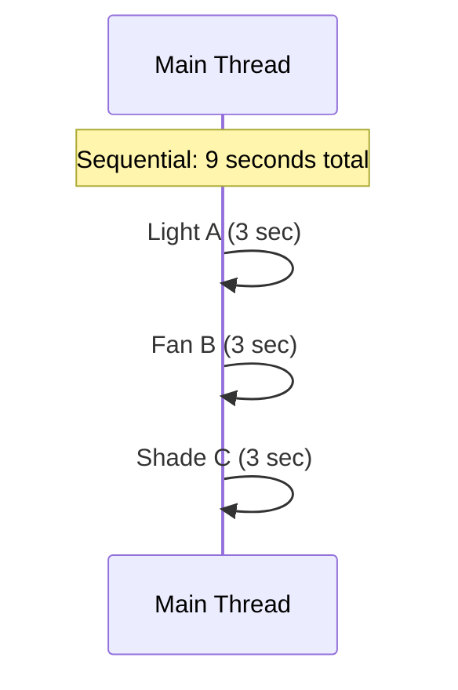
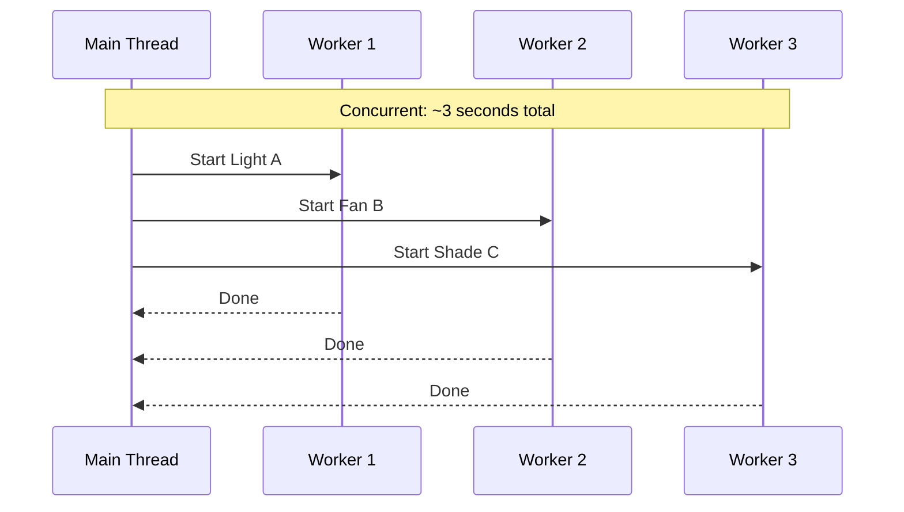
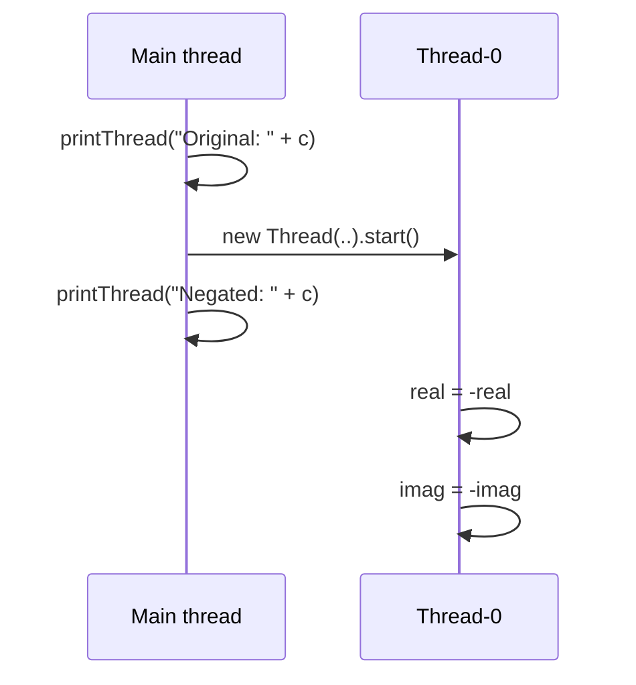
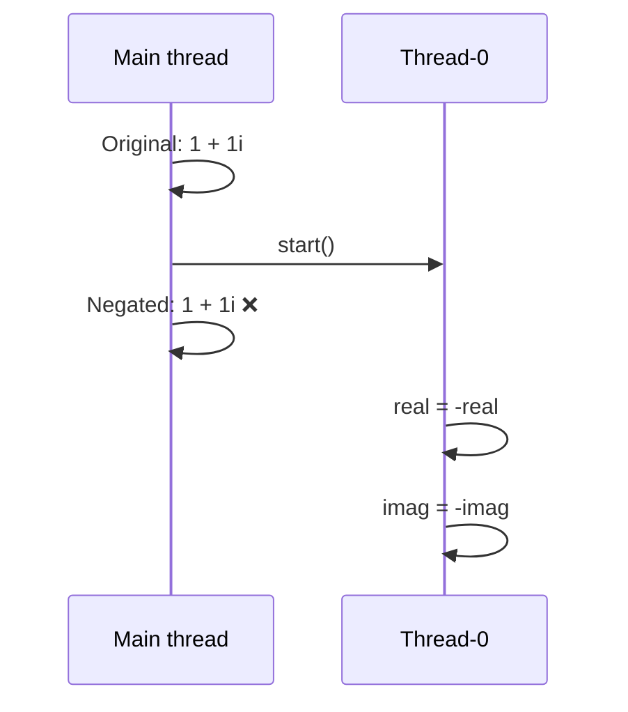
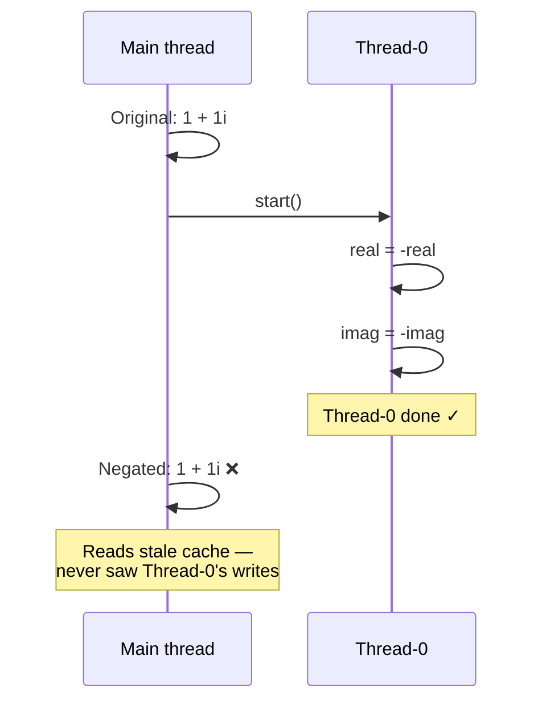
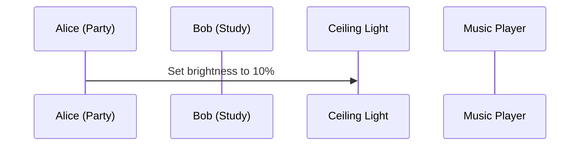
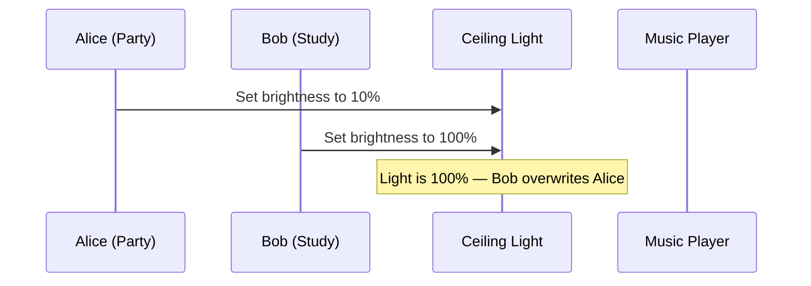
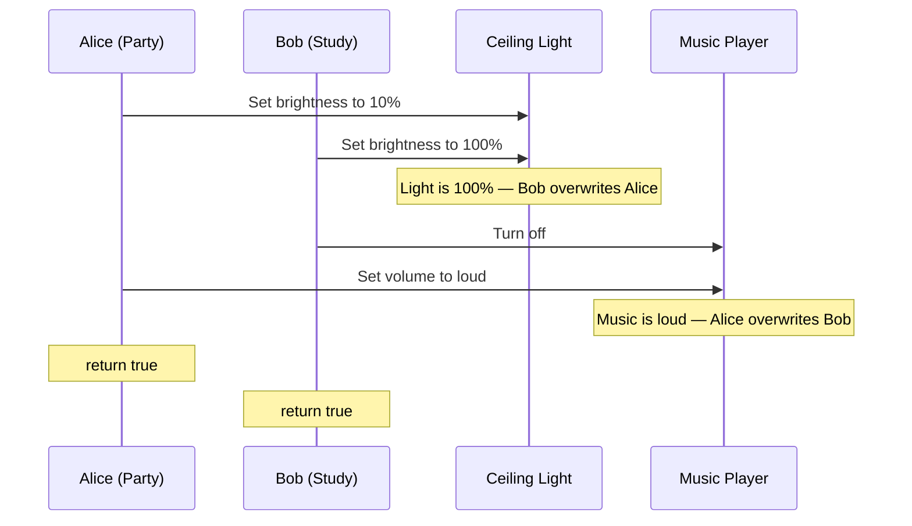
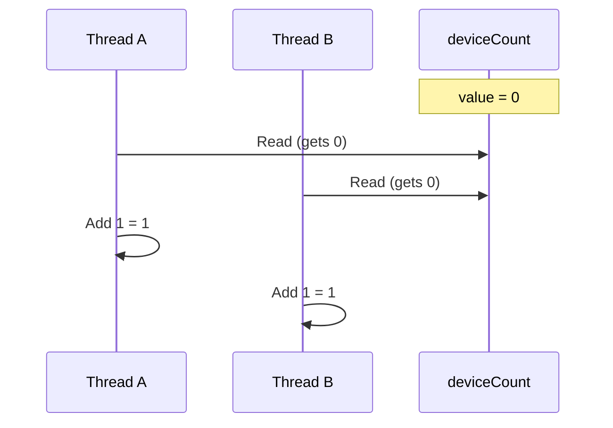
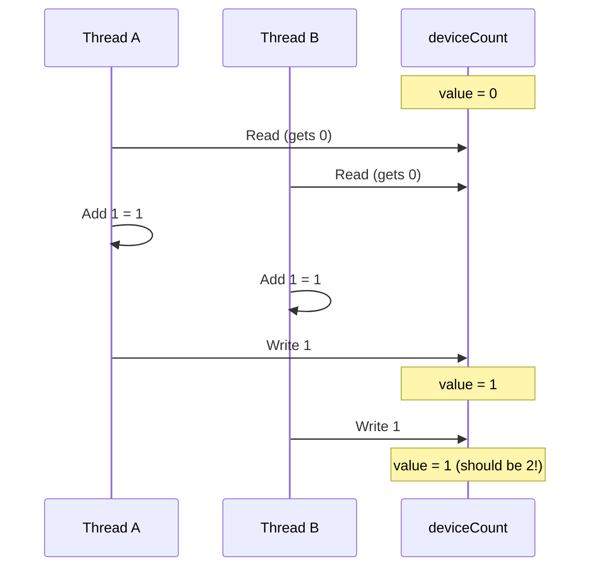

import RevealJS, { Slide } from '@site/src/components/RevealJS';
import Img from '@site/src/components/Img';
import PollSlide from '@site/src/components/PollSlide';

<RevealJS transition="slide">

{/* ============================================ */}
{/* COVER IMAGE */}
{/* ============================================ */}

<Slide>
  

<aside className="notes">
**Lecture overview:**
- **Total time:** ~55 minutes
- **Prerequisites:** L29 (GUIs in Java, event loop), L30 (MVVM, property binding), L12 (Domain Modeling)
- **Connects to:** L32 (Async/CompletableFuture), L33 (Event-Driven Architecture), GA1 (BackgroundTaskRunner)

**Structure (~22 slides):**
- Arc 1: Why Concurrency? + Week Roadmap (~10 min) — motivating scenario, three-lecture overview, concurrency vs parallelism
- Arc 2: Threads (~12 min) — creating threads, thread pools, interrupts
- Arc 3: The Problem — Shared Mutable State (~12 min) — race conditions, atomicity, Java Memory Model
- Arc 4: Solving It — Synchronization (~12 min) — synchronized, fine-grained locking, concurrent collections
- Arc 5: Deadlock (~8 min) — deadlock scenario, Coffman conditions, prevention
- Arc 6: Wrap-Up (~5 min) — comprehension check, takeaways, looking ahead

**Running example:** SceneItAll — the IoT/smarthome platform students know from L2, L13, L29, L30, Labs 11-12. IoT is a natural fit for concurrency: many devices, many users, many network calls, real-time state that must stay consistent.

> **Transition:** Let's start with the learning objectives...
</aside>

</Slide>

{/* ============================================ */}
{/* TITLE SLIDE */}
{/* ============================================ */}

<Slide>

# CS 3100: Program Design and Implementation II

## Lecture 31: Concurrency I — Threads and Synchronization

<p style={{marginTop: '2em', fontSize: '0.8em', color: '#666'}}>
  &copy;2026 Jonathan Bell & Ellen Spertus, CC-BY-SA
</p>

<aside className="notes">
**Context from previous lectures:**
- L29: Built a SceneItAll area dashboard — introduced the event loop. "Long handlers freeze the UI."
- L30: MVVM, property binding, ObservableList, ViewModel testing. Students are deep in the SceneItAll domain.
- L12: Domain modeling — competing actions on the same domain objects. Today we see the technical version of that problem.
- Today: why concurrency matters, how threads work, what goes wrong with shared state, and how to fix it.

> **Transition:** Here's what you'll be able to do after today...
</aside>

</Slide>

{/* ============================================ */}
{/* LEARNING OBJECTIVES */}
{/* ============================================ */}

<Slide>

## Learning Objectives

<p style={{fontSize: '0.85em', textAlign: 'left'}}>
After this lecture, you will be able to:
</p>

<ol style={{fontSize: '0.75em', textAlign: 'left'}}>
  <li>Describe threads as a concurrency mechanism</li>
  <li>Recognize the need for synchronization and atomicity</li>
  <li>Utilize locks and concurrent collections to implement basic thread-safe code</li>
  <li>Understand deadlocks and race conditions</li>
</ol>

<aside className="notes">
**Time allocation:**
- Objective 1: Threads and thread pools (~12 min)
- Objective 2: Shared mutable state, race conditions, atomicity (~12 min)
- Objective 3: synchronized, concurrent collections (~12 min)
- Objective 4: Deadlock scenarios and prevention (~8 min)
- Wrap-up: comprehension check, takeaways (~5 min)

**Connection to GA1:** The GA1 handout provides `BackgroundTaskRunner` — students need to understand what it does internally. Today's concepts are the foundation.

> **Transition:** Let me set the scene...
</aside>

</Slide>

{/* ============================================ */}
{/* ARC 1: WHY CONCURRENCY? + WEEK ROADMAP (~10 min) */}
{/* ============================================ */}

<Slide>

## 50 Devices, 3 Users, 1 Hub

<div style={{fontSize: '0.8em'}}>

SceneItAll's hub manages **50 smart devices** — lights, fans, shades, thermostats — across a whole house.

Three family members walk in and activate scenes **simultaneously** from different rooms:

| User | Scene | Devices | Sequential time |
|------|-------|---------|----------------|
| Alice | "Evening" | 15 devices (dim lights, close shades) | ~5 sec |
| Bob | "Movie Night" | 8 devices (lights off, shades closed) | ~3 sec |
| Carol | "Study" | 6 devices (desk lamp on, overhead dim) | ~2 sec |

</div>

<div style={{fontSize: '0.85em', marginTop: '0.8em'}}>
<strong>Sequential:</strong> 10 seconds of delay — Alice waits, Bob waits longer, Carol waits longest.<br/>

<strong>Concurrent:</strong> All three scenes activate within ~5 seconds.

Remember L29: "long handlers freeze the UI." Same problem — now the hub <em>is</em> the UI.

</div>

<aside className="notes">
To be clear, we're not talking about JavaFX scenes.

→ This week is about concurrency...
</aside>

</Slide>

<Slide>

## The Concurrency Roadmap: This Week and GA1

<div style={{fontSize: '0.75em'}}>

| Lecture | Topic | The question it answers |
|---------|-------|------------------------|
| **L31 (Mon)** | Threads, shared state, synchronization, deadlock | *"Why does my GUI freeze when I load data?"* |
| **L32 (Wed)** | Async programming, CompletableFuture, `Platform.runLater()` | *"How do I load data in the background and update my GUI when it's ready?"* |
| **L33 (Thu)** | Event-driven architecture, consistency, resilience | *"What happens when the service I depend on is slow or down?"* |

</div>

<div style={{fontSize: '0.8em', backgroundColor: 'rgba(147,112,219,0.15)', padding: '0.8em', borderRadius: '8px', marginTop: '0.8em'}}>

**What you'll use in GA1:** When CookYourBooks loads recipes from the repository, that's I/O. If you do it on the main thread, your GUI freezes. The GA1 handout provides **`BackgroundTaskRunner`** — it wraps threads and FX-thread callbacks into `run(callable, onSuccess, onFailure)`. You don't write threading boilerplate, but you **must understand what it does internally** (your TA will ask).

</div>

<aside className="notes">
**The three-lecture arc:** L31 builds the mental model (threads, shared state, locks). L32 gives the practical tool (CompletableFuture, Platform.runLater). L33 zooms out to system-level coordination (events, consistency).

**BackgroundTaskRunner:** This is provided in the GA1 handout code. It wraps javafx.concurrent.Task with daemon threads and FX-thread callbacks. Students call `BackgroundTaskRunner.run(() -> loadData(), data -> updateUI(data), ex -> showError(ex))`. They don't write the threading code, but TAs will ask what happens under the hood during code walks.

**GA1 connection:** The concepts from this week directly address the "Handling asynchronous operations in a GUI context" learning outcome in GA1.

> **Transition:** Before we dive in, let's clarify two terms people often confuse...
</aside>

</Slide>

<Slide>

## Poll: Do multiple apps on your laptop take turns or run simultaneously?

<PollSlide username='espertus'
  choices={["they take turns", "they run at the same time", "some of both", "no idea"]}
/>

<div style={{ fontSize: '.8em' }}>
For example, you might have Spotify, VSCode, and Discord all open at once.
</div>

<aside className="notes">

</aside>

</Slide>

<Slide>

## Concurrency with and without Parallelism

<div style={{ fontSize: '.8em' }}>

**Concurrency**: a program or system with multiple overlapping tasks
* **Time-slicing**: a single core rapidly switching among tasks
* **Parallelism**: multiple cores simultaneously executing different tasks
</div>


<aside className="notes">

<p style={{fontSize: '0.8em', color: '#9370DB'}}>
Your laptop has ~8 cores but hundreds of threads running right now. You get <strong>both</strong>: parallelism across cores, concurrency within each core. The bugs we'll see today apply to all of it.
</p>

**Key distinction:** Concurrency is about *structure* — designing your program to handle multiple things. Parallelism is about *execution* — actually running things at the same time on multiple cores.

**The real world is row 3.** A modern laptop has 8-16 cores, but the OS is running hundreds of threads. Each core time-slices between many threads. You get parallelism (multiple cores) AND concurrency (many threads per core). This is why concurrency bugs are so hard to reproduce — the exact interleaving depends on how the OS schedules threads across cores, which varies every time.

**Analogy:** A single chef (1 core) can manage 3 dishes concurrently by switching between them. Three chefs (3 cores) can work on all three dishes in parallel. A real restaurant kitchen (8 cores, 50 orders) has both — chefs switch between dishes AND work in parallel. If two chefs grab the same pan, you have a problem regardless.

> **Transition:** Let's look at the mechanism Java gives us for concurrency...
</aside>

</Slide>

<Slide>

## Time-Slicing vs. Parallelism


<aside className="notes">

</aside>

</Slide>

<Slide>

## Multiple cores

<div style={{ fontSize: '.8em' }}>
Modern processors have multiple "cores" (mini-processors), each of which can
run a different task, giving true parallelism.

<div style={{display: 'flex', gap: '5rem', alignItems: 'center'}}>
  
  
</div>


Both parallelism and time-slicing are used.
</div>

<aside className="notes">
Left image is licensed from freepik and does not require attribution.
</aside>

</Slide>

<Slide>

## Poll: Parallelism vs. Time-Slicing

Do you use parallelism or time-slicing for taking multiple courses in a semester?

<PollSlide username='espertus'
  choices={["parallelism", "time-slicing", "both", "neither", "not sure" ]}
/>

<aside className="notes">

</aside>

</Slide>


{/* ============================================ */}
{/* ARC 2: Threads with runnable examples */}
{/* ============================================ */}


<Slide>

## A Thread Is an Independent Path of Execution

<p style={{fontSize: '0.8em'}}>
Every Java program has a <strong>main thread</strong>. You can create additional threads that run concurrently.
Threads share the code and <strong>heap</strong> (data memory) but have their own
<strong>stack</strong> (call history) and instruction pointers.
</p>

<div style={{display: 'flex', gap: '2rem', alignItems: 'flex-start'}}>

<div style={{transform: 'scale(1.0)', transformOrigin: 'top left', flex: '0 0 auto'}}>


</div>

<div style={{transform: 'scale(2.4)', transformOrigin: 'top left', flex: '0 0 auto'}}>


</div>

</div>

<aside className="notes">
**Shared heap, separate stacks:** This is the key mental model. The heap is where objects live — Device objects, Scene objects, the ConcurrentHashMap of registered devices. Every thread can see and modify these. The stack is local — each thread's method call frames, local variables, parameters. This is private to each thread.

**The shared heap is what makes concurrency dangerous.** If threads only used their own stacks, there would be no concurrency bugs. The problems start when two threads read and write the same heap objects.

> **Transition:** Let's see the three ways to create threads in Java...
</aside>

</Slide>

<Slide>

## Poll: Do Java threads run in parallel (at the same time)?

If there are ten concurrent threads, do they run in parallel (on 10 different cores)
or using time-slicing on a single core?

<PollSlide username='espertus'
  choices={["they run on 10 different cores", "they run on a single core", "it depends"]}
/>

<aside className="notes">

</aside>

</Slide>


<Slide>

## Counter Example A

<div style={{display: 'flex', gap: '1.5rem', alignItems: 'flex-start'}}>
<div>
```java
public class Counter extends Thread {
  private final String name;
  private int count;
  private final int limit;

  public Counter(String name, int limit) {
    this.name = name;
    count = 0;
    this.limit = limit;
  }

  @Override
  public void run() {
    while (count < limit) {
      count++;
      System.out.println(name + ": " + count);
    }
  }

  public static void main(String[] args) {
    Counter counter1 = new Counter("Counter A", 5);
    counter1.start();
  }
}
```

</div>
<div className='fragment' style={{fontSize: '.8em'}}>
<pre>
Counter A: 1
Counter A: 2
Counter A: 3
Counter A: 4
Counter A: 5
</pre>

| Step | Main thread | counter1 thread |
|------|-------------|-----------------|
| 1 | `new Counter("A", 5)` | |
| 2 | `counter1.start()` → | spawned |
| 3 | (continues) | `run()` — counts 1→5 |

</div>
</div>
<div style={{ fontSize: '.6em' }}>
https://github.com/cs3100-spertus-s26/concurrency-examples/blob/counter-a/app/src/main/java/concurrency/Counter.java
</div>


</Slide>

<Slide>

## Counter Example B

<div style={{display: 'flex', gap: '1.5rem', alignItems: 'flex-start'}}>
<div>
```java
public class Counter extends Thread {
  private final String name;
  private int count;
  private final int limit;

  public Counter(String name, int limit) { ... }

  private static void printThread(String msg) {
    System.out.println(String.format("thread %s: %s",
        Thread.currentThread().getName(), msg));
  }

  @Override
  public void run() {
    while (count < limit) {
      count++;
      printThread(name + ": " + count);
    }
  }

  public static void main(String[] args) {
    printThread("At start of main()");
    Counter counter1 = new Counter("Counter A", 5);
    counter1.start();
  }
}
```

</div>
<div className='fragment' style={{fontSize: '.8em'}}>
<pre>
<span style={{color: '#4ac'}}>thread main: At start of main()</span><br/>
<span style={{color: '#e06c75'}}>thread Thread-0: Counter A: 1</span><br/>
<span style={{color: '#e06c75'}}>thread Thread-0: Counter A: 2</span><br/>
<span style={{color: '#e06c75'}}>thread Thread-0: Counter A: 3</span><br/>
<span style={{color: '#e06c75'}}>thread Thread-0: Counter A: 4</span><br/>
<span style={{color: '#e06c75'}}>thread Thread-0: Counter A: 5</span><br/>
</pre>

</div>
</div>

<div style={{ fontSize: '.6em' }}>
https://github.com/cs3100-spertus-s26/concurrency-examples/blob/counter-b/app/src/main/java/concurrency/Counter.java
</div>


<aside className="notes">

</aside>

</Slide>

<Slide>

## Poll: What could be the last line printed?

<PollSlide
  code={`
  @Override
  public void run() {
    while (count < limit) {
      count++;
      printThread(name + ": " + count);
    }
  }

  public static void main(String[] args) {
    printThread("At start of main()");
    Counter counter1 = new Counter("Counter A", 5);
    counter1.start();
    printThread("At end of main()");
  }
  `}
  choices={[
    "thread main: At end of main()",
    "thread Thread-0: At end of main()",
    "thread Thread-0: Counter A: 4",
    "thread Thread-0: Counter A: 5",
    "I have no idea"]}
  username="espertus"/>

<aside className="notes">
- multiple answer poll
- counter1c
</aside>

</Slide>
<Slide>

## Counter Example C

<div style={{display: 'flex', gap: '1.5rem', alignItems: 'flex-start'}}>
<div>
```java
public class Counter extends Thread {
  private final String name;
  private int count;
  private final int limit;

  public Counter(String name, int limit) { ... }

  private static void printThread(String msg) {
    System.out.println(String.format("thread %s: %s",
        Thread.currentThread().getName(), msg));
  }

  @Override
  public void run() {
    while (count < limit) {
      count++;
      printThread(name + ": " + count);
    }
  }

  public static void main(String[] args) {
    printThread("At start of main()");
    Counter counter1 = new Counter("Counter A", 3);
    counter1.start();
    printThread("At end of main()");
  }
}
```

</div>
<div style={{display: 'flex', flexDirection: 'column', gap: '0.5rem', fontSize: '.8em'}}>

<div className='fragment' style={{fontSize: '.8em'}}>
<pre>
<span style={{color: '#4ac'}}>thread main: At start of main()</span><br/>
<span style={{color: '#4ac'}}>thread main: At end of main()</span><br/>
<span style={{color: '#e06c75'}}>thread Thread-0: Counter A: 1</span><br/>
<span style={{color: '#e06c75'}}>thread Thread-0: Counter A: 2</span><br/>
<span style={{color: '#e06c75'}}>thread Thread-0: Counter A: 3</span><br/>
</pre>
</div>


<div className='fragment' style={{fontSize: '.8em'}}>
<pre>
<span style={{color: '#4ac'}}>thread main: At start of main()</span><br/>
<span style={{color: '#e06c75'}}>thread Thread-0: Counter A: 1</span><br/>
<span style={{color: '#4ac'}}>thread main: At end of main()</span><br/>
<span style={{color: '#e06c75'}}>thread Thread-0: Counter A: 2</span><br/>
<span style={{color: '#e06c75'}}>thread Thread-0: Counter A: 3</span><br/>
</pre>
</div>

<div className='fragment' style={{fontSize: '.8em'}}>
<pre>
<span style={{color: '#4ac'}}>thread main: At start of main()</span><br/>
<span style={{color: '#e06c75'}}>thread Thread-0: Counter A: 1</span><br/>
<span style={{color: '#e06c75'}}>thread Thread-0: Counter A: 2</span><br/>
<span style={{color: '#4ac'}}>thread main: At end of main()</span><br/>
<span style={{color: '#e06c75'}}>thread Thread-0: Counter A: 3</span><br/>
</pre>
</div>

<div className='fragment' style={{fontSize: '.8em'}}>
<pre>
<span style={{color: '#4ac'}}>thread main: At start of main()</span><br/>
<span style={{color: '#e06c75'}}>thread Thread-0: Counter A: 1</span><br/>
<span style={{color: '#e06c75'}}>thread Thread-0: Counter A: 2</span><br/>
<span style={{color: '#e06c75'}}>thread Thread-0: Counter A: 3</span><br/>
<span style={{color: '#4ac'}}>thread main: At end of main()</span><br/>
</pre>
</div>

<div className='fragment' style={{fontSize: '.8em'}}>
The output is **nondeterministic**.
</div>
</div>
</div>

<div style={{ fontSize: '.6em' }}>
https://github.com/cs3100-spertus-s26/concurrency-examples/blob/counter-c/app/src/main/java/concurrency/Counter.java
</div>


<aside className="notes">

</aside>

</Slide>

<Slide>

## The Big Picture

<div style={{ fontSize: '.75em' }}>
* Java programs can have multiple threads.

* Code in different threads can run concurrently, which can be
   * in parallel (simultaneously) on different cores
   * using time-slicing (interleaving) on a single core

* This can lead to **nondeterministic** (unpredictable) behavior.

* Why is nondeterminism a problem?

</div>
<aside className="notes">

</aside>

</Slide>

<Slide>

## Complex Number Example A

<div style={{display: 'flex', gap: '1.5rem', alignItems: 'flex-start'}}>
<div>
```java
public class ComplexNumber {
  private int real;
  private int imaginary;

  public ComplexNumber(int real, int imaginary) {
    this.real = real;
    this.imaginary = imaginary;
  }

  public void negate() {
    printThread("At start of negate()");
    real = -real;
    imaginary = -imaginary;
    printThread("At end of negate()");
  }

  @Override
  public String toString() {
    return String.format("%d + %di", real, imaginary);
  }

  public static void main(String[] args) {
      ComplexNumber c = new ComplexNumber(1, 1);
      printThread("Original: " + c);
      c.negate();
      printThread("Negated: " + c);
  }
}
```

</div>
<div className='fragment' style={{fontSize: '.8em'}}>
<pre>
thread main: Original: 1 + 1i
thread main: At start of negate()
thread main: At end of negate()
thread main: Negated: -1 + -1i
</pre>
</div>
</div>

<div style={{ fontSize: '.6em' }}>
https://github.com/cs3100-spertus-s26/concurrency-examples/blob/complex-a/app/src/main/java/concurrency/ComplexNumber.java
</div>


<aside className="notes">
- This is an ordinary single-threaded program.
→ Let's make it into a multi-threaded program
</aside>

</Slide>

<Slide>

## Complex Number Example B

<div style={{display: 'flex', gap: '1.5rem', alignItems: 'flex-start'}}>

<div style={{flex: '0 0 55%'}}>
```java
public class ComplexNumber {
  private int real;
  private int imaginary;

  public ComplexNumber(int real, int imaginary) { .. }

  public void negate() {
    printThread("At start of negate()");
    real = -real;
    imaginary = -imaginary;
    printThread("At end of negate()");
  }

  @Override
  public String toString() {
    return String.format("%d + %di", real, imaginary);
  }

  public static void main(String[] args) {
    ComplexNumber c = new ComplexNumber(1, 1);
    printThread("Original: " + c);
    new Thread(c::negate).start(); // easy way to create thread
    printThread("Negated: " + c);
  }
}
```

</div>

<div style={{flex: '0 0 40%'}}>


</div>
</div>
<div style={{ fontSize: '.8em' }}>
Poll: What can be printed at the end of `main()` for the negated value?
</div>
</Slide>

<Slide>

## Poll: What can be printed for the negated value?

<PollSlide username='espertus'
  code={`
  public static void main(String[] args) {
    ComplexNumber c = new ComplexNumber(1, 1);
    printThread("Original: " + c);
    new Thread(c::negate).start();
    printThread("Negated: " + c);
  }
  `}
  choices={["1 + 1i", "-1 + 1i", "1 + -1i", "-1 + -1i", "no idea"]}
/>

<div style={{ fontSize: '.6em' }}>
https://github.com/cs3100-spertus-s26/concurrency-examples/blob/complex-b/app/src/main/java/concurrency/ComplexNumber.java
</div>

<aside className="notes">
- multiple answer
</aside>

</Slide>
<Slide>

## Possible Outputs: Complex Number Example B

<div style={{display: 'flex', gap: '1rem', flexWrap: 'wrap', fontSize: '0.7em'}}>

<div>
<pre>
<span style={{color: '#4ac'}}>thread main: Original: 1 + 1i</span><br/>
<span style={{color: '#4ac'}}>thread main: Negated: 1 + 1i</span><br/>
<span style={{color: '#e06c75'}}>thread Thread-0: At start of negate()</span><br/>
<span style={{color: '#e06c75'}}>thread Thread-0: At end of negate()</span><br/>
</pre>
</div>

<div className='fragment'>
<pre>
<span style={{color: '#4ac'}}>thread main: Original: 1 + 1i</span><br/>
<span style={{color: '#e06c75'}}>thread Thread-0: At start of negate()</span><br/>
<span style={{color: '#4ac'}}>thread main: Negated: 1 + 1i</span><br/>
<span style={{color: '#e06c75'}}>thread Thread-0: At end of negate()</span><br/>
</pre>
</div>

<div className='fragment'>
<pre>
<span style={{color: '#4ac'}}>thread main: Original: 1 + 1i</span><br/>
<span style={{color: '#e06c75'}}>thread Thread-0: At start of negate()</span><br/>
<span style={{color: '#e06c75'}}>thread Thread-0: At end of negate()</span><br/>
<span style={{color: '#4ac'}}>thread main: Negated: -1 + -1i</span><br/>
</pre>
</div>

<div className='fragment'>
<pre>
<span style={{color: '#4ac'}}>thread main: Original: 1 + 1i</span><br/>
<span style={{color: '#e06c75'}}>thread Thread-0: At start of negate()</span><br/>
<span style={{color: '#4ac'}}>thread main: Negated: -1 + 1i</span><br/>
<span style={{color: '#e06c75'}}>thread Thread-0: At end of negate()</span><br/>
</pre>
</div>

</div>
<div className='fragment' style={{ fontSize: '.8em' }}>
This program is not only nondeterministic but has a **race condition**:<br/>
We can get a **wrong result** due to timing.
</div>

<div className='fragment' style={{ fontSize: '.6em' }}>
There's an additional problem I'm not revealing yet.
</div>

<aside className="notes">
The 4th output is a torn read — main reads `real` after it's been negated but `imaginary` before, producing `-1 + 1i`. This is the scariest one: not only is neither scene applied, the object is in a state that was never valid.
</aside>

</Slide>
<Slide>

## Problem 1: Order of Execution

<div style={{display: 'flex', gap: '1.5rem', alignItems: 'flex-start'}}>

<div style={{flex: '0 0 45%'}}>
```java
public static void main(String[] args) {
    ComplexNumber c = new ComplexNumber(1, 1);
    printThread("Original: " + c);
    new Thread(c::negate).start();
    printThread("Negated: " + c);
}
```

<p style={{fontSize: '0.8em', color: '#e06c75'}}>
No guarantee Thread-0 runs before main prints "Negated".
</p>

</div>

<div style={{flex: '0 0 48%'}}>


</div>

</div>

<aside className="notes">
main prints "Negated" before Thread-0 has done anything. The result looks like negate() had no effect — because it hasn't run yet.
</aside>

</Slide>

<Slide>

## Problem 2: Cached Values

<div style={{display: 'flex', gap: '1.5rem', alignItems: 'flex-start'}}>

<div style={{flex: '0 0 45%'}}>
```java
public static void main(String[] args) {
    ComplexNumber c = new ComplexNumber(1, 1);
    printThread("Original: " + c);
    new Thread(c::negate).start();
    printThread("Negated: " + c);
}
```

<p style={{fontSize: '0.8em', color: '#e06c75'}}>
Even if Thread-0 completes before main resumes, main's cache may hold stale values.
</p>

</div>

<div style={{flex: '0 0 48%'}}>


</div>

</div>

<aside className="notes">
Even in the "lucky" ordering where Thread-0 finishes before main prints, main may still see the old values. Each CPU core has its own cache. Without a happens-before relationship (volatile, synchronized, or join()), the JVM makes no guarantee that Thread-0's writes are visible to main.

> **Transition:** So how do we fix this?
</aside>

</Slide>

<Slide>
## Java Memory Model


</Slide>

<Slide>

## Hard Things in Computer Science

<div style={{ fontSize: '.8em' }}>

<div className='fragment'>
*"There are only two hard things in Computer Science: cache invalidation and naming things"* — Phil Karlton
</div>

<div className='fragment'>
*"There are two hard things in computer science: cache invalidation, naming things, and off-by-one errors."* — Jeff Atwood
</div>


</div>
<aside className="notes">

</aside>

</Slide>


{/* ============================================ */}
{/* ARC 3: SYNCHRONIZATION */}
{/* ============================================ */}


<Slide>

## Two Users Activate Different Scenes at the Same Time

<p style={{fontSize: '0.85em'}}>
Alice activates "Party" (lights to 10%, music loud). Bob activates "Study" (lights to 100%, music off). Same room, same instant. This code handles it:
</p>

<div style={{fontSize: '0.72em'}}>
```java
public class SceneService {
    public boolean activateScene(Scene scene, Area room) {
        for (Device device : room.getDevices()) {
            DeviceState targetState = scene.getTargetState(device);
            if (targetState != null) {
                device.setState(targetState);
            }
        }
        return true;
    }
}
```

</div>

<p style={{fontSize: '0.8em', color: '#9370DB'}}>
Looks correct. What could go wrong?
</p>

<aside className="notes">
**Pause here and ask students.** The code is simple — iterate through devices, set each one's state. What could possibly go wrong? Let them think about it before showing the next slide.

> **Transition:** Let's trace what happens when two threads run this simultaneously...
</aside>

</Slide>

<Slide>

## Poll: What should happen if users make conflicting requests?

<div style={{ fontSize: '.7em' }}>
What if these requests are made at the same time by different people:
* Activate Party scene (lights to 10%, music loud)
* Activate Study scene (lights to 100%, music off)
What should be permissible outcomes?
</div>

<PollSlide username='espertus'
  choices={["Party scene is activated", "Movie Night scene is activated", "Either of the above", "A mixture occurs", "No changes are made"]}
/>

<aside className="notes">
- multiple select
</aside>

</Slide>


<Slide>

## The Interleaving (1/3): Alice Goes First


<p style={{fontSize: '0.85em'}}>
Alice sets the lights to 10%. So far so good...
</p>

<aside className="notes">
**Pause here.** "Nothing wrong yet. Alice sets lights to 10%. What happens if Bob arrives right now?"
</aside>

</Slide>

<Slide>

## The Interleaving (2/3): Bob Overwrites Alice


<p style={{fontSize: '0.85em', color: '#e06c75'}}>
Bob overwrites Alice's light setting. The lights are now 100% — Study mode wins on lights.
</p>

<aside className="notes">
**This is the key moment.** Bob's write simply overwrites Alice's. "And the same thing is about to happen with the music..."
</aside>

</Slide>

<Slide>

## The Interleaving (3/3): Nobody Got What They Wanted


<div style={{fontSize: '0.7em', marginTop: '0.3em'}}>
Both calls to `activateScene()` returned <code>true</code>, but neither scene was correctly applied.

Our code has a race condition.
</div>

<aside className="notes">
**The scary part:** Both methods return `true`. No exception. No crash. The room is silently in a mixed state — Study-mode lighting with Party-mode music. Alice and Bob each think their scene is active. Neither is correct.

**Key question to ask:** "How would you even know this happened? No error was thrown. The only way to discover it is to walk into the room."

> **Transition:** This has a name...
</aside>

</Slide>


<Slide>

## You Can't Even Trust deviceCount++ (1/2)

<p style={{fontSize: '0.85em'}}>
<code>deviceCount++</code> is <strong>three operations</strong>: read, add, write. Two threads registering devices simultaneously:
</p>



<p style={{fontSize: '0.85em'}}>
Both threads read 0. Both compute 1. What happens when they write?
</p>

<aside className="notes">
**Pause here.** "Both threads read the same value — 0. Both independently add 1. What value does each one write?" Students will say "1." "And what should the final value be?" "2." "But both are about to write 1..."
</aside>

</Slide>

<Slide>

## You Can't Even Trust deviceCount++ (2/2)



<p style={{fontSize: '0.8em', color: '#e06c75', marginTop: '0.3em'}}>
<strong>Lost update:</strong> Thread A writes 1. Thread B writes 1 — overwrites A's result with the same stale computation. One increment is silently lost. If you can't trust <code>deviceCount++</code>, how do you trust anything?
</p>

<aside className="notes">
**This is the "aha" moment.** Students think `deviceCount++` is a single operation because it's a single line of code. It's not — the JVM compiles it into read, add, write. Two threads can interleave between any of those steps.

**Expected result:** 2 (two devices registered). **Actual result:** 1 (one registration lost). No error, no exception — just silently wrong.

> **Transition:** And it gets worse...
</aside>

</Slide>

<Slide>

## Plant Example A

<div style={{display: 'flex', gap: '1.5rem', alignItems: 'flex-start'}}>
<div>
```java
public class Plant implements Runnable {

  private static final int WATERING_INTERVAL_DAYS = 3;
  private Instant lastTimeWatered;
  private int numTimesWatered = 0;

  private int daysSinceWatered() {
    return (int) Duration.between(lastTimeWatered,
        Instant.now()).toDays();
  }

  private void waterPlant() {
    printThread("Watering plant.");
    numTimesWatered++;
    lastTimeWatered = Instant.now();
  }

  @Override
  public void run() {
    if (lastTimeWatered == null
        || daysSinceWatered() >= WATERING_INTERVAL_DAYS) {
      printThread("About to water plant.");
      waterPlant();
      printThread("numTimesWatered: " + numTimesWatered);
    } else {
      printThread("No need to water plant.");
    }
  }

  public static void main(String[] args) {
    Plant plant = new Plant();
    new Thread(plant).start(); // roommate 1
    new Thread(plant).start(); // roommate 2
  }
}
```
</div>
<div className='fragment' style={{fontSize: '.8em'}}>
<pre>
<span style={{color: '#e06c75'}}>thread Thread-0: About to water plant.</span><br/>
<span style={{color: '#d19a66'}}>thread Thread-1: About to water plant.</span><br/>
<span style={{color: '#e06c75'}}>thread Thread-0: Watering plant</span><br/>
<span style={{color: '#d19a66'}}>thread Thread-1: Watering plant</span><br/>
<span style={{color: '#d19a66'}}>thread Thread-1: numTimesWatered: 2</span><br/>
<span style={{color: '#e06c75'}}>thread Thread-0: numTimesWatered: 2</span><br/>
</pre>
</div>
</div>

<div style={{ fontSize: '.6em' }}>
https://github.com/cs3100-spertus-s26/concurrency-examples/blob/plant-a/app/src/main/java/concurrency/Plant.java
</div>

<aside className="notes">
This is the output I happened to get, not the only possible output.
</aside>

</Slide>

<Slide>

## Race Condition: Plant Watering

```java
  private void waterPlant() {
    printThread("Watering plant.");
    numTimesWatered++;
    lastTimeWatered = Instant.now();
  }

  @Override
  public void run() {
    if (lastTimeWatered == null
        || daysSinceWatered() >= WATERING_INTERVAL_DAYS) {
      printThread("About to water plant.");
      waterPlant();
      printThread("numTimesWatered: " + numTimesWatered);
    } else {
      printThread("No need to water plant.");
    }
  }
```

<div style={{fontSize: '0.75em'}}>

| Step | <span style={{color: '#e06c75'}}>Thread-0</span> | <span style={{color: '#d19a66'}}>Thread-1</span> | Plant object |
|------|----------|----------|--------------|
| 1 | <span style={{color: '#e06c75'}}>`lastTimeWatered == null?` YES</span> | | |
| 2 | | <span style={{color: '#d19a66'}}>`lastTimeWatered == null?` YES</span> | |
| 3 | <span style={{color: '#e06c75'}}>About to water plant.</span> | | |
| 4 | | <span style={{color: '#d19a66'}}>About to water plant.</span> | |
| 5 | <span style={{color: '#e06c75'}}>Watering plant</span> | | `numTimesWatered` → 1 |
| 6 | | <span style={{color: '#d19a66'}}>Watering plant</span> | `numTimesWatered` → 2 |
| 7 |  | <span style={{color: '#d19a66'}}>numTimesWatered: 2</span> | |
| 8 | <span style={{color: '#e06c75'}}>numTimesWatered: 2</span> | | |

</div>


<aside className="notes">

</aside>

</Slide>


<Slide>

## How to Solve Plant Watering?

<div style={{ fontSize: '.75em' }}>
Two roommates have a whiteboard that shows when the plants were last watered.

At any time, a roommate can check if it's been more than X days since the plants were watered. If so,
* water the plant
* update the date on the whiteboard

This can lead to the plant getting watered twice on the same day.

How can this problem be fixed without direct communication? (Assume they're both invisible.)

If it helps, you can assume there is a Husky plush.

</div>

<aside className="notes">
Think-Pair-Share
</aside>

</Slide>

<Slide>

## Synchronizing on a Shared Object

<div style={{ fontSize: '.75em' }}>
Have a rule that a roommate must follow this sequence:
1. Pick up the Husky plush.
2. Read the whiteboard.
3. Water the plants if needed.
4. Update the whiteboard.
5. Put down the Husky plush.

Steps 2-4 cannot be done unless holding the Husky plush.
</div>

<aside className="notes">

</aside>

</Slide>


<Slide>

## Plant Example B

<div style={{display: 'flex', gap: '1.5rem', alignItems: 'flex-start'}}>
<div>
```java
public class Plant implements Runnable {

  private static final int WATERING_INTERVAL_DAYS = 3;
  private Instant lastTimeWatered;
  private int numTimesWatered = 0;
  private final Object huskyPlush = new Object();  // NEW

  private int daysSinceWatered() { .. }

  private void waterPlant() {
    printThread("Watering plant.");
    numTimesWatered++;
    lastTimeWatered = Instant.now();
  }

  @Override
  public void run() {
    synchronized (huskyPlush) {                    // NEW
      if (lastTimeWatered == null
          || daysSinceWatered() >= WATERING_INTERVAL_DAYS) {
        printThread("About to water plant.");
        waterPlant();
        printThread("numTimesWatered: " + numTimesWatered);
      } else {
        printThread("No need to water plant.");
      }
    }
  }

  public static void main(String[] args) {
    Plant plant = new Plant();
    new Thread(plant).start(); // roommate 1
    new Thread(plant).start(); // roommate 2
  }
}
```
</div>
<div className='fragment' style={{fontSize: '.8em'}}>
My output:
<pre>
<span style={{color: '#e06c75'}}>thread Thread-0: About to water plant.</span><br/>
<span style={{color: '#e06c75'}}>thread Thread-0: Watering plant...</span><br/>
<span style={{color: '#e06c75'}}>thread Thread-0: numTimesWatered: 1</span><br/>
<span style={{color: '#d19a66'}}>thread Thread-1: Plant does not need watering.</span><br/>
</pre>

The only other possible output:

<pre>
<span style={{color: '#d19a66'}}>thread Thread-1: About to water plant.</span><br/>
<span style={{color: '#d19a66'}}>thread Thread-1: Watering plant...</span><br/>
<span style={{color: '#d19a66'}}>thread Thread-1: numTimesWatered: 1</span><br/>
<span style={{color: '#e06c75'}}>thread Thread-0: Plant does not need watering.</span><br/>
</pre>
</div>


</div>

<div style={{ fontSize: '.6em' }}>
https://github.com/cs3100-spertus-s26/concurrency-examples/blob/plant-a/app/src/main/java/concurrency/Plant.java
</div>

<aside className="notes">
Thread-1 could have run first.
</aside>

</Slide>

<Slide>

## Synchronization

<div style={{ fontSize: '.8em' }}>
Synchronizing on an object (such as `huskyPlush` means):

<ol>
  <li><span>The current thread tries to grab the lock on the object.</span><span style={{display:'block', marginLeft:'0em'}}>— If already locked, block the current thread.</span><span style={{display:'block', marginLeft:'0em'}}>— Otherwise, grab the lock and proceed.</span></li>
  <li>Hold the lock until the end of the synchronization block.</li>
  <li>Release the lock.</li>
</ol>

This has two benefits:
1. **mutual exclusion**: only one thread can be in the block at a time.
2. **visibility**: writes made by one thread within the block are visible to the next thread that acquires the lock

</div>

<aside className="notes">

</aside>

</Slide>

<Slide>

## Synchronization objects

<div style={{ fontSize: '.7em' }}>

We currently have this:
```java
  @Override
  public void run() {
    synchronized (huskyPlush) { ... }
  }
}
```

Instead of creating a new object, we could synchronization on the instance
(invoking object), the `Plant` we are calling `run()` on:

```java
  @Override
  public void run() {
    synchronized (this) { ... }
  }
```

This can be stated more concisely:

```java
  @Override
  public void synchronized run() {
    ...
  }
```

</div>

<div style={{ fontSize: '.6em' }}>
https://github.com/cs3100-spertus-s26/concurrency-examples/blob/plant-c/app/src/main/java/concurrency/Plant.java
</div>
<aside className="notes">

</aside>

</Slide>

{/* ============================================ */}
{/* ARC 4: SYNCHRONIZATION BUGS AND CONCURRENT DATA STRUCTURES */}
{/* ============================================ */}


<Slide>
## Synchronization is hard

<div style={{ fontSize: '.8em' }}>
* Three broken examples

* Data structures that can help
</div>

</Slide>

<Slide>

## What's Wrong With Plant Example D?

<div style={{display: 'flex', gap: '1.5rem', alignItems: 'flex-start'}}>

<div style={{flex: '0 0 55%'}}>
```java
public class Plant implements Runnable {
  // unchanged code omitted

  private void waterPlant() {
    printThread("Watering plant.");
    numTimesWatered++;
    lastTimeWatered = Instant.now();
  }

  @Override
  public synchronized void run() {
    if (lastTimeWatered == null
        || daysSinceWatered() >= WATERING_INTERVAL_DAYS) {
      printThread("About to water plant.");
      waterPlant();
      printThread("numTimesWatered: " + numTimesWatered);
    } else {
      printThread("No need to water plant.");
    }
  }

  public static void main(String[] args) {
    Plant plant = new Plant();
    new Thread(plant).run(); // roommate 1
    new Thread(plant).run(); // roommate 2
  }
}
```

</div>

<div className="fragment" style={{flex: '0 0 40%'}}>
<pre>
<span style={{color: '#e06c75'}}>thread main: About to water plant.</span><br/>
<span style={{color: '#e06c75'}}>thread main: Watering plant.</span><br/>
<span style={{color: '#e06c75'}}>thread main: numTimesWatered: 1</span><br/>
<span style={{color: '#e06c75'}}>thread main: No need to water plant.</span><br/>
</pre>
</div>

</div>

<div style={{fontSize: '.6em'}}>
https://github.com/cs3100-spertus-s26/concurrency-examples/blob/plant-d/app/src/main/java/concurrency/Plant.java
</div>

</Slide>

<Slide>

## What's Wrong With Plant Example E?

<div style={{display: 'flex', gap: '1.5rem', alignItems: 'flex-start'}}>

<div style={{flex: '0 0 55%'}}>
```java
public class Plant implements Runnable {
  // unchanged code omitted

  private void waterPlantIfNeeded() {
    if (lastTimeWatered == null
        || daysSinceWatered() >= WATERING_INTERVAL_DAYS) {
      printThread("About to water plant.");
      waterPlant();
      printThread("numTimesWatered: " + numTimesWatered);
    } else {
      printThread("No need to water plant.");
    }
  }

  @Override
  public synchronized void run() {
    waterPlantIfNeeded();
  }

  public static void main(String[] args) {
    Plant plant = new Plant();
    new Thread(plant).start();             // roommate 1
    new Thread(plant::waterPlantIfNeeded)  // roommate 2
        .start();                          
  }
}
```

</div>

<div className="fragment" style={{flex: '0 0 40%'}}>
<pre>
<span style={{color: '#e06c75'}}>thread Thread-0: About to water plant.</span><br/>
<span style={{color: '#d19a66'}}>thread Thread-1: About to water plant.</span><br/>
<span style={{color: '#e06c75'}}>thread Thread-0: Watering plant.</span><br/>
<span style={{color: '#d19a66'}}>thread Thread-1: Watering plant.</span><br/>
<span style={{color: '#e06c75'}}>thread Thread-0: numTimesWatered: 2</span><br/>
<span style={{color: '#d19a66'}}>thread Thread-1: numTimesWatered: 2</span><br/>
</pre>


</div>

</div>

<div className='fragment' style={{fontSize: '.75em', marginTop: '-1em'}}>
The lock is useless if
threads can enter the critical section another way.
</div>
<div style={{fontSize: '.6em', marginTop: '-1em'}}>
https://github.com/cs3100-spertus-s26/concurrency-examples/blob/plant-e/app/src/main/java/concurrency/Plant.java
</div>

</Slide>

<Slide>

## What's Wrong With Dining Example A?

<div style={{display: 'flex', gap: '.75rem', alignItems: 'flex-start'}}>

<div style={{flex: '0 0 55%', transform: 'scale(0.85)', transformOrigin: 'top left', marginBottom: '-10%'}}>
```java
public class DiningExample {
  private final Object fork = new Object();
  private final Object knife = new Object();

  public void roommate1() {
    synchronized (fork) {
      printThread("Roommate 1 picked up fork.");
      synchronized (knife) {
        printThread("Roommate 1 picked up knife. Eating!");
      }
    }
  }

  public void roommate2() {
    synchronized (knife) {
      printThread("Roommate 2 picked up knife.");
      synchronized (fork) {
        printThread("Roommate 2 picked up fork. Eating!");
      }
    }
  }

  public static void main(String[] args) {
    DiningExample d = new DiningExample();
    new Thread(d::roommate1).start();
    new Thread(d::roommate2).start();
  }
}
```

</div>

<div className="fragment" style={{flex: '0 0 40%', fontSize: '0.75em'}}>
<pre>
<span style={{color: '#e06c75'}}>thread Thread-0: Roommate 1 picked up fork.</span><br/>
<span style={{color: '#d19a66'}}>thread Thread-1: Roommate 2 picked up knife.</span><br/>
</pre>

</div>

</div>

<p className='fragment' style={{fontSize: '0.8em'}}>
This is a <strong>deadlock</strong>: two threads each waiting for a lock held by the other.
</p>

<div style={{fontSize: '.6em'}}>
https://github.com/cs3100-spertus-s26/concurrency-examples/blob/dining-a/app/src/main/java/concurrency/Dining.java
</div>
<aside className="notes">
The fix: always acquire locks in the same order. If both roommates always pick up the fork before the knife, deadlock is impossible — one will always get the fork first and proceed.
</aside>

</Slide>

<Slide>

## Concurrent Data Structures

<p style={{fontSize: '0.85em'}}>
Java provides thread-safe data structures in <code>java.util.concurrent</code> that handle synchronization internally — no <code>synchronized</code> blocks needed.
</p>

<div style={{fontSize: '0.8em'}}>

| Class | Replaces | Guarantee |
|-------|----------|-----------|
| `AtomicInteger` | `int` / `Integer` | Read-modify-write is atomic (e.g. `incrementAndGet()`) |
| `AtomicReference<T>` | object reference | Atomic compare-and-swap on any object |
| `ConcurrentHashMap<K,V>` | `HashMap` | Safe concurrent reads and writes |
| `CopyOnWriteArrayList<T>` | `ArrayList` | Safe for many readers, few writers |
| `BlockingQueue<T>` | `Queue` | Thread-safe producer-consumer handoff |

</div>

<p style={{fontSize: '0.85em', marginTop: '0.8em'}}>
Prefer these over manual <code>synchronized</code> blocks — they are faster, less error-prone, and express intent clearly.
</p>

<aside className="notes">
AtomicInteger is the most common fix for the numTimesWatered++ race condition — replace int with AtomicInteger and call incrementAndGet() instead of ++.

ConcurrentHashMap is what the SceneItAll hub uses internally for its device registry — it allows multiple threads to read and write without blocking each other unnecessarily.

BlockingQueue is the foundation of the producer-consumer pattern — one thread puts items in, another takes them out, and the queue handles the synchronization.
</aside>

</Slide>


{/* ============================================ */}
{/* ARC 6: WRAP-UP (~5 min) */}
{/* ============================================ */}

<Slide>

## Concurrency Bugs Are the Hardest Bugs

<div style={{fontSize: '0.8em'}}>

Why they're hard:

- **Timing-dependent** — the bug only appears under specific interleavings
- **Non-reproducible** — run the same test twice, get different results
- **Load-dependent** — works fine with 5 devices, glitches with 50

</div>

<p style={{fontSize: '0.85em', marginTop: '0.8em'}}>
The family's lights work fine with 5 devices. Add a 6th and scenes start glitching. Add a firmware update and the hub deadlocks. These bugs grow with scale.
</p>

<div style={{fontSize: '0.8em', marginTop: '0.8em'}}>

**Detection strategies:**
1. **Code review** — look for shared mutable state accessed without synchronization
2. **Static analysis** — tools like SpotBugs detect common patterns
3. **Stress testing** — activate 10 scenes simultaneously, verify device states
4. **Design** — prefer immutable objects, concurrent collections, minimal shared state

</div>

<p style={{fontSize: '0.85em', color: '#9370DB', marginTop: '0.5em'}}>
"The best concurrency bug is the one you avoid by not sharing mutable state."
</p>

<aside className="notes">
**This is a mindset slide.** The takeaway isn't "memorize these four strategies" — it's "concurrency bugs are qualitatively different from the bugs you've encountered so far."

**Normal bugs** are deterministic — same input, same output, every time. You can set a breakpoint and step through.

**Concurrency bugs** are nondeterministic — they depend on scheduling, CPU speed, cache behavior, load, and phase of the moon. Your test might pass 999 times and fail once. Adding a print statement changes the timing enough to make the bug disappear (a "Heisenbug").

**The best defense is design:** don't share mutable state in the first place. Use immutable records, concurrent collections, and message passing. When you must share state, use synchronization.

> **Transition:** Key takeaways...
</aside>

</Slide>

<Slide>

## Poll: Share Something You Learned Today

<PollSlide username="espertus" />
<aside className="notes">
Open-ended poll
</aside>

</Slide>

<Slide>

## Key Takeaways

<ol style={{fontSize: '0.8em'}}>
  <li><strong>Threads enable concurrency</strong> — multiple paths of execution sharing the same heap. Use thread pools, not raw threads.</li>
  <li><strong>Shared mutable state is dangerous.</strong> Race conditions produce silently wrong results. <code>deviceCount++</code> is not atomic.</li>
  <li><strong><code>synchronized</code> provides atomicity + visibility.</strong> Mutual exclusion prevents interleaving. Memory visibility ensures threads see each other's writes.</li>
  <li><strong>Use concurrent collections</strong> — <code>ConcurrentHashMap</code>, <code>AtomicInteger</code>, <code>BlockingQueue</code>. The experts already debugged them.</li>
  <li><strong>Prevent deadlock with consistent lock ordering.</strong> Always acquire locks in the same order across all code paths.</li>
</ol>

<aside className="notes">
**Recap the arc:** We started with the motivating problem (50 devices, 3 users, 1 hub). We learned how threads work (creating, pooling, interrupting). We saw what goes wrong (race conditions, lost updates, stale data). We fixed it (synchronized, concurrent collections). And we saw the new problem synchronization creates (deadlock).

**Connection to GA1:** Students won't write raw thread code in GA1 — they'll use `BackgroundTaskRunner`. But they need to understand what it does internally, and they need to recognize when shared state is being accessed concurrently.

> **Transition:** What's coming next...
</aside>

</Slide>

<Slide>

## Looking Ahead

<div style={{fontSize: '0.85em'}}>

**L32 (Wednesday): Asynchronous Programming**
- Activating "Evening" means sending commands to 15 devices — each one a 200ms network call
- Threads are expensive for all that waiting
- `CompletableFuture` and `allOf` for fan-out patterns
- `Platform.runLater()` for updating your GA1 GUI from a background thread

**Lab 12 runs Monday** — GUI pair programming with Scene Builder

**Your group project:**
- GA1 (due Apr 9): `BackgroundTaskRunner` wraps the threading concepts from today
- Your TA will ask what happens under the hood — be ready to explain threads, shared state, and synchronization

</div>

<p style={{fontSize: '0.85em', marginTop: '1em', color: '#9370DB'}}>
Today: why shared state is dangerous and how locks protect it. Wednesday: how to avoid blocking threads entirely.
</p>

<aside className="notes">
**L32 preview:** Today we learned that threads can run work concurrently. But sending 15 device commands means 15 threads sitting around waiting for Zigbee responses. Each thread costs memory. L32 introduces async programming — instead of blocking a thread waiting for a response, you register a callback and move on. CompletableFuture makes this composable.

**Lab 12:** Students build SceneItAll GUI components using Scene Builder and MVVM patterns from L29-30. This is pair programming — they'll practice binding, property listeners, and FXML layout.

**GA1 connection:** `BackgroundTaskRunner.run(callable, onSuccess, onFailure)` is the practical tool. Under the hood: it creates a `javafx.concurrent.Task`, runs it on a daemon thread, and uses `Platform.runLater()` to call `onSuccess`/`onFailure` on the FX thread. Students need to explain this during code walks.

> That's it for today. Questions?
</aside>

</Slide>

<Slide>

## Bonus Slide


</Slide>

</RevealJS>
