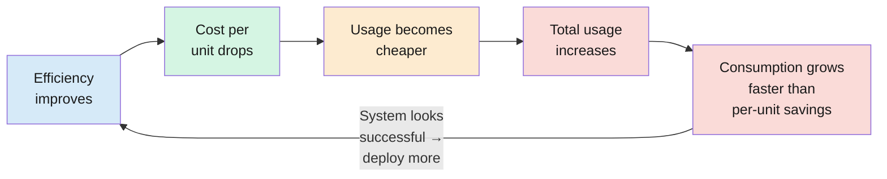

import RevealJS, { Slide } from '@site/src/components/RevealJS';
import Img from '@site/src/components/Img';

<RevealJS transition="slide">

{/* ============================================ */}
{/* COVER IMAGE */}
{/* ============================================ */}

<Slide>
  

<aside className="notes">
**Lecture overview:**
- **Total time:** ~55 minutes
- **Prerequisites:** L34 (Performance), L35 (Safety and Reliability)
- **Connects to:** L1 (Introduction — "integral of programming over time"), L28 (Accessibility), L23 (Open Source)

**Structure (~26 slides):**
- Arc 1: The Meta-Quality Attribute (~10 min) — bridge from L35, definition, semester mechanisms
- Arc 2: Four Dimensions (~10 min) — technical, economic, environmental, social, interaction table
- Arc 3: Jevons' Paradox + Order Effects (~10 min) — efficiency vs sustainability, LLM pricing, cascading effects
- Arc 4: Who Benefits, Who Bears Risk (~15 min) — veil of ignorance, rate limiting exercise, Pawtograder 4-dimension analysis, Azure outage, values-requirements gap
- Arc 5: Course Capstone (~10 min) — comprehension check, Karlskrona, value judgment thesis, course arc table, Parnas, L1 bookend

**Capstone lecture:** This is the final content lecture. The narrative arc closes: L1 opened with "SE is the integral of programming over time." Today names what that integral computes and connects every lecture into one framework.

> **Transition:** Let's start with the learning objectives...
</aside>

</Slide>

{/* ============================================ */}
{/* TITLE SLIDE */}
{/* ============================================ */}

<Slide>

# CS 3100: Program Design and Implementation II

## Lecture 36: Sustainability

  &copy;2026 Jonathan Bell, CC-BY-SA

<aside className="notes">
**Context from previous lectures:**
- L34: Performance engineering — measure, don't guess. Ended with: "Performance trade-offs distribute costs. Who benefits from optimization, and who is excluded?"
- L35: Safety and reliability — Swiss cheese model, Therac-25, Boeing, CrowdStrike. Ended with: "Who profits from a design decision, and who bears the risk?"
- Today: We generalize that distributional question into the concept of sustainability — the meta-quality attribute that asks whether ALL your quality attributes hold up over time, and for whom.

> **Transition:** Here's what you'll be able to do after today...
</aside>

</Slide>

{/* ============================================ */}
{/* LEARNING OBJECTIVES */}
{/* ============================================ */}

<Slide>

## Learning Objectives

After this lecture, you will be able to:

<ol style={{fontSize: '0.75em', textAlign: 'left'}}>
  <li>Define software sustainability as a meta-quality attribute</li>
  <li>Apply the four dimensions of sustainability to evaluate design trade-offs</li>
  <li>Recognize how efficiency gains can increase total resource consumption</li>
  <li>Evaluate who benefits and who bears risk in design trade-offs</li>
</ol>

<aside className="notes">
**Time allocation:**
- Objective 1: Meta-quality attribute, semester connections (~10 min)
- Objective 2: Four dimensions, interaction table (~10 min)
- Objective 3: Jevons' paradox, LLM pricing, order effects (~10 min)
- Objective 4: Veil of ignorance, Pawtograder analysis, values gap (~15 min)
- Wrap-up: comprehension check, capstone arc, L1 bookend (~10 min)

> **Transition:** Let's bridge from where we left off Tuesday...
</aside>

</Slide>

{/* ============================================ */}
{/* ARC 1: THE META-QUALITY ATTRIBUTE (~10 min) */}
{/* ============================================ */}

<Slide>

## From Safety to Sustainability: Generalizing "Who Profits, Who Bears Risk?"

In L35, we saw Boeing sell sensor redundancy as an **optional upgrade**. Budget airlines saved money. Passengers bore the risk — without knowing it.

That distributional question — **who benefits, who pays, over what time horizon** — is the core question of sustainability.

**L1 callback:** "Software engineering is the integral of programming over time." Every lecture since has been about what that integral measures. Today we name it.

<aside className="notes">
**Bridge from L35:** Tuesday we ended with "who profits from a design decision, and who bears the risk?" — applied to safety-critical systems. Today we generalize: that question applies to every design decision, not just safety decisions.

**L1 callback:** In L1, we defined SE as "the integral of programming over time." That definition has been the through-line. Readability (L5) is readable over time. Coupling (L7) is changeable over time. Testing (L15) is correct over time. Performance (L34) is fast over time. Safety (L35) is safe over time. Today: sustainability is the name for what that integral computes.

> **Transition:** So what exactly is sustainability?
</aside>

</Slide>

<Slide>

## SceneItAll's Success Disaster

SceneItAll launches. 50 beta homes. Everything works. Fast, reliable, safe. Great reviews.

| What went right | What happened next |
|----------------|-------------------|
| Fast firmware updates | Team pushes 10x more often; total traffic doubles |
| Reliable occupancy sensing | Insurance companies want the data; users never consented |
| Accessible on modern phones | 100,000 homes; users with screen readers can't configure scenes |
| Free cloud tier covers costs | Growth past the free tier; locked into vendor pricing |
| Small team ships fast | Original devs leave; no one understands the Zigbee adapter code |

Nothing <strong>broke.</strong> The system <strong>succeeded</strong> — and the success created problems the original design never anticipated.

<aside className="notes">
**This is the "success disaster" slide.** Every row in this table is something that went RIGHT — and then created a new problem at scale. Students should feel the tension: good engineering decisions that become sustainability liabilities over time.

**Walk through 2-3 rows:** The firmware update row connects to Jevons' paradox (coming later). The occupancy row connects to social sustainability. The accessibility row connects to L28 — the system works for its original users but excludes new ones.

**Key insight:** L35 asked "what happens when this fails?" This lecture asks the harder question: "what happens when this succeeds?"

> **Transition:** Let's name what's happening here...
</aside>

</Slide>

<Slide>

## Sustainability: What Happens When This Succeeds?

**Definition (Lago et al.):** "Preservation of long-term beneficial use of software, and its appropriate evolution, in a context that continuously changes."

**The key word is "beneficial."** SceneItAll's occupancy data *is* useful — for the homeowner. It's *harmful* — for the homeowner whose data is sold. Same feature, different stakeholders, different time horizon.

Sustainability is not another quality attribute to add to the list. It is the **meta-quality attribute** — it asks whether all the other quality attributes (performance, safety, accessibility, changeability) **hold up over time, and for whom.**

Lago distinguishes two directions: **sustainable software** (inward — is the artifact itself maintainable, efficient, evolvable?) and **software for sustainability** (outward — does the software support sustainable processes in the world?). Both matter.

<aside className="notes">
**Lago et al. (2024)** formalized this in a comprehensive ACM Computing Surveys paper. The key contribution: sustainability is not one dimension. It has four dimensions that interact and sometimes conflict (next slides).

**Inward vs outward:** "Sustainable software" is about the artifact — can we maintain it, is it energy-efficient, does it resist software rot? "Software for sustainability" is about what the software enables — does Pawtograder make education more accessible? Do SceneItAll's energy-saving scenes actually reduce household energy use? A system can be inwardly sustainable (clean code, low coupling) but outwardly unsustainable (enables behaviors that harm people or the environment).

**The "beneficial" insight:** A system can be technically excellent and socially harmful. It can be economically viable and environmentally destructive. "Beneficial" forces you to ask: beneficial to whom?

**Connect to L4/L9:** Specification debt (L4) — ambiguous specs create a "hidden decision factory" where choices compound. Requirements cost escalation (L9) — fixing a requirements error costs 1x during gathering, 100x after deployment. Both are sustainability stories.

> **Transition:** Safety and sustainability look similar. What's the difference?
</aside>

</Slide>

<Slide>

## Safety vs. Sustainability: Two Different Questions

**Safety (L35)**

"What happens when this **fails?**"

- Therac-25 race condition
- Boeing single sensor
- CrowdStrike boot loop

Focus: **failure modes.** Who gets hurt when things go wrong?

**Sustainability (today)**

"What happens when this **succeeds** — at scale, over years, across stakeholders you haven't met?"

- SceneItAll occupancy data sold
- Pawtograder narrows curriculum
- LLM subsidy reshapes labor market

Focus: **success modes.** Who bears the cost when things go right?

<aside className="notes">
**The distinction is subtle but important.** Safety is about failure — when the system breaks, who gets hurt? Sustainability is about success — when the system works exactly as designed and scales, what unintended consequences emerge?

**Both use the same distributional question** from L35: who profits, who bears risk? But safety analyzes this in the failure case, and sustainability analyzes it in the success case.

**The examples on the right are all "success disasters":** SceneItAll's occupancy sensing works perfectly — that's the problem. Pawtograder's auto-grading scales beautifully — that's the problem. LLM pricing drops — that's the problem. Each success creates new stakeholders and new risks.

> **Transition:** You've actually been building sustainability mechanisms all semester...
</aside>

</Slide>

<Slide>

## You've Been Building Sustainability Mechanisms All Semester

| What you learned | Where | What it sustains |
|-----------------|-------|-----------------|
| Information hiding | L6 | **Changeability** — hidden internals can evolve without breaking clients |
| Low coupling | L7 | **Independence** — modules can be maintained, replaced, scaled independently |
| SOLID principles | L8 | **Evolvability** — code resists "software rot" as requirements change |
| Hexagonal architecture | L16 | **Vendor independence** — swap infrastructure without rewriting domain logic |
| Open source evaluation | L23 | **Supply chain health** — dependencies that won't be abandoned or relicensed |
| Accessibility | L28 | **Inclusivity** — system serves diverse and growing user populations |
| Staged rollout | L35 | **Blast radius control** — failures don't cascade to every user simultaneously |

Decisions that seem like "good engineering practice" in the short term are sustainability investments in the long term.

<aside className="notes">
**The recurring theme:** Students have been doing sustainability work all semester — they just didn't have a name for it. Information hiding (L6) isn't just "good practice" — it's how you sustain changeability over years. Low coupling (L7) isn't just a design principle — it's how you sustain team independence. Testing (L15) isn't just about catching bugs — it's how you sustain confidence that changes don't break things.

**L4/L9 Recall:** Specification debt (L4) — ambiguous specs create a "hidden decision factory" where implementers make untracked choices that compound. Requirements cost escalation (L9) — fixing a requirements error costs 1x during gathering, 100x after deployment. Both are sustainability stories.

> **Transition:** Sustainability has four dimensions. Let's break them down...
</aside>

</Slide>

{/* ============================================ */}
{/* ARC 2: FOUR DIMENSIONS (~10 min) */}
{/* ============================================ */}

<Slide>

## Technical Sustainability: Can the System Be Maintained and Evolved?

  

The dimension you know best. Low coupling, testability, readable code, clear contracts.

**SceneItAll:** Hexagonal architecture (L16) lets the team swap the Zigbee adapter for a Matter adapter without rewriting scene activation logic.

**The test:** Can a new developer join and make changes? Can you replace a dependency without a rewrite?

<aside className="notes">
**This is familiar territory.** Most of the semester has been about technical sustainability — writing code that other people (including your future self) can understand, modify, and extend. The four-dimensions diagram will reappear on each dimension slide with the current dimension highlighted.

**Key insight for students:** Technical sustainability is necessary but not sufficient. A system can be beautifully architected and still unsustainable if it's too expensive to run, too energy-intensive to scale, or exclusionary to certain users.

> **Transition:** The next dimension is less obvious...
</aside>

</Slide>

<Slide>

## Economic Sustainability: Is the Total Cost of Ownership Viable?

Beyond hosting costs: developer time, dependency cost, lock-in risk, support burden, opportunity cost.

**Pawtograder:** GitHub Actions free tier covers current grading volume — but growth past the free tier means GitHub's pricing, not yours. And if GitHub changes their API? Every autograder integration breaks.

**License changes are an economic hazard:** MongoDB (AGPL to SSPL), HashiCorp (MPL to BSL) — your dependency's license can change under you.

**L23 Recall:** OpenSSL secured most of the internet — maintained by a handful of volunteers until Heartbleed exposed how underfunded critical infrastructure can be. Economically unsustainable open source is a **supply chain risk** for everyone who depends on it.

<aside className="notes">
**Key insight:** Economic sustainability includes costs that don't show up on your cloud bill. Developer time to understand a dependency, cost of migrating when a vendor changes terms, support burden when users hit edge cases — these are all real costs.

**OpenSSL story (L23 callback):** Before Heartbleed in 2014, OpenSSL had essentially one full-time developer maintaining code that secured most HTTPS connections worldwide. That's economically unsustainable. After Heartbleed, the Core Infrastructure Initiative was created to fund critical open-source projects — but many similar projects remain underfunded.

> **Transition:** The third dimension is increasingly urgent...
</aside>

</Slide>

<Slide>

## Environmental Sustainability: What Resources Does the System Consume?

Direct compute costs (energy, hardware, cooling) **plus** indirect effects (does the system enable behaviors that consume more resources?).

**L20 callback:** "Every network request requires CPU cycles, network interface power, router power, server CPU, data center cooling." Batching saves energy, not just latency.

Tease: efficiency gains don't always reduce total consumption. We'll see why next.

<aside className="notes">
**Brief slide — tee up Jevons.** Don't spend long here. The key point is that environmental sustainability isn't just "use less CPU." It includes the indirect effects — what behaviors does the system enable? We'll explore this in depth with Jevons' paradox in Arc 3.

> **Transition:** The fourth dimension is the most human...
</aside>

</Slide>

<Slide>

## Social Sustainability: Does the System Serve People Well — Including People Who Aren't Direct Users?

Accessibility (L28), inclusivity, fairness, privacy. **Indirect stakeholders emerge over time.**

**SceneItAll usage analytics:**
- At **50 beta homes** — occupancy data is a debugging tool
- At **100,000 homes** — the same data is a burglary-risk or insurance-discrimination vector

The system didn't change. The stakeholder population did.

<aside className="notes">
**The scale-changes-everything point:** This connects directly to L35's safety debt concept — the same holes in your Swiss cheese become more dangerous as the blast radius grows. Here the "holes" are privacy practices that were fine at small scale but harmful at large scale.

**L28 callback:** Accessibility is a social sustainability issue. If your system serves sighted users today but can't be used with a screen reader, it's socially unsustainable — the user population will grow more diverse over time, not less.

> **Transition:** These four dimensions don't operate independently...
</aside>

</Slide>

<Slide>

## The Dimensions Interact — and Conflict

<table style={{fontSize: '0.62em', tableLayout: 'fixed', width: '100%'}}>
<colgroup>
<col style={{width: '18%'}} />
<col style={{width: '20%'}} />
<col style={{width: '20%'}} />
<col style={{width: '22%'}} />
<col style={{width: '20%'}} />
</colgroup>
<thead>
<tr><th>Decision</th><th>Technical</th><th>Economic</th><th>Environmental</th><th>Social</th></tr>
</thead>
<tbody>
<tr><td>Monolith to microservices</td><td>Better: independent deployment</td><td>Worse: operational complexity</td><td>Worse: network overhead, container sprawl (L20)</td><td>Neutral</td></tr>
</tbody>
<tbody className="fragment">
<tr><td>Add WCAG accessibility</td><td>Moderate effort</td><td>Higher dev cost</td><td>Neutral</td><td>Better: inclusive (L28)</td></tr>
<tr><td>Switch to serverless</td><td>Moderate: vendor-specific APIs</td><td>Better: pay-per-use (L21)</td><td>Mixed: no idle waste but cold start overhead</td><td>Worse: vendor lock-in limits self-hosting</td></tr>
<tr><td>Keep all telemetry forever</td><td>Simpler: no retention policy</td><td>Worse: storage costs grow linearly</td><td>Worse: ~98% of data center data is "dark data" — never used (Lago)</td><td>Worse: privacy risk grows with data volume</td></tr>
</tbody>
</table>

No decision optimizes all four. Sustainability analysis makes trade-offs <strong>visible</strong> — not resolved.

<aside className="notes">
**Walk through one row in detail.** The microservices row is a good one: it improves technical sustainability (teams can deploy independently) but worsens economic (more infrastructure to manage) and environmental (more network calls, more containers, each with overhead per L20). Social is roughly neutral.

**Key takeaway:** There is no universally "sustainable" choice. The framework's value is making trade-offs explicit so decision-makers can weigh them deliberately rather than stumbling into consequences.

> **Transition:** The environmental dimension has a surprising twist. Let's look at what happens when you make software more efficient...
</aside>

</Slide>

{/* ============================================ */}
{/* ARC 3: JEVONS' PARADOX + ORDER EFFECTS (~12 min) */}
{/* ============================================ */}

<Slide>

## Jevons' Paradox: Efficiency Is Not Sustainability

**1865:** More efficient coal engines led to **more** total coal consumption. Efficiency made it cheaper, expanding use faster than per-unit savings.

| Technology | Per-unit gain | Total consumption |
|-----------|--------------|-------------------|
| Cloud computing | Cheaper per hour | Total energy skyrocketed |
| Web + CDNs | Faster per byte | Pages: 100KB → 4MB |
| CI/CD | Cheaper per build | Vastly more builds |
| LLM inference | Cheaper per token | AI compute exploding |

  

Making software faster/cheaper does not automatically make it more sustainable.

<aside className="notes">
**This is the key reversal of the lecture.** Students assume that efficiency improvements reduce resource consumption. Jevons' paradox says the opposite often happens.

**Historical context:** Jevons was writing about coal in Victorian England. The same pattern appears in every technology domain: highways (more lanes = more driving), storage (bigger drives = more data kept), bandwidth (faster connections = larger media files).

> **Transition:** Let's see why this is a self-reinforcing loop...
</aside>

</Slide>

<Slide>

## The Jevons Cycle: Why Efficiency Feeds Itself

The loop is self-reinforcing. Each efficiency gain makes the next round of expansion cheaper.

<aside className="notes">
**The cycle is the key visual.** Students need to see that Jevons isn't a one-time effect — it's a feedback loop. Each round of efficiency improvement lowers the barrier, which increases usage, which justifies more investment in efficiency, which lowers the barrier further.

**Cloud computing example:** More efficient VMs → cheaper compute → more workloads migrate to cloud → total cloud energy skyrockets → invest in even more efficient VMs → cycle continues.

> **Transition:** You're living inside this cycle right now...
</aside>

</Slide>

<Slide>

## SceneItAll + Pawtograder: You're Living Inside Jevons' Paradox

**SceneItAll:**

Efficient firmware updates (faster Zigbee, smaller deltas) did not reduce total traffic — they meant the team pushes updates **more frequently**.

Per-update cost dropped 5x. Update frequency increased 10x. <strong>Total update traffic doubled.</strong>

**Pawtograder:**

Efficient automated grading enables **unlimited submissions**. Students submit 3,000-12,000 times per day across the course.

Before: submit once, human grades. The <em>system</em> is more efficient; the <em>total resource consumption</em> is higher.

<aside className="notes">
**Make it personal.** Students are experiencing Pawtograder's Jevons' paradox right now. They submit frequently because the system makes it cheap — container spin-up, test execution, result reporting — all automated and fast. Before automated grading, they'd submit once or twice and wait for a human. The per-submission cost is tiny; the aggregate compute is significant.

**Not a moral judgment:** This isn't "students are wasteful." Unlimited submissions genuinely help learning. The point is that efficiency creates new usage patterns, and those patterns have costs.

> **Transition:** The most striking example of this pattern is happening in AI right now...
</aside>

</Slide>

<Slide>

## LLMs: Jevons' Paradox as a Business Strategy

Per-token API prices have dropped across model generations even as total inference volume has surged. Snapshot (Anthropic API pricing, retrieved 2026-03-31): Claude Opus 4.1 at \$15/\$75 per million input/output tokens; Claude Opus 4.6 at \$5/\$25 — about **3x lower** per million tokens.

**Illustrative estimate:** Claude Code Max plans (\$200/mo) may correspond to ~\$5,000 in API compute at published list rates — a significant gap that illustrates the Jevons pattern, not a precise accounting. Real API spend depends on models, tokens, caching, batching, and contract discounts.

| Cost layer | Who pays | Who benefits |
|-----------|---------|-------------|
| GPU hardware + energy | Cloud providers (passed to AI companies) | Developers using the tools |
| Training data creation | Original authors (often unconsented) | AI companies + users |
| Subsidy gap (~\$200 vs ~\$5,000 estimate) | AI company investors (for now) | Individual developers |
| Environmental externality | Everyone (carbon emissions) | Direct users of the service |
| Labor displacement risk | Workers in affected roles | Companies reducing headcount |

"Who profits, who bears risk?" applied to the tools you use every day.

<aside className="notes">
**Caveats to share if asked:**
- The ~$5,000 figure is a back-of-envelope classroom estimate for a very heavy individual workflow at published list API rates for premium models. It is not an official bill or guarantee.
- Per-query energy estimates for LLMs vary widely. Early popular claims of ~10x a Google search are time-bound and scenario-dependent. Oviedo et al. (arXiv:2509.20241, Sep 2025) estimate a median ~0.34 Wh per query for large frontier models, with wide spread, and report that naive non-production extrapolations can overstate energy by ~4-20x.
- The strategic pattern still matches Jevons: subscription pricing expands usage relative to pay-as-you-go.

**The cost stack table is the key visual.** Walk through each row: who pays and who benefits are different groups. That distributional mismatch is a sustainability concern — the same pattern from Boeing selling redundancy as optional.

> **Transition:** Let's practice spotting the pattern...
</aside>

</Slide>

<Slide>

## Jevons in the Wild: Spot the Rebound Effect

Which of these exhibit Jevons' paradox? For each, identify: what got more efficient, and what increased.

| Scenario | Jevons? | What increased? |
|----------|---------|----------------|
| A. Adding database indexes speeds queries 10x. DevOps adds more monitoring queries. | ❓ | |
| B. Switching to incremental compilation (20x faster). Developers recompile constantly during debugging. | ❓ | |
| C. Raising API rate limit from 100 to 1000 req/sec. Clients send 5x more requests. | ❓ | |
| D. Adding WCAG accessibility to SceneItAll. More users can use the app. | ❓ | |

Discuss with a neighbor. Not all of these are Jevons — which one isn't?

<aside className="notes">
**Answers:**
- A: **Yes.** Faster queries → more queries. Per-query cost dropped, total query load increased.
- B: **Yes.** Faster compilation → more compilations. Classic rebound — the convenience increases the behavior.
- C: **Yes.** Higher limit → clients exploit it. The capacity increase was consumed immediately.
- D: **No.** This is not Jevons — more users is the *intended goal*, not a rebound effect. Accessibility expands the user base; total usage increases, but that's the point. Jevons is about unintended consumption growth that outpaces efficiency gains.

**D is the trick question.** Students who mark it as Jevons are confusing "more usage" with "rebound effect." Jevons requires that the increased usage is an *unintended consequence* of the efficiency gain, not the explicit goal.

> **Transition:** Jevons asks "does efficiency reduce consumption?" There's an even harder question...
</aside>

</Slide>

<Slide>

## Digital Sufficiency: Should We Build This at All?

Jevons asks whether efficiency reduces total consumption. **Sufficiency** asks a more radical question: is this technology needed in the first place?

| Efficiency question | Sufficiency question |
|-------------------|---------------------|
| How do we make this drone software more energy-efficient? | Efficient medical drones get cheap enough to become toys — negating all the efficiency gains at scale |
| How do we optimize data center storage? | Should we be storing 98% "dark data" that no one will ever read? |
| How do we make LLM inference cheaper per token? | Should you be using an LLM for this task, or would `grep` do? |
| How do we make SceneItAll updates faster? | Does every light bulb need a WiFi chip and cloud connection? |

The EU's Right to Repair: extending hardware life = less hardware produced. Sufficiency, not efficiency.

<aside className="notes">
**This concept comes from Lago's ICSA 2025 keynote.** She distinguishes efficiency (optimize what we produce) from sufficiency (assess whether we should produce it at all). This is a harder question — and one that engineers rarely ask.

**The drone example is Lago's:** Efficient medical drones are a sustainability win. But if affordable drones become toys, all the efficiency gains are negated — you're now mass-producing drones with significant environmental impact for entertainment. That's a rebound effect driven by sufficiency failure.

**The LLM row is the most personal for students:** They've been using Claude Code all semester. Sometimes an LLM is the right tool. Sometimes `grep`, `git log`, or reading the code is faster, cheaper, and more sustainable. Sufficiency is about choosing the right tool, not just optimizing the one you have.

**The dark data statistic:** Lago cites estimates that ~98% of data managed in data centers is "dark data" — data that is stored but never accessed. That's energy consumed to maintain storage that provides no value. A sufficiency approach would ask: do we need to store this?

> **Transition:** Whether the question is efficiency or sufficiency, effects cascade...
</aside>

</Slide>

<Slide>

## First, Second, and Third-Order Effects

| | 1st-order (direct) | 2nd-order (behavioral) | 3rd-order (systemic) |
|---|---|---|---|
| **SceneItAll** | Hub uses power to run | Convenience increases total energy use; usage data reveals when you're home | Insurance pricing and surveillance reshape around smart-home data |
| **Pawtograder** | Each submission uses compute | Unlimited submissions change study habits — autograder becomes the debugger | If every course auto-grades, assignments gravitate toward what's auto-gradeable, narrowing what students learn |
| **LLM Agents** | GPU inference per prompt | Developers write more code, explore more approaches, iterate faster | Labor market restructures; codebases grow faster than teams can understand them |

"If this system is wildly successful, what behaviors does it enable, and who is affected?"

<aside className="notes">
**Walk through one system at a time, pausing at each order.** Each click reveals the next effect. The pedagogical goal is for students to *feel* the cascade — each order is less predictable than the last.

**SceneItAll (fragments 1-3):** Start here because it's familiar. First order is obvious — the hub draws power. Second order is a behavioral shift — people use more energy because automation makes it frictionless, and usage data creates an occupancy signal nobody asked for. Third order is systemic — insurance companies and surveillance systems reorganize around data that exists only because the product succeeded.

**Pawtograder (fragments 4-6):** This one is personal. First order is boring compute cost. Second order — ask students: "How many of you have submitted just to see what the autograder says?" That behavioral shift is a second-order effect of making submissions free. Third order — if autograding scales to every course, what kinds of assignments disappear? Design critiques, open-ended projects, anything that requires human judgment to evaluate.

**LLMs (fragments 7-9):** The most current. First order is GPU cost per prompt. Second order — developers produce more code (Jevons' paradox from the previous slide, applied to code volume). Third order — if codebases grow faster than teams can understand them, and junior roles contract, who maintains all that code? This connects directly to L38 (Future of Programming).

**The purple question (fragment 10)** is the design heuristic. You can't predict all second- and third-order effects. But you can ask the question early and revisit it as the system scales.

> **Transition:** So how do we reason about who benefits and who bears risk?
</aside>

</Slide>

{/* ============================================ */}
{/* ARC 4: WHO BENEFITS, WHO BEARS RISK (~13 min) */}
{/* ============================================ */}

<Slide>

## The Veil of Ignorance: Design As If You Don't Know Which Stakeholder You'll Be

Rawls' thought experiment: design the rules of a society as if you **don't know which position you'll occupy** in it. Applied to software:

**SceneItAll:** Would you accept this design if you might be...
- The developer maintaining code in 3 years
- A user with a visual impairment
- A homeowner with intermittent internet
- The person whose occupancy data is sold
- A homeowner locked out during a firmware update

**Pawtograder:** Would you accept this design if you might be...
- A Northeastern student with fast internet
- A community college student self-hosting with limited IT
- A student with a disability needing accessible feedback
- A TA grading 200 submissions during finals
- A student who got a zero from an autograder crash (L35)

The veil doesn't tell you what to build. It tells you which trade-offs deserve extra scrutiny.

<aside className="notes">
**Three fragments: SceneItAll, then Pawtograder, then the takeaway.**

The veil of ignorance is a design heuristic, not a rule. It surfaces the trade-offs where the people benefiting and the people bearing risk are different groups.

**Fragment 1 — SceneItAll:** Read through the list. Each stakeholder connects to a prior lecture: developer in 3 years (L7, changeability), visual impairment (L28, accessibility), intermittent internet (L20, networks), occupancy data (L35, indirect safety), locked out during firmware update (L35, blast radius). Let students absorb that the same system looks very different depending on which stakeholder you are.

**Fragment 2 — Pawtograder:** Now it's personal. The Northeastern student is them — everything works great. But a community college self-hosting (economic), a student with a disability (social), a TA during finals (they feel this one), an autograder crash victim (L35 fail-safe). The trajectory is from "this design is fine" to "wait, is it?"

**Fragment 3 — Takeaway:** The veil doesn't resolve trade-offs — it identifies which ones deserve extra scrutiny. If you'd be worried about a design as any of these stakeholders, that's a signal to investigate further.

**Connection to L35:** This is the same distributional question — "who profits, who bears risk?" — generalized into a repeatable design practice. In L35 it was about safety (Boeing passengers). Here it's about everything — accessibility, economics, privacy, environmental impact.

> **Transition:** Let's apply the veil to a real design decision...
</aside>

</Slide>

<Slide>

## The Veil Decides: Who Bears the Cost of "Unlimited" Submissions?

**Scenario:** Pawtograder offers unlimited autograder submissions. The compute cost is real — but invisible to students. Behind the veil, you might be:

| Stakeholder | Impact of "unlimited" |
|------------|--------|
| Student at Northeastern | Submit freely, fast feedback, iterate quickly |
| Student at community college self-hosting | Their IT budget pays per container-minute — unlimited = unaffordable |
| Student with slow internet | Each submission is a 30-second upload + 2-minute wait — "unlimited" isn't free |
| Student who uses autograder as debugger | Learns less; relies on output instead of reasoning ([L13](/lecture-notes/l13-intro-ai-agents)) |
| The planet | 12,000 submissions/day × 2 min compute = real energy (Jevons) |

"Unlimited" is a design choice that encodes a value: iteration over efficiency. Does the veil change your assessment?

<aside className="notes">
**This slide lands all at once.** Walk through the table top to bottom — the arc goes from "this is great" to "wait, is it?"

Start with the Northeastern student — this is the student in the room. Sounds great. Then shift: community college self-hosting pays per container-minute ("unlimited" = unaffordable). Slow internet means rate-limited by physics. The autograder-as-debugger is the second-order effect from the previous slide. The planet row connects to Jevons' paradox. "Unlimited" sounds neutral but encodes a value judgment — iteration over efficiency, Northeastern's context over others'.

**Discussion prompts:**
- Should there be a daily submission cap? What would a fair cap look like?
- Should Pawtograder show the compute cost of each submission? (Transparency as sufficiency nudge)
- Is "unlimited for us, unaffordable for them" a sustainability problem?

> **Transition:** Let's apply all four dimensions to a system you know well...
</aside>

</Slide>

<Slide>

## Pawtograder Through Four Dimensions

<table style={{fontSize: '0.62em', tableLayout: 'fixed', width: '100%'}}>
<colgroup>
<col style={{width: '15%'}} />
<col style={{width: '50%'}} />
<col style={{width: '35%'}} />
</colgroup>
<thead>
<tr><th>Dimension</th><th>Assessment</th><th>Key Question</th></tr>
</thead>
<tbody>
<tr><td><strong>Technical</strong></td><td>Open-source, modular (L16 hex arch). GitHub Actions dependency.</td><td>If GitHub changes their Actions pricing or API, how much breaks?</td></tr>
<tr><td><strong>Economic</strong></td><td>Serverless pay-per-use (L21), no licensing. But self-hosting requires expertise.</td><td>Can an under-resourced institution actually adopt this?</td></tr>
</tbody>
<tbody className="fragment">
<tr><td><strong>Environmental</strong></td><td>3-12k daily submissions, scale-to-zero. But Jevons applies: unlimited submissions generate more total compute.</td><td>Should there be a cooling-off period between submissions?</td></tr>
<tr><td><strong>Social</strong></td><td>GPL license, but requires GitHub. WCAG not yet validated.</td><td>Is it truly accessible to all students and institutions?</td></tr>
</tbody>
</table>

Open-source + modular + pay-per-use looks great on paper. The four-dimensional analysis reveals what's hidden.

<aside className="notes">
**Walk through each row.** Students know Pawtograder intimately — they use it every day. The technical row is strong (open source, hexagonal architecture). The economic row has a hidden cost (expertise barrier for self-hosting). The environmental row reveals Jevons (unlimited submissions). The social row has a gap (WCAG not validated).

**The "key question" column is intentionally open-ended.** These don't have clean answers. The point is that the analysis surfaces questions you wouldn't ask with a single-dimension lens.

> **Transition:** Let's look at a real decision that forced these trade-offs...
</aside>

</Slide>

<Slide>

## Real Decision: The Azure Outage

October 2025. Azure goes down. GitHub Actions stops running. Pawtograder can't grade submissions. Two options:

| | Option A: Self-hosted fallback | Option B: Stay GitHub-dependent |
|--|-------------------------------|-------------------------------|
| **Technical** | Complex failover logic; two systems to maintain | Simpler architecture; single system |
| **Economic** | Duplicate infrastructure costs | Leverage free tier; lower total cost |
| **Environmental** | Idle fallback resources most of the time | Shared infrastructure, higher utilization |
| **Social** | Resilient — students don't lose access during outages | Equal access for all institutions (no self-hosting expertise needed) |

No right answer. The four-dimensional analysis makes the trade-offs <strong>visible</strong>.

<aside className="notes">
**This is a real decision we faced.** When Azure went down and GitHub Actions stopped, students couldn't get grades on their submissions. The temptation was to build a self-hosted fallback. But look at the trade-offs: technical complexity doubles, economic cost doubles, environmental waste (idle resources), and social sustainability actually goes both ways — more resilient for our students, but harder for other institutions to replicate.

**The point isn't to find the "right" answer.** It's that without the four-dimensional analysis, you'd likely choose based on technical elegance or personal frustration alone, missing the social and environmental implications.

> **Transition:** Now you try — analyze a new feature request through all four dimensions...
</aside>

</Slide>

<Slide>

## Evaluate This Trade-off: Real-Time TA Notifications

**Feature request:** Add real-time email/SMS notifications to TAs whenever a student submits to Pawtograder.

Analyze across all four dimensions:

| Dimension | Better or worse? | Why? |
|-----------|-----------------|------|
| **Technical** | | New dependencies? Latency requirements? |
| **Economic** | | Does this increase hosting/SaaS costs? |
| **Environmental** | | Real-time push vs batch — compute difference? |
| **Social** | | TAs get faster feedback — but notifications during off-hours? |

Is this sustainable across all four dimensions? For which stakeholder does it worsen?

<aside className="notes">
**Exercise: 2 minutes, then discuss.**

**Expected analysis:**
- **Technical:** Worse — adds email/SMS service dependency, notification queue, delivery guarantees. More moving parts.
- **Economic:** Worse — SMS costs money per message. 3-12k submissions/day = significant SMS bill. Email is cheaper but still infrastructure.
- **Environmental:** Worse — real-time push means a notification for EVERY submission. Batch (daily digest) would be far more efficient.
- **Social:** Mixed — TAs get faster awareness (good for intervention), but 12k notifications/day is overwhelming. Off-hours notifications are disruptive. Who opted into this?

**The sustainability answer:** A daily digest email is far more sustainable than real-time SMS across all four dimensions. But it's less responsive. That trade-off should be explicit, not accidental.

**Key teaching point:** Students apply the framework to a NEW decision — not pre-analyzed. This moves from recognition to application (LO2).

> **Transition:** Here's the honest ending about operationalizing values...
</aside>

</Slide>

<Slide>

## The Values-Requirements Gap: Operationalizing Values Is Genuinely Hard

You can state values clearly. Translating them into **testable requirements** is an open research problem.

| Value | Attempted Requirement | Problem |
|-------|----------------------|---------|
| Fairness | "Grade all submissions identically" | Identical can be inequitable (students with disabilities, slow connections hit timeouts) |
| Privacy | "Don't collect unnecessary data" | "Necessary" depends on who's asking — debugging needs telemetry, but telemetry is surveillance |
| Environmental | "Minimize compute" | Conflicts with unlimited submissions, thorough test suites, and fast feedback |

C.T. Nguyen calls this <strong>value capture.</strong> Economists call it <strong>Goodhart's Law</strong>: "when a measure becomes a target, it ceases to be a good measure."

<aside className="notes">
**Nguyen's "value capture":** The philosopher C.T. Nguyen names the mechanism behind this table: once you create a simplified metric for a rich value, people orient toward the metric and forget the value. The law school optimizes for U.S. News rankings instead of its actual pedagogical mission. The developer optimizes for code coverage instead of code quality. The metric *captures* and overwrites the original value. This is why the gap isn't just hard to close — closing it too aggressively (with a clean metric) can make things worse.

**The table is deliberately frustrating.** Each "attempted requirement" sounds reasonable until you see the problem. "Grade identically" is fair in one sense and unfair in another. "Don't collect unnecessary data" is vague because "necessary" is contextual. "Minimize compute" directly conflicts with pedagogical goals.

**Ask students:** Has code coverage ever distorted what tests you write? That's value capture. Has a GPA ever distorted what courses you choose? Same thing.

> **Transition:** Let's check your understanding, and then we'll close the semester...
</aside>

</Slide>

{/* ============================================ */}
{/* ARC 5: COURSE CAPSTONE (~10 min) */}
{/* ============================================ */}

<Slide>

## Comprehension Check

Open Poll Everywhere and answer the three questions.

<aside className="notes">
**Poll Q1:** Pawtograder switches from GitHub Actions to a self-hosted CI system. This improves which sustainability dimension(s)?
- A. Technical only — less vendor dependency
- B. **Technical (less lock-in) and Social (any institution can run it)** [CORRECT]
- C. All four dimensions improve
- D. Economic — cheaper hosting

*Teaching point: dimensions interact. Less lock-in improves technical AND social sustainability, but may worsen economic (self-hosting costs) and environmental (less shared infrastructure efficiency).*

**Poll Q2:** SceneItAll releases a firmware update that makes device communication 50% more energy-efficient. Total energy consumption across all deployments increases by 20% over the next year. This is an example of:
- A. A bug in the firmware
- B. **Jevons' paradox — efficiency enabled more usage** [CORRECT]
- C. The update wasn't actually efficient
- D. Environmental sustainability improving

*Teaching point: per-unit efficiency is not the same as total consumption. The update worked perfectly — it just enabled more frequent updates and more devices.*

**Poll Q3:** You're designing a feature that collects device usage data to improve SceneItAll's recommendations. Applying the veil of ignorance, which stakeholder perspective is most important to consider?
- A. The developer who needs telemetry for debugging
- B. The product manager who needs data for features
- C. **The homeowner whose occupancy patterns could be sold to insurance companies** [CORRECT]
- D. The data scientist who needs training data

*Teaching point: the veil of ignorance prioritizes the stakeholder with the least power and most risk — the one who didn't consent to being a data source.*

> **Transition:** Let's step back and see where sustainability fits in the field...
</aside>

</Slide>

<Slide>

## System Design Is Never Value-Neutral

**The Karlskrona Manifesto on Sustainability Design (2015):** foundational consensus document from ~30 software engineering researchers.

Core principle: every architecture, API, and default setting reflects assumptions about **who matters** and **what matters**.

Sustainability is the practice of making those assumptions **explicit** and revisiting them as the system and its context evolve.

<aside className="notes">
**The Karlskrona Manifesto:** Published in 2015 by about 30 prominent SE researchers. It established sustainability as a first-class concern in software engineering, not an afterthought. The core insight: design decisions are never neutral — they always encode value judgments, even when the designer doesn't realize it.

**This connects to the L35 theme:** In L35 we saw that Boeing's decision to make sensor redundancy optional was a value judgment (cost savings over safety). The Karlskrona Manifesto says ALL design decisions are like this — they just have less dramatic consequences most of the time.

> **Transition:** Let's make this concrete with the choices you've seen in this course...
</aside>

</Slide>

<Slide>

## Every Design Decision Encodes a Value Judgment

Pawtograder's choices encode values — whether we thought about them or not:

- **Unlimited submissions** values learning-by-iteration over compute efficiency
- **Requiring GitHub** values standardization over universal access
- **Auto-grading** values scale over human nuance

The question is not whether your design encodes values. It's whether you <strong>chose</strong> them deliberately.

<aside className="notes">
**The three bullet points are personal.** Students are living inside these value judgments right now. Unlimited submissions is a choice we made — it values iteration over efficiency. Requiring GitHub is a choice — it values platform consistency over universal access. Auto-grading is a choice — it values scale over the nuance a human grader provides.

**Make trade-offs visible so decision-makers understand who bears the cost.** That's the goal.

> **Transition:** Step back — what has this semester been about?
</aside>

</Slide>

<Slide>

## Everything This Semester Sustains Something

| Lecture Arc | What It Sustains | Time Horizon |
|------------|-----------------|-------------|
| L5-L8: Readability, coupling, SOLID | Code future developers can understand and change | Years of maintenance |
| L9, L12: Requirements, domain modeling | Systems that solve the right problem | Project lifetime |
| L15-L16: Testing, testability | Confidence that changes don't break existing behavior | Every commit |
| L18-L21: Architecture, networks, serverless | Systems that scale, evolve, survive infrastructure changes | Organizational lifetime |
| L23: Open source | Supply chains that don't depend on abandoned projects | Industry-wide |
| L28: Accessibility | Systems that serve all users, not just ones who look like the developers | Societal |
| L34-L35: Performance, safety | Systems that don't harm users through slowness or failure | Immediate to catastrophic |

Sustainability is not a new topic. It is the name for what all of these have in common.

<aside className="notes">
**This is the course arc payoff.** The semester arc table shows the progression: from "code that one developer writes" to "systems that serve society." Each row widens the lens — from hours to years, from individual developer to civilization.

**Let this slide breathe.** Students should see the full table and feel the coherence — every topic this semester has been about the same thing at different scales.

> **Transition:** One more perspective on this...
</aside>

</Slide>

<Slide>

## Parnas: The Question Is Not "AI" but "Critical Software"

> "What we should be doing is trying to regulate critical software rather than trying to make regulations that apply to AI."

The sustainability framework agrees: **what is the blast radius, who are the stakeholders, and are the trade-offs visible?**

Same questions for a `for` loop processing loan applications and a neural network doing the same thing.

Professional responsibility transcends the technology.

<aside className="notes">
**Parnas at ICSE 2025:** David Parnas — one of the founders of software engineering — argued that the "AI regulation" debate is asking the wrong question. The issue isn't whether something is "AI." The issue is whether software is making consequential decisions about people's lives, and whether the trade-offs are visible and accountable.

**Connection to this course:** A `for` loop that processes loan applications can deny people housing. A neural network that does the same thing can also deny people housing. The technology is different; the responsibility is the same. The sustainability framework asks the same questions regardless of implementation: what's the blast radius, who are the stakeholders, are the trade-offs visible?

> **Transition:** Let's close where we began...
</aside>

</Slide>

<Slide>

## The Integral of Programming Over Time

L1: "Software engineering is the integral of programming over time."

**Sustainability is what that integral computes.**

Go build software that provides value over time, to the people who need it, without imposing unacceptable costs on the people who don't.

<aside className="notes">
**This is the emotional close.** L1 opened the semester with a promise: software engineering is not programming. Programming is writing code that works today. Engineering is writing code that works tomorrow, next year, and for people you haven't met.

Every lecture has been a different lens on that promise — readability, coupling, testing, architecture, safety, performance. Sustainability is the name for what they all have in common: designing software that continues to provide value over time, to the people who need it, without imposing unacceptable costs on the people who don't.

**Let the slide breathe.** Don't rush through this. Pause after reading the final line.

> **Transition:** But we're not done yet...
</aside>

</Slide>

<Slide>

## Looking Ahead

**L37 (Monday): Map-Reduce** — a case study in sustainable architecture at planetary scale. How Google designed a programming model that let thousands of engineers process the world's data without understanding distributed systems.

**L38 (Wednesday): The Future of Programming** — where does software engineering go from here?

**L39 (Thursday): Review**

**GA2: Feature Buffet due Thursday April 16.** Process over product — a well-documented partial feature scores higher than a complete feature with no documentation.

<aside className="notes">
**L37 preview:** Map-Reduce is a sustainability success story — a programming model designed so that thousands of engineers could process massive datasets without understanding the distributed systems underneath. That's technical sustainability at Google scale.

**L38 preview:** The final content lecture. Where is software engineering heading? How do the tools and principles from this semester apply to what comes next?

**GA2 reminder:** Feature Buffet is due next Thursday. Emphasize the grading philosophy: process over product. A well-documented partial feature with design evolution, meaningful PRs, and thoughtful reflection scores higher than a complete feature with no documentation. This IS sustainability thinking applied to their own work — document the journey, not just the destination.

> Questions?
</aside>

</Slide>

</RevealJS>
